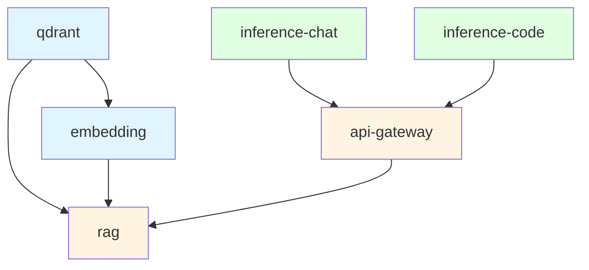

# Health Check Specification for Phase 2 Services

**작성일**: 2025-10-09
**목적**: Issue #14 Service Reliability 개선을 위한 헬스체크 표준화
**적용 범위**: Phase 2 모든 서비스

---

## 📋 헬스체크 설계 원칙

### 1. 의존성 기반 체크
- **단순 서비스**: 자체 프로세스 상태만 확인
- **의존성 서비스**: 연결된 서비스 상태도 확인

### 2. 타임아웃 설정
- **interval**: 체크 주기 (20-30초)
- **timeout**: 단일 체크 타임아웃 (5-10초)
- **retries**: 실패 허용 횟수 (3-5회)
- **start_period**: 초기 시작 유예 시간 (30초)

### 3. 경량화 원칙
- HTTP 클라이언트 있는 경우: `/health` 엔드포인트 호출
- HTTP 클라이언트 없는 경우: `/proc/net/tcp` 포트 리스닝 체크

---

## 🔍 서비스별 헬스체크 스펙

### 1. inference-chat (Chat 모델 서버)

**상태**: ✅ 추가 필요 (Phase 3 구조 참고)

**스펙**:
```yaml
healthcheck:
  test: ["CMD", "curl", "-fsS", "http://localhost:8001/health"]
  interval: 20s
  timeout: 5s
  retries: 5
  start_period: 30s
```

**체크 내용**:
- llama.cpp 서버 `/health` 엔드포인트 응답 확인
- HTTP 200 응답 필수
- 모델 로딩 완료 여부

**실패 시나리오**:
- 모델 파일 로딩 실패
- GPU 메모리 부족
- 프로세스 크래시

---

### 2. inference-code (Code 모델 서버)

**상태**: ✅ 추가 필요 (Phase 3 구조 참고)

**스펙**:
```yaml
healthcheck:
  test: ["CMD", "curl", "-fsS", "http://localhost:8001/health"]
  interval: 20s
  timeout: 5s
  retries: 5
  start_period: 30s
```

**체크 내용**:
- llama.cpp 서버 `/health` 엔드포인트 응답 확인
- HTTP 200 응답 필수
- 모델 로딩 완료 여부

**실패 시나리오**:
- 모델 파일 로딩 실패
- GPU 메모리 부족 (7B 모델)
- 프로세스 크래시

---

### 3. api-gateway (LiteLLM Gateway)

**상태**: ✅ 이미 존재 (수정 불필요)

**현재 스펙**:
```yaml
healthcheck:
  test: ["CMD", "python", "-c", "import urllib.request,sys; urllib.request.urlopen('http://localhost:8000/health')"]
  interval: 30s
  timeout: 10s
  retries: 3
  start_period: 30s
```

**체크 내용**:
- LiteLLM `/health` 엔드포인트 응답
- Python urllib 사용 (curl 미설치 컨테이너)
- HTTP 200 응답 필수

**실패 시나리오**:
- LiteLLM 프로세스 크래시
- config.yaml 로드 실패
- 백엔드 inference 서버 연결 불가

---

### 4. rag (RAG Service)

**상태**: ⚠️ 헬스체크 없음 → **강화 필요**

**기존 상태**: 헬스체크 없음

**개선 스펙**:
```yaml
healthcheck:
  test: ["CMD", "python", "-c", "import urllib.request; urllib.request.urlopen('http://localhost:8002/health')"]
  interval: 30s
  timeout: 10s
  retries: 3
  start_period: 30s
```

**체크 내용**:
- RAG 서비스 자체 상태 (FastAPI 프로세스)
- **의존성 체크**:
  - Qdrant 연결 상태 (`QDRANT_URL`)
  - Embedding 서비스 연결 상태 (`EMBEDDING_URL`)
  - API Gateway 연결 상태 (`API_GATEWAY_URL`)

**구현 필요** (`services/rag/app.py`):
```python
@app.get("/health")
async def health_check():
    """
    RAG 서비스 및 의존성 헬스체크
    """
    health_status = {
        "status": "healthy",
        "service": "rag",
        "dependencies": {}
    }

    try:
        # 1. Qdrant 연결 체크
        qdrant_url = os.getenv("QDRANT_URL", "http://qdrant:6333")
        async with httpx.AsyncClient(timeout=5.0) as client:
            resp = await client.get(f"{qdrant_url}/collections")
            health_status["dependencies"]["qdrant"] = "healthy" if resp.status_code == 200 else "unhealthy"
    except Exception as e:
        health_status["dependencies"]["qdrant"] = f"unhealthy: {str(e)}"
        health_status["status"] = "degraded"

    try:
        # 2. Embedding 서비스 연결 체크
        embedding_url = os.getenv("EMBEDDING_URL", "http://embedding:8003")
        async with httpx.AsyncClient(timeout=5.0) as client:
            resp = await client.get(f"{embedding_url}/health")
            health_status["dependencies"]["embedding"] = "healthy" if resp.status_code == 200 else "unhealthy"
    except Exception as e:
        health_status["dependencies"]["embedding"] = f"unhealthy: {str(e)}"
        health_status["status"] = "degraded"

    # 의존성 실패 시 503 반환
    if health_status["status"] == "degraded":
        return JSONResponse(status_code=503, content=health_status)

    return health_status
```

**실패 시나리오**:
- Qdrant 연결 불가
- Embedding 서비스 다운
- API Gateway 다운

---

### 5. embedding (Embedding Service)

**상태**: ⚠️ Phase 2에는 없음 → **추가 필요** (Phase 3 참고)

**스펙**:
```yaml
healthcheck:
  test: ["CMD", "python", "-c", "import urllib.request; urllib.request.urlopen('http://localhost:8003/health')"]
  interval: 30s
  timeout: 10s
  retries: 3
  start_period: 30s
```

**체크 내용**:
- FastAPI 프로세스 상태
- Embedding 모델 로딩 완료 여부
- `/health` 엔드포인트 응답

**구현 확인 필요** (`services/embedding/app.py`):
```python
@app.get("/health")
async def health_check():
    """
    Embedding 서비스 헬스체크
    """
    # 모델 로딩 상태 확인
    if hasattr(app.state, "model") and app.state.model is not None:
        return {"status": "healthy", "model_loaded": True}
    else:
        return JSONResponse(
            status_code=503,
            content={"status": "unhealthy", "model_loaded": False}
        )
```

**실패 시나리오**:
- 모델 다운로드 실패
- ONNX 런타임 오류
- 프로세스 크래시

---

### 6. qdrant (Vector Database)

**상태**: ⚠️ Phase 2에는 없음 → **추가 필요** (Phase 3 참고)

**특이사항**: Qdrant 컨테이너에는 `curl`/`wget`/`python` 없음

**스펙**:
```yaml
healthcheck:
  # /proc/net/tcp에서 포트 6333(hex:18BD) LISTEN 상태 확인
  test: ["CMD-SHELL", "grep -q ':18BD' /proc/net/tcp || exit 1"]
  interval: 30s
  timeout: 10s
  retries: 3
  start_period: 30s
```

**체크 내용**:
- `/proc/net/tcp` 파일에서 6333 포트가 LISTEN 상태인지 확인
- 포트 번호 6333 = hex `18BD`
- grep 패턴: `:18BD.*0A` (LISTEN 상태)

**포트 hex 변환**:
```python
# 6333 포트를 hex로 변환
hex(6333)[2:].upper()  # '18BD'
```

**실패 시나리오**:
- Qdrant 프로세스 크래시
- 포트 바인딩 실패
- 디스크 공간 부족 (storage 마운트)

---

## 🔗 의존성 체인 및 `depends_on` 설정

### Phase 2 의존성 그래프



### Docker Compose `depends_on` 설정

```yaml
services:
  inference-chat:
    # 의존성 없음 (독립 실행)
    healthcheck: [...]

  inference-code:
    # 의존성 없음 (독립 실행)
    healthcheck: [...]

  api-gateway:
    depends_on:
      inference-chat:
        condition: service_healthy
      inference-code:
        condition: service_healthy
    healthcheck: [...]

  embedding:
    # 의존성 없음 (독립 실행)
    healthcheck: [...]

  qdrant:
    # 의존성 없음 (독립 실행)
    healthcheck: [...]

  rag:
    depends_on:
      qdrant:
        condition: service_healthy
      embedding:
        condition: service_healthy
      api-gateway:
        condition: service_healthy
    healthcheck: [...]
```

**시작 순서**:
1. `qdrant`, `embedding`, `inference-chat`, `inference-code` (병렬 시작)
2. `api-gateway` (inference 서버들이 healthy 될 때까지 대기)
3. `rag` (qdrant, embedding, api-gateway가 healthy 될 때까지 대기)

---

## ⏱️ 타임아웃 및 재시도 설정 가이드

### 일반 원칙

| 서비스 유형 | interval | timeout | retries | start_period |
|------------|----------|---------|---------|--------------|
| **경량 서비스** (API) | 20s | 5s | 5 | 10s |
| **중량 서비스** (모델) | 30s | 10s | 3 | 30s |
| **DB 서비스** (Qdrant) | 30s | 10s | 3 | 30s |

### 서비스별 적용

| 서비스 | 유형 | interval | timeout | retries | start_period | 이유 |
|--------|------|----------|---------|---------|--------------|------|
| **inference-chat** | 경량 (3B 모델) | 20s | 5s | 5 | 30s | 빠른 모델 로딩 |
| **inference-code** | 중량 (7B 모델) | 20s | 5s | 5 | 30s | CPU 오프로드 고려 |
| **api-gateway** | 경량 (게이트웨이) | 30s | 10s | 3 | 30s | 기존 설정 유지 |
| **embedding** | 중량 (ONNX 모델) | 30s | 10s | 3 | 30s | 모델 로딩 시간 |
| **qdrant** | DB | 30s | 10s | 3 | 30s | 포트 바인딩 대기 |
| **rag** | 의존성 多 | 30s | 10s | 3 | 30s | 의존성 체크 시간 |

---

## 🧪 헬스체크 테스트 방법

### 1. 개별 서비스 헬스체크 테스트

```bash
# inference-chat
curl -fsS http://localhost:8001/health

# inference-code
curl -fsS http://localhost:8004/health

# api-gateway
curl -fsS http://localhost:8000/health

# embedding
curl -fsS http://localhost:8003/health

# qdrant (HTTP API로 간접 확인)
curl -fsS http://localhost:6333/collections

# rag
curl -fsS http://localhost:8002/health
```

### 2. Docker Healthcheck 상태 확인

```bash
# 모든 서비스 상태
docker compose -f docker/compose.p2.yml ps

# 특정 서비스 헬스체크 로그
docker inspect <container_id> | jq '.[0].State.Health'
```

### 3. 의존성 체인 검증

```bash
# rag 서비스가 의존성 모두 체크하는지 확인
docker compose -f docker/compose.p2.yml logs rag | grep -i health

# api-gateway가 inference 서버 대기하는지 확인
docker compose -f docker/compose.p2.yml logs api-gateway | grep -i waiting
```

---

## 🚨 장애 시나리오별 헬스체크 동작

### Scenario 1: inference-chat 장애

```
1. inference-chat healthcheck 연속 5회 실패
2. Docker가 컨테이너 상태를 "unhealthy"로 변경
3. restart: unless-stopped 정책에 따라 자동 재시작
4. api-gateway는 inference-code로 failover (LiteLLM 페일오버)
5. 30초 이내 inference-chat 복구 시 정상 트래픽 재개
```

### Scenario 2: Qdrant 재시작

```
1. Qdrant 컨테이너 재시작 시작
2. qdrant healthcheck 실패 시작
3. rag 서비스는 /health에서 "degraded" 반환 (503 상태)
4. rag의 depends_on이 qdrant healthy 대기 (새 컨테이너 시작 시)
5. Qdrant 포트 6333 바인딩 완료 (start_period 30초 이내)
6. healthcheck 3회 성공 후 "healthy" 상태 전환
7. rag 서비스 정상 동작 재개
```

### Scenario 3: 전체 서비스 재시작

```
1. docker compose down && docker compose up -d
2. 의존성 없는 서비스부터 시작:
   - qdrant, embedding, inference-chat, inference-code (병렬)
3. 각 서비스 start_period 30초 대기 후 healthcheck 시작
4. api-gateway는 inference-* 서비스 healthy 대기
5. rag는 qdrant, embedding, api-gateway healthy 대기
6. 모든 의존성 충족 시 rag 시작
7. 전체 시스템 정상 동작 (예상 시간: 1-2분)
```

---

## ✅ 구현 체크리스트

Phase 2 헬스체크 적용 완료 기준:

- [ ] `compose.p2.yml`에 inference-chat healthcheck 추가
- [ ] `compose.p2.yml`에 inference-code healthcheck 추가
- [ ] `compose.p2.yml`에 embedding healthcheck 추가
- [ ] `compose.p2.yml`에 qdrant healthcheck 추가 (포트 리스닝 체크)
- [ ] `services/rag/app.py`에 `/health` 엔드포인트 추가 (의존성 체크)
- [ ] `services/embedding/app.py`에 `/health` 엔드포인트 확인
- [ ] 모든 `depends_on`에 `condition: service_healthy` 적용
- [ ] 헬스체크 통합 테스트 통과

---

**작성자**: Claude Code
**참고 문서**: `PHASE2_VS_PHASE3_COMPARISON.md`, `compose.p3.yml`
