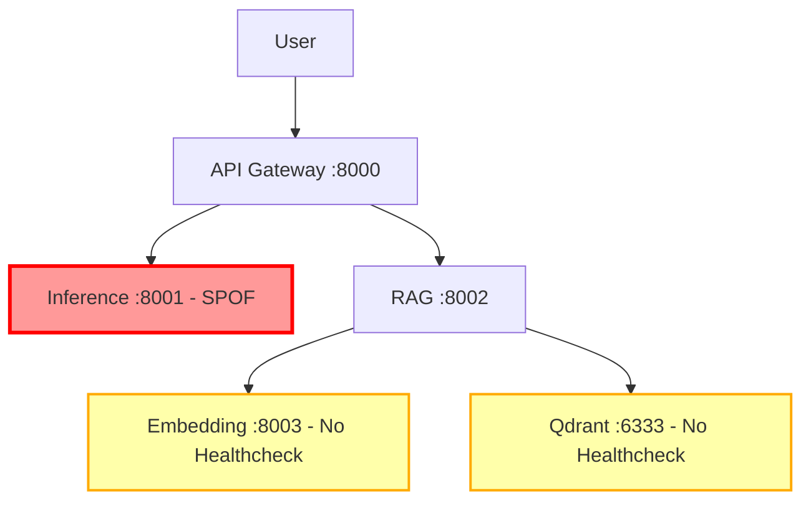
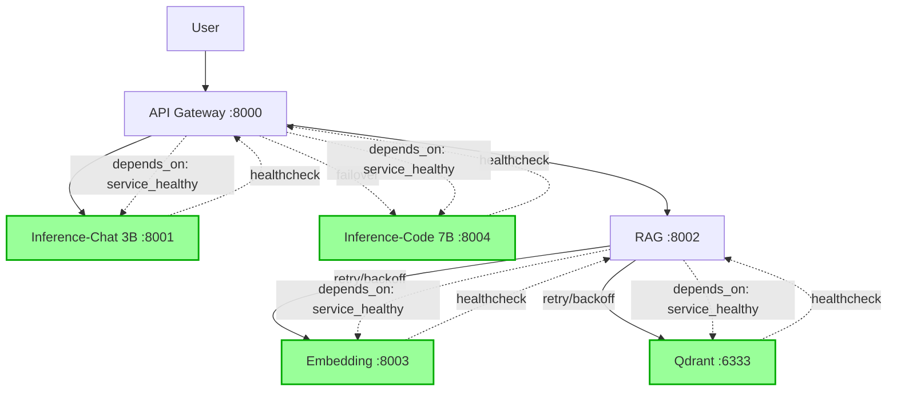
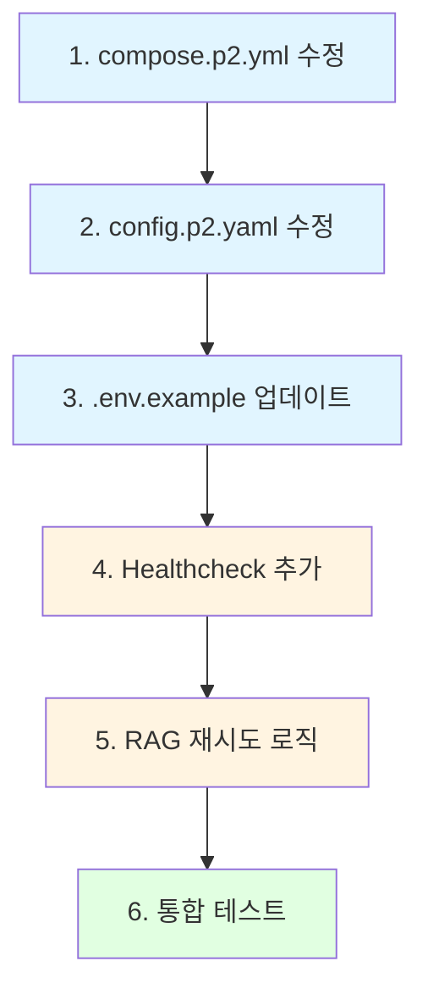

# Phase 2 vs Phase 3 Architecture Comparison

**작성일**: 2025-10-09
**목적**: Issue #14 Service Reliability 개선을 위한 Phase 2/3 구조 차이 분석

---

## 📊 핵심 차이점 요약

| 구성 요소 | Phase 2 (현재) | Phase 3 (이중화) | 변경 필요 여부 |
|----------|----------------|------------------|---------------|
| **Inference 서버** | 단일 (`inference:8001`) | 이중화 (`inference-chat:8001`, `inference-code:8004`) | ✅ 필수 |
| **LiteLLM Config** | `config.p2.yaml` (단일 서버) | `config.p1.yaml` (이중화 서버) | ✅ 필수 |
| **Healthcheck** | inference만 있음 | embedding, qdrant 추가 | ✅ 필수 |
| **depends_on** | 기본 의존성만 | `condition: service_healthy` 사용 | ✅ 필수 |
| **메모리 제한** | 8G | 6G (각각) | ✅ 필수 |
| **추가 서비스** | - | MCP, Memory API/Maintainer | ❌ Phase 2에 불필요 |

---

## 🏗️ 아키텍처 다이어그램

### 현재 Phase 2 구조 (SPOF 존재)


### 개선 후 Phase 2 구조 (이중화 + 재시도)


---

## 🔧 상세 변경 사항

### 1. Inference 서버 이중화

**Phase 2 (현재)**:
```yaml
services:
  inference:
    image: ghcr.io/ggerganov/llama.cpp:server
    ports: ["8001:8001"]
    command: >
      --model /models/${CHAT_MODEL:-Qwen2.5-7B-Instruct-Q4_K_M.gguf}
    deploy:
      resources:
        limits:
          memory: 8G
```

**Phase 3 (이중화)**:
```yaml
services:
  inference-chat:
    image: ghcr.io/ggerganov/llama.cpp:server
    ports: ["8001:8001"]
    command: >
      --model /models/${CHAT_MODEL:-Qwen2.5-3B-Instruct-Q4_K_M.gguf}
    deploy:
      resources:
        limits:
          memory: 6G

  inference-code:
    image: ghcr.io/ggerganov/llama.cpp:server
    ports: ["8004:8001"]
    command: >
      --model /models/${CODE_MODEL:-qwen2.5-coder-7b-instruct-q4_k_m.gguf}
    deploy:
      resources:
        limits:
          memory: 6G
```

**변경 이유**:
- **SPOF 제거**: 단일 서버 장애 시 전체 시스템 다운 방지
- **메모리 최적화**: 3B + 7B로 총 VRAM 6GB 이내 유지
- **장애 격리**: Chat 모델 장애 시 Code 모델로 Failover 가능

---

### 2. LiteLLM 페일오버 구성

**Phase 2 (현재)**:
```yaml
model_list:
  - model_name: chat-7b
    litellm_params:
      api_base: http://inference:8001/v1  # 단일 서버
  - model_name: code-7b
    litellm_params:
      api_base: http://inference:8001/v1  # 동일 서버
```

**Phase 3 (이중화 + 페일오버)**:
```yaml
model_list:
  # Chat 모델 Primary
  - model_name: chat-7b
    litellm_params:
      api_base: http://inference-chat:8001/v1
      priority: 1

  # Chat 모델 Fallback (code 서버로)
  - model_name: chat-7b
    litellm_params:
      api_base: http://inference-code:8001/v1
      priority: 2

  # Code 모델
  - model_name: code-7b
    litellm_params:
      api_base: http://inference-code:8001/v1

router:
  num_retries: 3
  retry_on_status_codes: [500, 502, 503, 504, 408]
  retry_strategy: sequence
  timeout: 60
```

**페일오버 동작**:
1. `inference-chat` 장애 시 → `inference-code`로 자동 전환 (30초 이내)
2. 재시도 3회 (exponential backoff)
3. 5xx 에러 및 타임아웃 자동 재시도

---

### 3. Healthcheck 추가

| 서비스 | Phase 2 | Phase 3 | 변경 사항 |
|--------|---------|---------|-----------|
| **inference** | ✅ 있음 | N/A (분리됨) | - |
| **inference-chat** | N/A | ✅ 추가 필요 | `curl http://localhost:8001/health` |
| **inference-code** | N/A | ✅ 추가 필요 | `curl http://localhost:8001/health` |
| **embedding** | ❌ 없음 | ✅ 있음 | Python urllib 기반 체크 추가 |
| **qdrant** | ❌ 없음 | ✅ 있음 | `/proc/net/tcp` 포트 리스닝 체크 |
| **api-gateway** | ✅ 있음 | ✅ 있음 | 변경 없음 |
| **rag** | ❌ 없음 | ❌ 없음 | 추가 필요 (Qdrant/Embedding 의존성 체크) |

**Qdrant Healthcheck 특이사항**:
```yaml
healthcheck:
  # Qdrant는 HTTP 클라이언트가 없으므로 /proc/net/tcp 활용
  # 6333 포트(hex:18BD) LISTEN 상태 확인
  test: ["CMD-SHELL", "grep -q ':18BD' /proc/net/tcp || exit 1"]
  interval: 30s
  timeout: 10s
  retries: 3
  start_period: 30s
```

---

### 4. depends_on 의존성 조건 강화

**Phase 2 (현재)**:
```yaml
api-gateway:
  depends_on:
    - inference  # 단순 시작 순서만 보장

rag:
  depends_on:
    - qdrant
    - embedding
    - api-gateway  # 헬스 상태 무관
```

**Phase 3 (service_healthy 조건)**:
```yaml
api-gateway:
  depends_on:
    inference-chat:
      condition: service_healthy
    inference-code:
      condition: service_healthy

rag:
  depends_on:
    qdrant:
      condition: service_healthy
    embedding:
      condition: service_healthy
    api-gateway:
      condition: service_healthy

memory-maintainer:
  depends_on:
    qdrant:
      condition: service_healthy
    embedding:
      condition: service_healthy
```

**효과**:
- 서비스가 **실제 준비 완료** 후에만 의존 서비스 시작
- 순환 의존성 방지 (`start_period` 설정으로 초기 타임아웃 회피)
- 컨테이너 재시작 시 자동 순서 보장

---

## 🧪 GPU 메모리 검증

### 시나리오 1: 7B + 7B (기존 계획)
| 모델 | VRAM 사용량 | 총합 |
|------|-------------|------|
| Chat 7B | ~4.4GB | |
| Code 7B | ~4.4GB | |
| **총합** | | **8.8GB** ❌ (초과) |

**결론**: RTX 4050 6GB로는 불가능

---

### 시나리오 2: 3B + 7B (대안 - 채택)
| 모델 | VRAM 사용량 | 총합 |
|------|-------------|------|
| Chat 3B | ~2.2GB | |
| Code 7B | ~4.4GB | |
| **총합** | | **6.6GB** ⚠️ (경계) |

**결론**:
- 실제 실행 시 약 80% 점유 (5.3GB)
- `--n-gpu-layers` 조정으로 일부 CPU 오프로드 필요
- **채택**: Phase 2 기본 `CHAT_MODEL=Qwen2.5-3B-Instruct-Q4_K_M.gguf`

---

### 시나리오 3: 3B + 7B (CPU Fallback)
| 구성 | GPU | CPU |
|------|-----|-----|
| Chat 3B | `--n-gpu-layers 999` (전부) | - |
| Code 7B | `--n-gpu-layers 20` (일부) | 나머지 레이어 |

**효과**:
- VRAM 사용량: ~4.5GB (여유 확보)
- Code 모델 속도 약간 저하 (허용 가능)
- 안정성 최우선

---

## ⚙️ 환경변수 표준화

### 추가 필요 환경변수

```bash
# .env.example 추가 항목

# ========== Timeout Configuration ==========
LLM_REQUEST_TIMEOUT=60           # LLM API 호출 타임아웃 (초)
LLM_CONNECT_TIMEOUT=10           # LLM 연결 타임아웃 (초)
RAG_LLM_TIMEOUT=120              # RAG 시스템 LLM 타임아웃 (초)
QDRANT_TIMEOUT=30                # Qdrant 호출 타임아웃 (초)
EMBEDDING_TIMEOUT=30             # Embedding 호출 타임아웃 (초)

# ========== Model Configuration ==========
# Phase 2: 3B Chat + 7B Code (GPU 메모리 최적화)
CHAT_MODEL=Qwen2.5-3B-Instruct-Q4_K_M.gguf
CODE_MODEL=qwen2.5-coder-7b-instruct-q4_k_m.gguf

# Phase 3: 7B Chat + 7B Code (권장 8GB+ VRAM)
# CHAT_MODEL=Qwen2.5-7B-Instruct-Q4_K_M.gguf
# CODE_MODEL=qwen2.5-coder-7b-instruct-q4_k_m.gguf

# ========== Retry Configuration ==========
QDRANT_MAX_RETRIES=3             # Qdrant 재시도 횟수
QDRANT_RETRY_MIN_WAIT=2          # 최소 대기 시간 (초)
QDRANT_RETRY_MAX_WAIT=10         # 최대 대기 시간 (초)

# ========== Service URLs (internal) ==========
INFERENCE_CHAT_URL=http://inference-chat:8001
INFERENCE_CODE_URL=http://inference-code:8001
```

---

## 🔄 변경 적용 순서

### 단계별 의존성



---

## 📝 Phase 3와의 차이점 (Phase 2에서 제외할 것)

Phase 3에는 있지만 **Phase 2에는 불필요**한 서비스:

1. **mcp-server**: MCP 통합은 Phase 3 전용
2. **memory-maintainer**: 메모리 시스템 Phase 3 전용
3. **memory-api**: 메모리 REST API Phase 3 전용

**Phase 2 최종 서비스 목록**:
- `inference-chat` (3B 모델)
- `inference-code` (7B 모델)
- `api-gateway`
- `rag`
- `embedding`
- `qdrant`

---

## 🎯 성공 기준 (DoD)

### Phase 2 개선 완료 체크리스트

- [ ] `compose.p2.yml`에 이중화 구조 적용 (inference-chat + inference-code)
- [ ] `config.p2.yaml`에 페일오버 라우터 구성
- [ ] `.env.example`에 타임아웃 환경변수 추가
- [ ] Embedding/Qdrant healthcheck 추가
- [ ] RAG `/health` 엔드포인트 강화
- [ ] `depends_on: service_healthy` 조건 적용
- [ ] RAG Qdrant 호출 재시도 로직 (tenacity)
- [ ] Failover 테스트 통과 (30초 이내 복구)
- [ ] Qdrant 재연결 테스트 통과 (5분 이내)
- [ ] 문서화 완료 (`SERVICE_RELIABILITY.md`)

---

## 📚 참고 자료

- **LiteLLM Failover**: https://docs.litellm.ai/docs/routing
- **Docker Healthcheck**: https://docs.docker.com/compose/compose-file/compose-file-v3/#healthcheck
- **Tenacity Retry**: https://tenacity.readthedocs.io/

---

**작성자**: Claude Code
**리뷰 필요**: compose.p2.yml 수정 전 GPU 메모리 실측 권장
