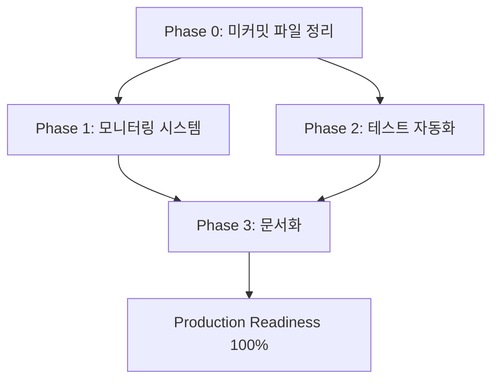
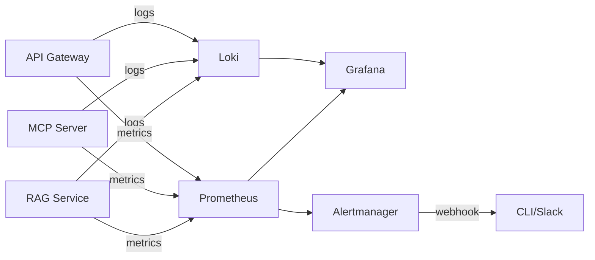
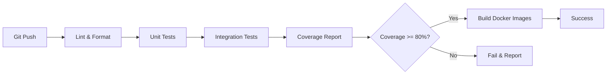

# 운영 준비도 90%→100% 달성 계획

## 문제 분석

### 1. 문제 정의 및 복잡성 평가
- **문제**: 프로덕션 준비도 90%→100% 달성을 위한 즉시 처리 및 우선 작업 완료
- **복잡성 수준**: 중간
- **예상 소요 시간**: 8-12시간 (2-3일)
- **주요 도전 과제**:
  - 기존 작업 산출물(fb_8.md, fb_9.md)과 현재 상태 일치성 확인
  - 모니터링 시스템의 범위 설정 (중앙화 로깅 vs 풀스택 관측성)
  - CI/CD 파이프라인의 컨테이너 환경 통합
  - 테스트 커버리지 목표치 설정 및 달성

### 2. 범위 및 제약조건
- **포함 범위**:
  - **즉시 처리**: 미커밋 파일 정리 (AGENTS.md, fb_8.md, fb_9.md)
  - **우선 작업 1**: 모니터링 시스템 구축 (로그 수집·메트릭·알림)
  - **우선 작업 2**: 테스트 자동화 (CI 파이프라인, 유닛/통합 테스트, 커버리지)
- **제외 범위**:
  - Phase 4 데스크톱 앱 개선 (다음 단계로 연기)
  - 성능 최적화 (API 캐싱, 병렬 실행 등)
  - PostgreSQL 마이그레이션
- **제약조건**:
  - 기존 Docker Compose 구조 유지 (Phase 1-3)
  - SQLite 기반 RBAC 시스템과 호환
  - WSL2 개발 환경에서 동작
  - 외부 SSD 경로 의존성 (/mnt/e/)
- **전제조건**:
  - Issue #8, #16, #18 완료 (RBAC + 승인 워크플로우 + 운영 준비)
  - Docker 환경 구성 완료 (compose.p1-p3.yml)
  - 기존 서비스 정상 동작 (API Gateway, MCP Server, RAG 등)

---

## 작업 분해

### Phase 0: 즉시 처리 - 미커밋 파일 정리 (30분)
**목표**: 작업 트리 정리 및 컨텍스트 동기화

| 작업 | 설명 | 완료 기준 (DoD) | 우선순위 |
|------|------|-----------------|----------|
| 0.1 파일 내용 검토 | AGENTS.md, fb_8.md, fb_9.md 변경 사항 분석 | 각 파일의 목적과 현재 상태 일치성 확인 | 높음 |
| 0.2 커밋 또는 폐기 결정 | 유지할 내용과 삭제할 내용 구분 | git status 클린 상태 | 높음 |
| 0.3 Git 커밋 | Conventional Commits 규칙 준수 | 변경 사항 커밋 완료 | 높음 |

**예상 산출물:**
- Git 커밋 메시지 (예: `docs: update AGENTS.md with approval workflow notes`)
- 정리된 작업 트리 (`git status` 클린)

---

### Phase 1: 모니터링 시스템 구축 (4-6시간)
**목표**: 중앙화된 로그 수집, 메트릭, 알림 시스템 기반 구축

| 작업 | 설명 | 완료 기준 (DoD) | 우선순위 |
|------|------|-----------------|----------|
| 1.1 요구사항 정의 | 모니터링 범위, 메트릭 종류, 알림 규칙 정의 | 요구사항 문서 작성 (`docs/ops/MONITORING_REQUIREMENTS.md`) | 높음 |
| 1.2 기술 스택 선정 | Prometheus + Grafana vs ELK vs Loki 선택 | 기술 스택 결정 및 근거 문서화 | 높음 |
| 1.3 로그 수집 구현 | 구조화된 로그 포맷 + 중앙 저장소 | 모든 서비스 로그가 한 곳에 수집됨 | 높음 |
| 1.4 메트릭 수집 구현 | API 응답 시간, 에러율, 리소스 사용률 | Prometheus exporter 통합 완료 | 중간 |
| 1.5 알림 규칙 설정 | 서비스 장애, 높은 에러율 감지 | 알림 테스트 통과 | 중간 |
| 1.6 Grafana 대시보드 | 주요 메트릭 시각화 | 대시보드 JSON 파일 커밋 | 낮음 |

**기술 스택 (제안):**
- **로그**: Loki + Promtail (경량, Grafana 통합 우수)
- **메트릭**: Prometheus + FastAPI Prometheus exporter
- **알림**: Alertmanager (Prometheus 내장) + Webhook (CLI 알림)
- **시각화**: Grafana

**데이터 모델:**
```yaml
# 주요 메트릭
- http_requests_total{service, method, status}
- http_request_duration_seconds{service, endpoint, quantile}
- rbac_permission_checks_total{result, role}
- approval_requests_total{status}
- mcp_tool_executions_total{tool, status}
- system_resource_usage{service, resource_type}
```

---

### Phase 2: 테스트 자동화 (4-6시간)
**목표**: CI/CD 파이프라인 구축 및 테스트 커버리지 확보

| 작업 | 설명 | 완료 기준 (DoD) | 우선순위 |
|------|------|-----------------|----------|
| 2.1 CI/CD 요구사항 정의 | 테스트 범위, 커버리지 목표, 배포 전략 | 요구사항 문서 작성 | 높음 |
| 2.2 GitHub Actions 워크플로우 | 푸시/PR 시 자동 테스트 실행 | `.github/workflows/ci.yml` 작성 | 높음 |
| 2.3 유닛 테스트 확장 | 기존 테스트 부족 영역 보완 | 각 서비스별 10개 이상 테스트 | 높음 |
| 2.4 통합 테스트 작성 | 서비스 간 통신 검증 | E2E 시나리오 5개 이상 통과 | 중간 |
| 2.5 커버리지 리포팅 | pytest-cov + Codecov 통합 | 커버리지 80% 이상 달성 | 중간 |
| 2.6 Docker 환경 테스트 | CI에서 컨테이너 빌드 및 테스트 | 모든 Phase 빌드 성공 | 중간 |

**CI 파이프라인 단계:**
```yaml
1. Lint & Format (Black, Ruff)
2. Unit Tests (pytest, 서비스별 격리)
3. Integration Tests (Docker Compose Phase 2 환경)
4. Coverage Report (pytest-cov)
5. Security Scan (Bandit, Safety)
6. Build Docker Images (Phase 1-3)
```

**테스트 우선순위:**
1. **높음**: RBAC 미들웨어, 승인 워크플로우, API Gateway 라우팅
2. **중간**: RAG 쿼리, Embedding 생성, MCP 도구 실행
3. **낮음**: CLI 유틸리티, 헬스체크 엔드포인트

---

### Phase 3: 문서화 및 검증 (2시간)
**목표**: 운영 가이드 업데이트 및 전체 시스템 검증

| 작업 | 설명 | 완료 기준 (DoD) | 우선순위 |
|------|------|-----------------|----------|
| 3.1 모니터링 가이드 작성 | 대시보드 사용법, 알림 해석 | `docs/ops/MONITORING_GUIDE.md` 작성 | 높음 |
| 3.2 CI/CD 가이드 작성 | 워크플로우 실행 방법, 트러블슈팅 | `docs/ops/CI_CD_GUIDE.md` 작성 | 중간 |
| 3.3 CLAUDE.md 업데이트 | Production readiness 100% 반영 | CLAUDE.md 최신화 | 높음 |
| 3.4 전체 시스템 검증 | Phase 3 환경에서 E2E 테스트 | 모든 서비스 정상 동작 확인 | 높음 |

**산출물:**
```
docs/ops/
├── MONITORING_REQUIREMENTS.md
├── MONITORING_GUIDE.md
├── CI_CD_GUIDE.md
└── DEPLOYMENT_CHECKLIST.md

.github/workflows/
├── ci.yml
└── cd.yml (선택적)

docker/
├── grafana/
│   └── dashboards/
│       └── system_overview.json
└── prometheus/
    └── prometheus.yml
```

---

## 실행 계획

### 우선순위 매트릭스
```
긴급 & 중요              | 중요하지만 덜 긴급
-------------------------|---------------------------
0.1-0.3 미커밋 파일 정리  | 1.6 Grafana 대시보드
1.1-1.3 로그/메트릭 수집  | 2.4 통합 테스트 확장
2.1-2.2 CI 파이프라인    | 3.2 CI/CD 가이드
3.3 CLAUDE.md 업데이트   |

긴급하지만 덜 중요       | 덜 중요 & 덜 긴급
-------------------------|---------------------------
1.4 메트릭 수집 구현     | 1.5 알림 규칙 세부 조정
2.3 유닛 테스트 확장     | 2.6 Docker 환경 테스트
```

### 마일스톤
- **Day 1 전반 (2시간)**: Phase 0 완료 + Phase 1 요구사항 정의 (1.1-1.2)
- **Day 1 후반 (4시간)**: Phase 1 핵심 구현 (1.3-1.4)
- **Day 2 전반 (4시간)**: Phase 2 CI 파이프라인 (2.1-2.3)
- **Day 2 후반 (2시간)**: Phase 2 커버리지 (2.4-2.5)
- **Day 3 (2시간)**: Phase 3 문서화 + 검증

### 위험 요소 및 대응 방안
| 위험 요소 | 가능성 | 영향도 | 대응 방안 |
|-----------|--------|--------|-----------|
| fb_8.md/fb_9.md 내용 불일치 | 중간 | 낮음 | Phase 0에서 철저히 검토, 불필요 시 과감히 삭제 |
| Prometheus 메모리 오버헤드 | 중간 | 중간 | Retention 기간 단축 (7일), 메트릭 샘플링 간격 조정 |
| CI 파이프라인 빌드 시간 초과 | 높음 | 중간 | 병렬 실행, Docker 레이어 캐싱 활용 |
| 테스트 커버리지 80% 미달 | 중간 | 높음 | 핵심 경로 우선 테스트, 임시 목표 75%까지 허용 후 후속 티켓 생성 |
| GitHub Actions 무료 티어 제한 | 낮음 | 중간 | Self-hosted runner 고려 또는 실행 빈도 조정 |

---

## 품질 체크리스트

### 각 작업 완료 시 확인사항
- [ ] 요구사항 충족 여부 확인 (기능 테스트)
- [ ] 코드 리뷰 완료 (self-review + 린트 통과)
- [ ] 관련 문서 업데이트 (README, 운영 가이드)
- [ ] 다음 작업 차단 요소 없음 (의존성 확인)
- [ ] Git 커밋 메시지 작성 (Conventional Commits)

### 전체 완료 기준 (DoD)
- [ ] Phase 0: `git status` 클린 상태, 관련 문서 커밋 완료
- [ ] Phase 1: 모든 서비스 로그/메트릭이 Grafana에서 조회 가능
- [ ] Phase 2: GitHub Actions CI 워크플로우 성공, 커버리지 80% 이상
- [ ] Phase 3: `docs/ops/` 가이드 문서 3개 이상 작성
- [ ] CLAUDE.md에 Production readiness 100% 반영
- [ ] 전체 시스템 E2E 테스트 통과 (`make up-p3` → 헬스체크 → 도구 실행)

---

## 리소스 및 참고자료

### 필요한 리소스
- **인력**: 1명 (백엔드/DevOps 개발자, 10-14시간)
- **도구**:
  - Prometheus, Loki, Grafana (Docker Compose로 배포)
  - GitHub Actions (무료 티어)
  - pytest, pytest-cov, pytest-asyncio
  - Docker, Docker Compose
- **인프라**: 로컬 개발 환경 (WSL2), 외부 SSD (/mnt/e/)

### 학습 자료
- [Prometheus Getting Started](https://prometheus.io/docs/introduction/overview/)
- [Grafana Loki Documentation](https://grafana.com/docs/loki/latest/)
- [GitHub Actions CI/CD](https://docs.github.com/en/actions)
- [pytest-cov Coverage](https://pytest-cov.readthedocs.io/)
- [FastAPI Prometheus Instrumentation](https://github.com/trallnag/prometheus-fastapi-instrumentator)

### 유사 사례
- **Issue #14**: 서비스 안정성 개선 (헬스체크, 재시도 메커니즘)
- **Issue #18**: RBAC 운영 준비 (테스트, 벤치마크, 문서화)
- **GitLab CI/CD**: Self-hosted runner, Docker-in-Docker 패턴

### 프로젝트 문서
- `docs/ops/SERVICE_RELIABILITY.md` - 서비스 안정성 가이드
- `docs/security/SECURITY.md` - 보안 시스템 개요
- `docs/progress/v1/fb_7.md` - Issue #14 구현 내역
- `docs/progress/v1/ri_9.md` - Issue #18 계획

---

## 아키텍처 다이어그램

### 작업 의존성 그래프


### 모니터링 아키텍처


### CI/CD 파이프라인 플로우


---

## 💡 추가 고려사항

### Phase 완료 후 회고
- **Phase 0 후**: fb_8.md, fb_9.md 내용이 현재 계획과 불일치하면 아카이브 처리
- **Phase 1 후**: Prometheus 메모리 사용량 모니터링, 7일 이상 데이터 축적 시 retention 조정
- **Phase 2 후**: CI 빌드 시간이 10분 초과 시 병렬화 전략 재검토

### 예상 이슈 및 대응
- **Grafana 데이터소스 설정**: Loki/Prometheus URL을 Docker 내부 네트워크 주소로 설정
- **GitHub Actions 권한**: Docker 빌드 시 GHCR 푸시 권한 필요 (선택적)
- **테스트 격리**: 통합 테스트 시 각 테스트마다 DB 초기화 필요 (fixture 활용)

### 후속 작업 (Phase 4 이후로 연기)
- [ ] Phase 4 데스크톱 앱 개선 (스마트 모델 선택, 코드 하이라이팅)
- [ ] 성능 최적화 (API 캐싱, MCP 병렬 실행)
- [ ] PostgreSQL 마이그레이션 (SQLite 동시성 제약 해결)
- [ ] Kubernetes 배포 (프로덕션 확장성)

---

## 구현 우선순위 작업 목록

### 즉시 시작 (오늘)
1. [ ] AGENTS.md, fb_8.md, fb_9.md 내용 검토
2. [ ] 불필요 내용 제거 또는 커밋
3. [ ] Phase 1 요구사항 문서 작성 시작

### Day 1 완료 목표
4. [ ] Prometheus + Loki + Grafana Docker Compose 설정
5. [ ] FastAPI 서비스에 Prometheus exporter 통합
6. [ ] 기본 메트릭 수집 확인

### Day 2 완료 목표
7. [ ] GitHub Actions CI 워크플로우 작성
8. [ ] 유닛/통합 테스트 확장 (커버리지 80% 목표)
9. [ ] pytest-cov 리포트 생성

### Day 3 완료 목표
10. [ ] 모니터링/CI 가이드 문서 작성
11. [ ] CLAUDE.md 업데이트 (100% 달성)
12. [ ] 전체 시스템 검증 및 Git 커밋

---

## Claude Code 작업 가이드
- Phase 0 실행 시 `git status`와 `git diff`로 변경 파일을 확인하고 필요 시 `git restore`/`git add`를 사용한다.
- Phase 1에서는 `docker/compose.p3.yml`을 그대로 유지한 채 `docker/prometheus/prometheus.yml`, `docker/grafana/dashboards/system_overview.json`, `docs/ops/MONITORING_REQUIREMENTS.md`를 생성하거나 갱신한다.
- FastAPI 서비스(metric 노출)는 `services/api-gateway/main.py`, `services/mcp-server/app.py`, `services/rag/main.py`에 `prometheus_fastapi_instrumentator`를 추가해 구현한다.
- Phase 2 CI 설정은 `.github/workflows/ci.yml` 새 파일을 작성하고 Black·Ruff·pytest·docker compose 단계를 모두 정의한다.
- 테스트 커버리지는 `pytest --cov=services --cov=desktop-app --cov-report=term-missing` 명령을 기준으로 80%를 목표로 한다.
- Phase 3 문서화는 `docs/ops/MONITORING_GUIDE.md`, `docs/ops/CI_CD_GUIDE.md`, `docs/ops/DEPLOYMENT_CHECKLIST.md`를 신규 작성하고 CLAUDE.md에 운영 준비 100% 달성 기록을 남긴다.

---

## 🎯 성공 기준
- **Production readiness**: 90% → **100%**
- **모니터링 시스템**: Grafana 대시보드 1개 이상 동작
- **테스트 자동화**: GitHub Actions CI 성공, 커버리지 80% 이상
- **운영 문서**: `docs/ops/` 가이드 3개 작성
- **최종 검증**: `make up-p3` 후 전체 서비스 정상 동작
