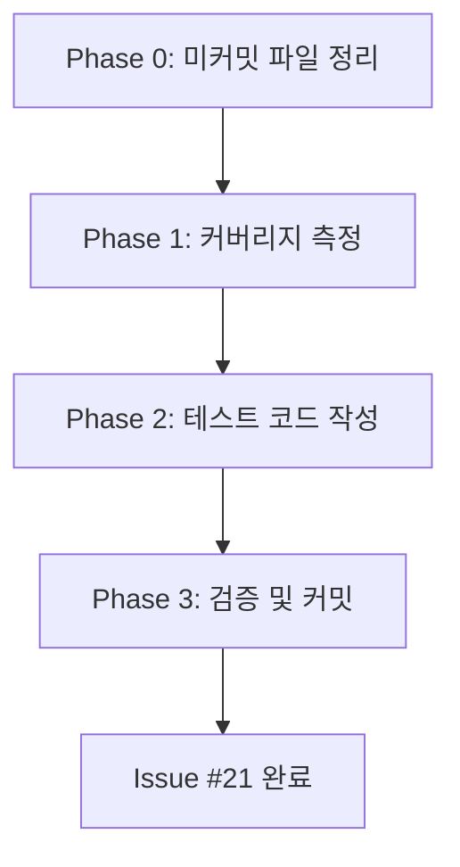
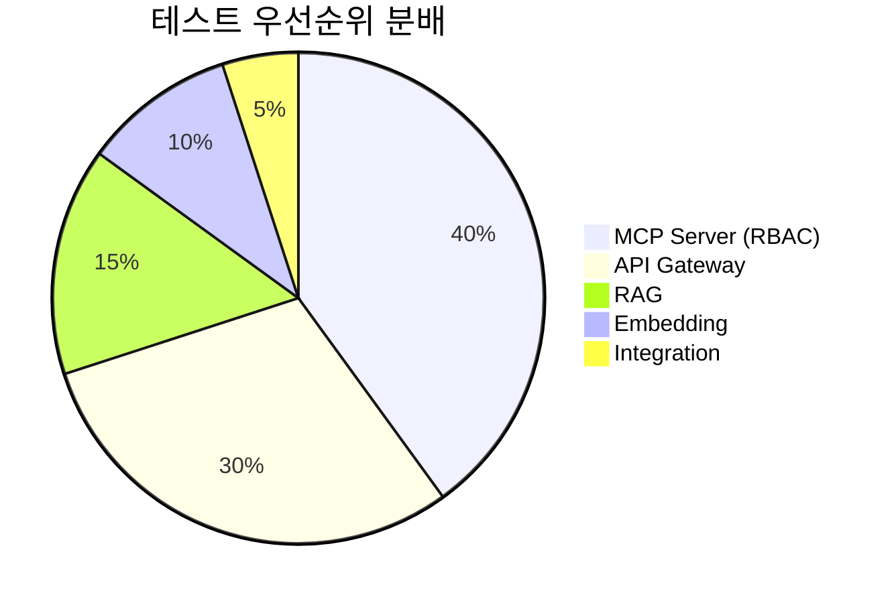

# 미커밋 문서 정리 + 테스트 커버리지 80% 달성 계획

## 문제 분석

### 1. 문제 정의 및 복잡성 평가
- **문제**: 미커밋 문서 정리 및 테스트 커버리지 80% 달성 (Issue #21)
- **복잡성 수준**: 중간
- **예상 소요 시간**: 4-6시간
- **주요 도전 과제**:
  - 기존 계획 문서(fb_8.md, fb_9.md, fb_10.md)의 필요성 판단
  - 현재 커버리지 파악 및 부족 영역 식별
  - 테스트 작성 우선순위 결정 (핵심 경로 vs 전체 커버리지)
  - 비동기 FastAPI 테스트 환경 설정

### 2. 범위 및 제약조건
- **포함 범위**:
  - **Phase 0**: 미커밋 파일 정리 (AGENTS.md, fb_8.md, fb_9.md, fb_10.md)
  - **Phase 1**: 현재 커버리지 측정 및 분석
  - **Phase 2**: 우선순위별 테스트 코드 작성
  - **Phase 3**: 커버리지 80% 달성 검증 및 커밋
- **제외 범위**:
  - E2E 테스트 (통합 테스트만 포함)
  - GPU 필요 테스트 (로컬 수동 실행)
  - Desktop App 테스트 (현재 우선순위 낮음)
- **제약조건**:
  - 기존 CI/CD 워크플로우 호환성 유지
  - pytest + pytest-asyncio + httpx 환경
  - Docker Compose Phase 2 환경에서 테스트 실행
- **전제조건**:
  - Issue #20 완료 (모니터링 + CI/CD 구축 완료)
  - 기존 테스트 16개 작성 완료 (RAG 5, Embedding 7, Integration 4)

---

## 작업 분해

### Phase 0: 즉시 처리 - 미커밋 문서 정리 (30분)
**목표**: 작업 트리 클린 상태 유지

| 작업 | 설명 | 완료 기준 (DoD) | 우선순위 |
|------|------|-----------------|----------|
| 0.1 파일 내용 검토 | AGENTS.md, fb_8.md, fb_9.md, fb_10.md 내용 확인 | 각 파일의 필요성 판단 | 높음 |
| 0.2 커밋 또는 삭제 결정 | 유지: `git add` → `git commit` / 폐기: `git restore` | `git status` 클린 | 높음 |
| 0.3 Git 커밋 | Conventional Commits 규칙 준수 | 변경 사항 커밋 완료 | 높음 |

**판단 기준:**
- `AGENTS.md`: 승인 워크플로우 관련 메모 → 유지 (참고 자료)
- `docs/progress/v1/fb_8.md`: 승인 워크플로우 계획 → 아카이브 (Issue #16 완료)
- `docs/progress/v1/fb_9.md`: RBAC 운영 준비 계획 → 아카이브 (Issue #18 완료)
- `docs/progress/v1/fb_10.md`: 모니터링 + CI/CD 계획 → 유지 (Issue #20 참조 자료)

---

### Phase 1: 현재 커버리지 측정 및 분석 (30분)
**목표**: 테스트 부족 영역 식별

| 작업 | 설명 | 완료 기준 (DoD) | 우선순위 |
|------|------|-----------------|----------|
| 1.1 전체 커버리지 측정 | `pytest --cov=services --cov-report=term-missing` | 현재 커버리지 % 파악 | 높음 |
| 1.2 서비스별 커버리지 분석 | 각 서비스 커버리지 개별 측정 | 부족 영역 우선순위 리스트 | 높음 |
| 1.3 테스트 우선순위 결정 | RBAC, MCP, API Gateway 우선 | 작업 계획 수립 | 높음 |

**측정 명령:**
```bash
# 전체 커버리지
pytest --cov=services --cov-report=term-missing --cov-report=html

# 서비스별 커버리지
pytest --cov=services/api-gateway --cov-report=term
pytest --cov=services/mcp-server --cov-report=term
pytest --cov=services/rag --cov-report=term
pytest --cov=services/embedding --cov-report=term
```

---

### Phase 2: 테스트 코드 작성 (2-3시간)
**목표**: 우선순위별 테스트 보강

| 작업 | 설명 | 완료 기준 (DoD) | 우선순위 |
|------|------|-----------------|----------|
| 2.1 MCP Server 테스트 확장 | RBAC 미들웨어, 도구 실행 테스트 | 커버리지 +20% | 높음 |
| 2.2 API Gateway 테스트 확장 | 라우팅, 페일오버, 헬스체크 | 커버리지 +15% | 높음 |
| 2.3 RAG 테스트 확장 | 쿼리, 인덱싱, 에러 처리 | 커버리지 +10% | 중간 |
| 2.4 Embedding 테스트 확장 | 배치 처리, 에러 처리 | 커버리지 +5% | 중간 |
| 2.5 통합 테스트 추가 | 서비스 간 통신 검증 | E2E 시나리오 3개 | 낮음 |

**테스트 우선순위 (CLAUDE.md 기준):**
1. **높음**: RBAC 미들웨어, 승인 워크플로우, API Gateway 라우팅
2. **중간**: RAG 쿼리, Embedding 생성, MCP 도구 실행
3. **낮음**: CLI 유틸리티, 헬스체크 엔드포인트

**예상 추가 테스트 수:**
- MCP Server: 15개 (RBAC 8, 도구 실행 5, 샌드박스 2)
- API Gateway: 10개 (라우팅 4, 페일오버 3, 헬스체크 3)
- RAG: 5개 (쿼리 2, 인덱싱 2, 에러 1)
- Embedding: 3개 (배치 1, 에러 2)
- Integration: 3개 (서비스 간 통신)
- **총 36개 테스트 추가** (기존 16 + 36 = 52개)

---

### Phase 3: 검증 및 커밋 (1시간)
**목표**: 커버리지 80% 달성 확인 및 문서화

| 작업 | 설명 | 완료 기준 (DoD) | 우선순위 |
|------|------|-----------------|----------|
| 3.1 최종 커버리지 측정 | 전체 및 서비스별 커버리지 재측정 | 80% 이상 달성 | 높음 |
| 3.2 CI 통과 확인 | GitHub Actions 워크플로우 성공 | 모든 테스트 통과 | 높음 |
| 3.3 문서 업데이트 | CLAUDE.md에 커버리지 결과 반영 | 문서 갱신 완료 | 중간 |
| 3.4 Git 커밋 | `test: expand coverage for issue-21` | 변경 사항 커밋 | 높음 |

**검증 체크리스트:**
```bash
# 1. 로컬 테스트 실행
pytest --cov=services --cov-report=term-missing --cov-report=html

# 2. 커버리지 확인
# WSL: wslview htmlcov/index.html, Linux: xdg-open htmlcov/index.html, macOS: open htmlcov/index.html
wslview htmlcov/index.html  # 환경에 맞는 명령 사용

# 3. CI 테스트 실행 (선택)
docker compose -f docker/compose.p2.cpu.yml up -d
pytest services/

# 4. 커버리지 80% 이상 확인
# services/ 전체: >= 80%
# 핵심 서비스 (mcp-server, api-gateway, rag): >= 85%
```

---

## 실행 계획

### 우선순위 매트릭스
```
긴급 & 중요              | 중요하지만 덜 긴급
-------------------------|---------------------------
0.1-0.3 미커밋 파일 정리  | 2.4 Embedding 테스트 확장
1.1-1.3 커버리지 측정     | 2.5 통합 테스트 추가
2.1 MCP Server 테스트    | 3.3 문서 업데이트
2.2 API Gateway 테스트   |

긴급하지만 덜 중요       | 덜 중요 & 덜 긴급
-------------------------|---------------------------
2.3 RAG 테스트 확장      | Desktop App 테스트 (제외)
3.1-3.2 검증 및 CI       | E2E 테스트 (제외)
```

### 마일스톤
- **0-30분**: Phase 0 완료 (미커밋 파일 정리)
- **30-60분**: Phase 1 완료 (커버리지 측정 및 분석)
- **60-240분**: Phase 2 완료 (테스트 코드 작성)
- **240-300분**: Phase 3 완료 (검증 및 커밋)

### 위험 요소 및 대응 방안
| 위험 요소 | 가능성 | 영향도 | 대응 방안 |
|-----------|--------|--------|-----------|
| 현재 커버리지가 예상보다 낮음 (50% 미만) | 중간 | 높음 | 목표를 70%로 조정, 핵심 경로만 우선 테스트 |
| 비동기 테스트 작성 복잡도 | 중간 | 중간 | 기존 테스트 패턴 재사용, `pytest-asyncio` fixture 활용 |
| CI 환경에서 테스트 실패 | 낮음 | 높음 | 로컬 Docker 환경에서 사전 검증, Mock 사용 |
| 테스트 작성 시간 초과 | 높음 | 중간 | 핵심 서비스 우선, 나머지는 후속 이슈로 분리 |
| fb_8.md/fb_9.md 삭제 후 참조 필요 | 낮음 | 낮음 | Git 히스토리에서 복구 가능, 필요 시 아카이브 폴더 생성 |

---

## 품질 체크리스트

### 각 작업 완료 시 확인사항
- [ ] 요구사항 충족 여부 확인 (테스트 통과)
- [ ] 코드 리뷰 완료 (self-review + 린트 통과)
- [ ] 커버리지 증가 확인 (최소 +5% 이상)
- [ ] 다음 작업 차단 요소 없음
- [ ] Git 커밋 메시지 작성 (Conventional Commits)

### 전체 완료 기준 (DoD)
- [ ] Phase 0: `git status` 클린 상태
- [ ] Phase 1: 현재 커버리지 % 파악 완료
- [ ] Phase 2: 테스트 코드 36개 이상 추가
- [ ] Phase 3: 전체 커버리지 80% 이상 달성
- [ ] GitHub Actions CI 워크플로우 성공
- [ ] CLAUDE.md에 커버리지 결과 반영
- [ ] Git 커밋 완료 (`test: expand coverage for issue-21`)

---

## 리소스 및 참고자료

### 필요한 리소스
- **인력**: 1명 (백엔드 개발자, 4-6시간)
- **도구**:
  - pytest, pytest-cov, pytest-asyncio
  - httpx (FastAPI 테스트)
  - Docker, Docker Compose (Phase 2 CPU 환경)
- **인프라**: 로컬 개발 환경 (WSL2)

### 학습 자료
- https://docs.pytest.org/
- https://pytest-cov.readthedocs.io/
- https://fastapi.tiangolo.com/tutorial/testing/
- https://pytest-asyncio.readthedocs.io/

### 유사 사례
- Issue #18: RBAC 운영 준비 (10개 통합 테스트 작성)
- Issue #20: 모니터링 + CI/CD (16개 테스트 작성)

### 프로젝트 문서
- `docs/ops/CI_CD_GUIDE.md` - CI/CD 및 테스트 가이드
- `services/mcp-server/tests/` - 기존 RBAC 테스트 참고
- `.github/workflows/ci.yml` - CI 워크플로우 설정

---

## 아키텍처 다이어그램

### 작업 의존성 그래프


### 테스트 커버리지 목표


---

## 💡 추가 고려사항

### Phase 완료 후 회고
- Phase 0 후: fb_8.md, fb_9.md가 필요 없다면 과감히 삭제
- Phase 1 후: 커버리지 50% 미만이면 목표를 70%로 조정
- Phase 2 후: 테스트 작성 시간이 3시간 초과 시 핵심 경로만 우선

### 예상 이슈 및 대응
- 비동기 테스트 복잡도: 기존 `conftest.py`의 `async_client` fixture 재사용
- Mock 서비스 필요: CPU 환경에서 mock-inference 서비스 활용
- 테스트 격리: 각 테스트마다 DB 초기화 (pytest fixture)

### 후속 작업 (선택적)
- E2E 테스트 추가 (별도 이슈)
- Desktop App 테스트 (Phase 4 개선 시)
- GPU 통합 테스트 자동화 (CI/CD 확장)

---

## 구현 우선순위 작업 목록

### 즉시 시작 (0-30분)
1. `git status`로 변경 파일 확인
2. `AGENTS.md`, `fb_8.md`, `fb_9.md`, `fb_10.md` 내용 검토
3. 유지할 파일 커밋, 불필요한 파일 삭제

### Phase 1 완료 목표 (30-60분)
4. `pytest --cov=services --cov-report=term-missing` 실행
5. 서비스별 커버리지 분석 및 우선순위 결정
6. 테스트 작성 계획 수립

### Phase 2 완료 목표 (60-240분)
7. MCP Server 테스트 15개 작성 (RBAC, 도구 실행)
8. API Gateway 테스트 10개 작성 (라우팅, 페일오버)
9. RAG 테스트 5개 작성 (쿼리, 인덱싱)
10. Embedding 테스트 3개 작성 (배치, 에러)
11. Integration 테스트 3개 작성 (서비스 간 통신)

### Phase 3 완료 목표 (240-300분)
12. 최종 커버리지 측정 (80% 이상 확인)
13. GitHub Actions CI 통과 확인
14. CLAUDE.md 업데이트
15. Git 커밋: `test: expand coverage for issue-21`

---

## Claude Code 작업 가이드
- Phase 0에서 `git status`, `git diff`로 변경 파일 확인 후 `git add` 또는 `git restore` 사용
- Phase 1에서 `pytest --cov=services --cov-report=html` 실행 후 `htmlcov/index.html` 확인
- Phase 2에서 기존 테스트 패턴(`services/*/tests/test_*.py`) 참고하여 작성
- 비동기 테스트는 `@pytest.mark.asyncio` + `async_client` fixture 사용
- Mock 서비스는 `docker/compose.p2.cpu.yml`의 mock-inference 활용
- Phase 3에서 `pytest --cov=services --cov-report=term-missing` 재실행하여 80% 달성 검증

---

## 🎯 성공 기준
- Phase 0: `git status` 클린 상태
- Phase 1: 현재 커버리지 파악 완료
- Phase 2: 테스트 코드 36개 추가 (기존 16 + 36 = 52개)
- Phase 3: 전체 커버리지 80% 이상 달성
- 최종: GitHub Actions CI 성공, CLAUDE.md 업데이트, Git 커밋 완료
