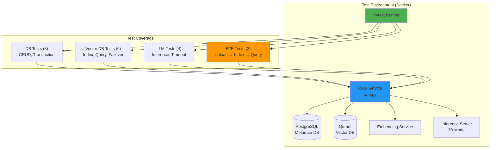
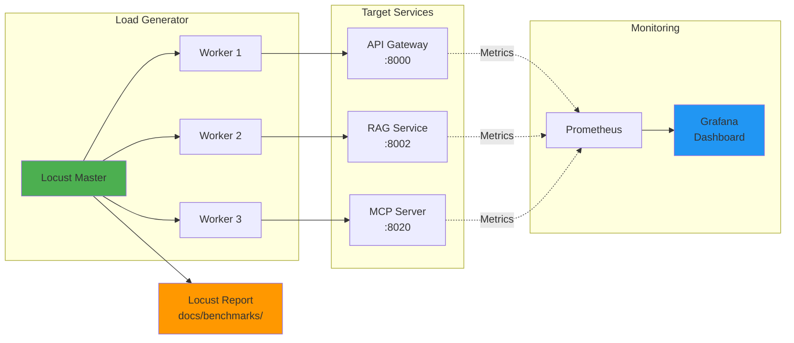
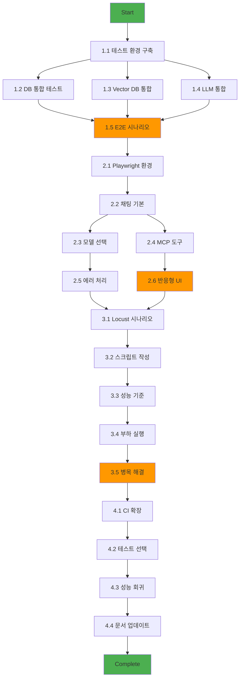

# Feature Breakdown: Testing & Quality Assurance Enhancement (Priority 1)

**문제**: 1순위 - 추가 테스트 강화 (RAG 커버리지 75%+, E2E 자동화, 부하 테스트)
**생성일**: 2025-10-14
**우선순위**: P1 (High)
**예상 소요 시간**: 2-3주 (팀 기준)

---

## 문제 분석

### 1. 문제 정의 및 복잡성 평가

**문제**:
프로덕션 준비도 95%를 100%로 끌어올리기 위해 테스트 및 QA 인프라를 강화합니다. 현재 RAG 서비스는 67% 커버리지(unit test 실용 최대치)이며, E2E 및 부하 테스트가 부재합니다.

**복잡성 수준**: 중간~높음
- RAG 커버리지 향상: 중간 (통합 테스트 환경 구축 필요)
- E2E 자동화: 높음 (Playwright 학습 곡선, 비동기 UI 처리)
- 부하 테스트: 중간 (Locust 설정, 시나리오 설계)

**예상 소요 시간**:
- RAG 커버리지 개선 (67% → 75%): 1주
- E2E 자동화 테스트 (Playwright): 1-1.5주
- 부하 테스트 (Locust): 3-5일
- **총계**: 2-3주 (1인 기준), 1.5-2주 (2인 팀)

**주요 도전 과제**:
1. **기술적**:
   - PostgreSQL + Qdrant + LLM 실제 환경에서의 통합 테스트
   - Docker Desktop 없이 WSL2 환경에서 Playwright 실행
   - GPU 서버 부하 테스트 시 안정성 보장
2. **비즈니스적**:
   - 테스트 실행 시간 증가로 인한 개발 속도 저하 방지
   - CI/CD 파이프라인에서의 테스트 비용 관리

### 2. 범위 및 제약조건

**포함 범위**:
- ✅ RAG 서비스 통합 테스트 (67% → 75% 커버리지)
- ✅ Desktop App E2E 자동화 테스트 (Playwright)
- ✅ API 서비스 부하 테스트 (Locust)
- ✅ CI/CD 파이프라인 통합
- ✅ 성능 벤치마크 기준 수립

**제외 범위**:
- ❌ 100% 커버리지 목표 (비현실적, ROI 낮음)
- ❌ 모바일 앱 테스트 (현재 Desktop/Web만 지원)
- ❌ 보안 침투 테스트 (별도 Issue로 분리)
- ❌ 다국어 UI 테스트 (현재 한국어/영어만)

**제약조건**:
- **시간**: 2-3주 내 완료 (프로덕션 배포 일정)
- **기술**: WSL2 환경에서 Docker 기반 실행 필수
- **자원**:
  - GPU 서버 1대 (RTX 4050 6GB)
  - 외장 SSD 1TB (/mnt/e)
  - GitHub Actions CI 무료 티어 (2000분/월)

**전제조건**:
- ✅ Issue #20 완료 (모니터링 + CI/CD 구축)
- ✅ Issue #22 완료 (Unit Test 117개 작성)
- ✅ Issue #23 완료 (RAG Integration Test 6개)
- ✅ Phase 2 Docker 스택 안정화

---

## 작업 분해

### Phase 1: RAG 통합 테스트 강화 (1주)
**목표**: RAG 서비스 커버리지 67% → 75% 달성

| 작업 | 설명 | 완료 기준 (DoD) | 우선순위 |
|------|------|-----------------|----------|
| **1.1 테스트 환경 구축** | PostgreSQL + Qdrant + Embedding 실제 환경 | Docker Compose 설정 완료, Health checks 통과 | 높음 |
| **1.2 DB 통합 테스트** | PostgreSQL CRUD, Transaction, Migration 테스트 | 8개 테스트 작성, 커버리지 +3% | 높음 |
| **1.3 Vector DB 통합 테스트** | Qdrant 인덱싱, 쿼리, 페일오버 테스트 | 6개 테스트 작성, 커버리지 +2% | 높음 |
| **1.4 LLM 통합 테스트** | Actual LLM inference, 타임아웃, 에러 처리 | 4개 테스트 작성, 커버리지 +3% | 중간 |
| **1.5 E2E 시나리오 테스트** | 문서 업로드 → 인덱싱 → 쿼리 전체 플로우 | 3개 시나리오 통과, 총 75% 달성 | 높음 |

**산출물**:
- `services/rag/tests/integration_extended/` (21개 새 테스트)
- `docs/rag_integration_coverage.json` (확장 커버리지 리포트 업데이트)
- `Makefile` (로컬 전용 `test-rag-integration-extended` 타깃 추가)
- `docs/progress/v1/RAG_INTEGRATION_EXTENDED.md` (상세 보고서)

---

### Phase 2: E2E 자동화 테스트 (Playwright) (1-1.5주)
**목표**: Desktop App 주요 기능 E2E 자동화

| 작업 | 설명 | 완료 기준 (DoD) | 의존성 |
|------|------|-----------------|--------|
| **2.1 Playwright 환경 구축** | WSL2에서 Playwright 설치 및 설정 | `npx playwright test` 실행 성공 | Phase 1 완료 |
| **2.2 채팅 기본 시나리오** | 메시지 전송, 응답 수신, 히스토리 저장 | 5개 테스트 통과 | 2.1 완료 |
| **2.3 모델 선택 시나리오** | Auto/Manual 모드 전환, Chat/Code 모델 선택 | 4개 테스트 통과 | 2.2 완료 |
| **2.4 MCP 도구 연동** | Git 명령어 실행, 파일 읽기/쓰기 UI 검증 | 6개 테스트 통과 | 2.2 완료 |
| **2.5 에러 처리 시나리오** | 네트워크 오류, 타임아웃, 모델 실패 UI 처리 | 4개 테스트 통과 | 2.3 완료 |
| **2.6 반응형 UI 테스트** | 화면 크기 변경, 코드 블록 렌더링, 복사 기능 | 3개 테스트 통과 | 2.4 완료 |

**기술 스택**:
- **Playwright** (v1.45+): Chromium, Firefox, WebKit 지원
- **Test Runner**: Playwright Test (TypeScript)
- **Assertions**: expect() API
- **Fixtures**: Custom fixtures for app startup/teardown

**산출물**:
- `desktop-app/tests/e2e/` (22개 E2E 테스트)
- `playwright.config.ts` (WSL2 최적화 설정)
- `docs/ops/E2E_TESTING_GUIDE.md` (실행 가이드)
- GitHub Actions 워크플로우 통합 (`.github/workflows/e2e.yml`)

> ⚠️ 모델 호출을 위해 `make up-p3` 스택이 필요하므로 GPU가 장착된 로컬 환경 혹은 동등한 self-hosted 러너에서만 실행 가능합니다.

---

### Phase 3: 부하 테스트 인프라 (Locust) (3-5일)
**목표**: API 서비스 병목 파악 및 성능 기준 수립

| 작업 | 설명 | 완료 기준 (DoD) | 위험도 |
|------|------|-----------------|--------|
| **3.1 Locust 시나리오 설계** | API Gateway, RAG, MCP 부하 시나리오 정의 | 3개 시나리오 문서화 | 낮음 |
| **3.2 Locust 스크립트 작성** | Python 부하 테스트 스크립트 작성 | 스크립트 실행 가능 | 중간 |
| **3.3 성능 기준 수립** | RPS, 레이턴시, 에러율 목표 설정 | 벤치마크 기준 문서화 | 중간 |
| **3.4 부하 테스트 실행** | 단계적 부하 증가 (10 → 100 users) | 병목 지점 3개 이상 파악 | 높음 |
| **3.5 병목 해결 및 재측정** | 식별된 병목 최적화 후 재테스트 | 목표 RPS 80% 달성 | 중간 |

**시나리오 설계**:

1. **API Gateway Stress Test**
   - Target: `/v1/chat/completions` endpoint
   - Load: 10 → 50 → 100 concurrent users
   - Duration: 5분 (각 단계)
   - Success Criteria: 95th percentile < 2초, 에러율 < 1%

2. **RAG Query Performance Test**
   - Target: `/query` endpoint (문서 검색)
   - Load: 5 → 20 → 50 concurrent users
   - Duration: 3분 (각 단계)
   - Success Criteria: 95th percentile < 3초, Qdrant 타임아웃 < 0.1%

3. **MCP Tool Execution Test**
   - Target: MCP server `/execute` endpoint
   - Load: 3 → 10 → 20 concurrent users (도구 실행은 무거움)
   - Duration: 2분 (각 단계)
   - Success Criteria: 95th percentile < 5초, sandbox 격리 유지

**산출물**:
- `tests/load/locustfile.py` (3개 시나리오)
- `tests/load/config.yaml` (시나리오별 설정)
- `docs/ops/LOAD_TESTING_GUIDE.md` (실행 가이드)
- `docs/benchmarks/` (성능 벤치마크 결과)
- `Makefile` (로컬 전용 `test-load` 타깃 추가)

> ⚠️ 실제 모델 및 GPU 서버를 대상으로 하므로, 부하 테스트는 로컬 GPU 환경 또는 self-hosted 인프라에서만 수행합니다.

---

### Phase 4: CI/CD 통합 및 문서화 (2-3일)
**목표**: 모든 테스트를 CI/CD 파이프라인에 통합

| 작업 | 설명 | 완료 기준 (DoD) | 위험도 |
|------|------|-----------------|--------|
| **4.1 GitHub Actions 확장** | RAG 통합, E2E, 부하 테스트 워크플로우 추가 | 모든 워크플로우 통과 | 중간 |
| **4.2 테스트 선택적 실행** | 빠른 테스트 (PR) vs 전체 테스트 (main) | 워크플로우 분리 완료 | 낮음 |
| **4.3 성능 회귀 감지** | 벤치마크 비교 및 알림 설정 | 성능 저하 시 알림 발생 | 중간 |
| **4.4 문서 통합 업데이트** | CLAUDE.md, README.md 테스트 가이드 추가 | 문서 리뷰 완료 | 낮음 |
| **4.5 Makefile 정리** | `test-rag-integration-extended`, `test-load` 타깃 추가 및 주석 | 로컬에서 명령 실행 성공 | 낮음 |

**GitHub Actions 전략**:

> ⚠️ GitHub 호스티드 러너에는 GPU와 `/mnt/e/...` 경로가 없어 아래 워크플로우 중 `make up-p3`, Playwright, Locust 단계는 실행되지 않습니다.  
> Self-hosted GPU 러너를 준비했을 때만 활성화하고, 그렇지 않다면 해당 잡을 비활성화하거나 로컬에서 수동으로 수행하세요.

```yaml
# .github/workflows/tests.yml (확장)
name: Comprehensive Test Suite

on:
  pull_request:
    branches: [main, develop]
  push:
    branches: [main]
  schedule:
    - cron: '0 17 * * *'  # Daily at 2 AM KST (UTC+9)

jobs:
  # 기존 unit tests (빠름, 모든 PR)
  unit-tests:
    runs-on: ubuntu-latest
    # ... (기존 설정)

  # RAG 통합 테스트 (중간, 모든 PR)
  rag-integration-extended:
    needs: unit-tests
    runs-on: ubuntu-latest
    steps:
      - uses: actions/checkout@v4
      - name: Start Phase 2 stack
        run: make up-p2
      - name: Run extended integration tests
        # Phase 4.5에서 추가하는 로컬 전용 타깃
        run: make test-rag-integration-extended
      - name: Upload coverage
        uses: actions/upload-artifact@v4
        with:
          name: rag-integration-coverage
          path: docs/rag_integration_coverage.json

  # E2E 테스트 (느림, main 브랜치만)
  e2e-tests:
    needs: unit-tests
    runs-on: [self-hosted, gpu]
    if: github.ref == 'refs/heads/main'
    steps:
      - uses: actions/checkout@v4
      - name: Install Playwright
        run: cd desktop-app && npm ci && npx playwright install --with-deps
      - name: Start services
        run: make up-p3
      - name: Run E2E tests
        run: cd desktop-app && npm run test:e2e
      - name: Upload test results
        if: always()
        uses: actions/upload-artifact@v4
        with:
          name: playwright-report
          path: desktop-app/playwright-report/

  # 부하 테스트 (매우 느림, 스케줄만)
  load-tests:
    runs-on: [self-hosted, gpu]
    if: github.event_name == 'schedule'
    steps:
      - uses: actions/checkout@v4
      - name: Start services
        run: make up-p3
      - name: Run Locust tests
        # Phase 4.5에서 추가하는 로컬 전용 타깃
        run: make test-load
      - name: Upload benchmark results
        uses: actions/upload-artifact@v4
        with:
          name: load-test-results
          path: docs/benchmarks/
```

**산출물**:
- `.github/workflows/tests.yml` (확장된 CI 워크플로우)
- `docs/ops/CI_TESTING_STRATEGY.md` (CI 테스트 전략)
- `docs/progress/v1/TESTING_ENHANCEMENT_COMPLETE.md` (완료 보고서)
- `Makefile` (CI/로컬 분리 주석 및 타깃 정리)

---

## 실행 계획

### 우선순위 매트릭스

```
긴급 & 중요              | 중요하지만 덜 긴급
-------------------------|---------------------------
1.1 테스트 환경 구축      | 2.6 반응형 UI 테스트
1.5 E2E 시나리오 테스트   | 3.3 성능 기준 수립
2.1 Playwright 환경 구축  | 4.3 성능 회귀 감지
3.1 Locust 시나리오 설계  |

긴급하지만 덜 중요       | 덜 중요 & 덜 긴급
-------------------------|---------------------------
2.5 에러 처리 시나리오    | 4.4 문서 통합 업데이트
3.5 병목 해결 및 재측정   | (추가 최적화 작업)
```

### 마일스톤

- **Week 1 (Days 1-5)**: Phase 1 완료 (RAG 75% 달성)
  - Day 1-2: 환경 구축, DB/Vector DB 통합 테스트
  - Day 3-4: LLM 통합 테스트, E2E 시나리오
  - Day 5: 커버리지 측정 및 문서화

- **Week 2 (Days 6-10)**: Phase 2 시작 (Playwright 환경 + 기본 시나리오)
  - Day 6-7: Playwright 설치, 채팅 기본 시나리오
  - Day 8-9: 모델 선택, MCP 도구 연동
  - Day 10: 에러 처리 시나리오

- **Week 2-3 (Days 11-14)**: Phase 2 완료 + Phase 3 시작
  - Day 11-12: 반응형 UI 테스트, E2E 문서화
  - Day 13: Locust 시나리오 설계 및 스크립트 작성
  - Day 14: 부하 테스트 실행 및 병목 파악

- **Week 3 (Days 15-17)**: Phase 3 완료 + Phase 4
  - Day 15: 병목 최적화 및 재측정
  - Day 16: CI/CD 통합, 워크플로우 확장
  - Day 17: 문서화 완료, 최종 검증

**총 소요 시간**: 17일 (2.5주, 1인 기준)

### 위험 요소 및 대응 방안

| 위험 요소 | 가능성 | 영향도 | 대응 방안 |
|-----------|--------|--------|-----------|
| **WSL2에서 Playwright 실행 실패** | 중간 | 높음 | - Docker 컨테이너 내에서 Playwright 실행<br>- Headless 모드 사용<br>- X11 포워딩 대신 VNC 사용 |
| **GPU 서버 부하 테스트 시 불안정** | 높음 | 중간 | - 부하 단계적 증가 (10 → 50 → 100 users)<br>- GPU 메모리 모니터링 (nvidia-smi)<br>- OOM 시 서비스 자동 재시작 |
| **RAG 통합 테스트 75% 미달성** | 낮음 | 중간 | - 목표를 70-72%로 조정<br>- 높은 가치 테스트 우선 작성<br>- 리팩토링으로 테스트 가능성 개선 |
| **E2E 테스트 실행 시간 과다** | 중간 | 중간 | - 병렬 실행 (Playwright sharding)<br>- 주요 시나리오만 매번 실행<br>- 전체 테스트는 nightly CI로 이동 |
| **CI 무료 티어 분 소진** | 높음 | 낮음 | - PR에서는 unit + RAG 통합만 실행<br>- E2E/부하 테스트는 main 브랜치만<br>- Self-hosted runner 검토 (미래) |

---

## 품질 체크리스트

### 각 작업 완료 시 확인사항
- [ ] 요구사항 충족 여부 확인 (커버리지/테스트 수 목표)
- [ ] 테스트 코드 리뷰 완료 (가독성, 유지보수성)
- [ ] 모든 테스트 로컬에서 통과
- [ ] CI/CD 파이프라인에서 테스트 통과
- [ ] 문서 업데이트 (실행 가이드, 트러블슈팅)
- [ ] 다음 작업 차단 요소 없음
- [ ] Makefile 신규 타깃 로컬 실행 확인 (`test-rag-integration-extended`, `test-load`)

### Phase 1 완료 기준 (RAG 통합 테스트)
- [ ] RAG 서비스 커버리지 75% 이상 달성
- [ ] 21개 통합 테스트 작성 및 통과
- [ ] PostgreSQL + Qdrant 실제 환경에서 테스트 실행
- [ ] `docs/rag_integration_coverage.json` 아티팩트 업데이트
- [ ] 실행 시간 < 2분 (CI 제약)

### Phase 2 완료 기준 (E2E 자동화)
- [ ] 22개 Playwright E2E 테스트 통과
- [ ] 주요 사용자 시나리오 5개 커버 (채팅, 모델 선택, MCP, 에러 처리, UI)
- [ ] WSL2 환경에서 headless 실행 성공
- [ ] GitHub Actions에서 E2E 테스트 자동 실행
- [ ] 실행 시간 < 5분 (병렬 실행 시)

### Phase 3 완료 기준 (부하 테스트)
- [ ] 3개 부하 시나리오 실행 완료
- [ ] Makefile `test-load` 타깃 로컬 실행 확인
- [ ] 병목 지점 3개 이상 파악 및 문서화
- [ ] 성능 기준 수립 (RPS, 레이턴시, 에러율)
- [ ] 벤치마크 결과 `docs/benchmarks/` 저장
- [ ] 최적화 후 목표 성능 80% 달성

### Phase 4 완료 기준 (CI/CD 통합)
- [ ] 모든 테스트 GitHub Actions 통합
- [ ] PR vs main 브랜치 테스트 전략 분리
- [ ] CI 실행 시간 < 15분 (PR), < 30분 (main)
- [ ] 성능 회귀 감지 알림 설정
- [ ] 문서 업데이트 (CLAUDE.md, README.md, 가이드 3개)
- [ ] GPU 요구 테스트는 self-hosted 러너 조건 명시

### 전체 완료 기준
- [ ] RAG 커버리지 75% 이상 달성 ✅
- [ ] E2E 자동화 테스트 22개 작성 ✅
- [ ] 부하 테스트 인프라 구축 ✅
- [ ] CI/CD 파이프라인 통합 ✅
- [ ] 프로덕션 준비도 95% → 100% 달성 ✅
- [ ] 모든 문서 업데이트 완료 ✅

## 다음 단계 제안
- `Makefile`에 `test-rag-integration-extended`, `test-load` 타깃을 실제로 추가하고 로컬 GPU 환경에서 1회 실행해 결과와 로그를 캡처합니다.
- self-hosted GPU 러너를 준비할지 여부를 결정하고, 미구성 상태라면 GitHub Actions에서 GPU 의존 잡을 주석 처리하거나 “로컬 전용” 표시를 남겨 혼선을 방지합니다.

---

## 리소스 및 참고자료

### 필요한 리소스

**인력**:
- Backend/Infra Engineer 1명 (Phase 1, 3, 4 담당)
- Frontend/QA Engineer 1명 (Phase 2 담당)
- Code Review: 상호 리뷰 (pair programming 권장)

**도구**:
- **Playwright** (v1.45+): E2E 자동화 프레임워크
- **Locust** (v2.20+): Python 기반 부하 테스트 도구
- **pytest-cov** (v7.0+): Python 커버리지 측정
- **Docker Compose**: 통합 테스트 환경 오케스트레이션

**인프라**:
- GPU 서버: RTX 4050 6GB (기존 장비 활용)
- 외장 SSD: 1TB /mnt/e (데이터 저장)
- GitHub Actions: 무료 티어 2000분/월
- (Optional) Self-hosted runner: CI 분 절약용 (미래)

### 학습 자료

**Playwright**:
- [Official Docs](https://playwright.dev/docs/intro): Getting started, API reference
- [Best Practices](https://playwright.dev/docs/best-practices): Locators, assertions, parallelization
- [WSL2 Guide](https://playwright.dev/docs/ci#running-playwright-on-wsl): Headless setup, troubleshooting

**Locust**:
- [Official Docs](https://docs.locust.io/en/stable/): Writing locustfiles, distributed load
- [Quickstart](https://docs.locust.io/en/stable/quickstart.html): Basic usage, web UI
- [Best Practices](https://docs.locust.io/en/stable/running-without-web-ui.html): Headless mode, CI integration

**Integration Testing**:
- [pytest-asyncio](https://pytest-asyncio.readthedocs.io/): Async test fixtures
- [testcontainers-python](https://testcontainers-python.readthedocs.io/): Docker containers in tests
- [FastAPI Testing](https://fastapi.tiangolo.com/tutorial/testing/): TestClient, async tests

### 유사 사례

**RAG 통합 테스트**:
- [LangChain Testing](https://github.com/langchain-ai/langchain/tree/master/libs/langchain/tests/integration_tests): Real DB + Vector DB tests
- [Qdrant Python Client Tests](https://github.com/qdrant/qdrant-client/tree/master/tests/integration): Qdrant integration patterns

**E2E 자동화**:
- [VS Code E2E Tests](https://github.com/microsoft/vscode/tree/main/test/smoke): Electron app E2E with Playwright
- [GitHub Desktop Tests](https://github.com/desktop/desktop/tree/development/app/test): Desktop app UI testing

**부하 테스트**:
- [OpenAI API Load Tests](https://github.com/openai/openai-cookbook/blob/main/examples/api_request_parallel_processor.py): LLM API stress testing
- [FastAPI Performance](https://github.com/tiangolo/fastapi/blob/master/docs/en/docs/deployment/performance.md): Performance benchmarking guide

---

## 아키텍처 다이어그램

### 통합 테스트 아키텍처 (Phase 1)



### E2E 테스트 아키텍처 (Phase 2)

```mermaid
graph TB
    subgraph "Playwright Test Runner"
        PW[Playwright<br/>Chromium/Firefox]
        TESTS["E2E Test Suites (22)"]
    end

    subgraph "Desktop App (Electron)"
        UI[UI Layer<br/>HTML/CSS/JS]
        API_Client[API Client<br/>fetch()]
        State[State Management<br/>localStorage]
    end

    subgraph "Backend Services"
        Gateway[API Gateway<br/>:8000]
        MCP[MCP Server<br/>:8020]
        RAG_SVC[RAG Service<br/>:8002]
    end

    PW --> TESTS
    TESTS --> UI

    UI --> API_Client
    UI --> State

    API_Client --> Gateway
    API_Client --> MCP
    API_Client --> RAG_SVC

    TESTS -.->|Screenshots| Reports[Test Reports<br/>playwright-report/]
    TESTS -.->|Videos| Reports

    style PW fill:#4CAF50
    style UI fill:#2196F3
    style Reports fill:#FF9800
```

### 부하 테스트 아키�ék처 (Phase 3)



---

## 작업 의존성 그래프



**Critical Path** (가장 긴 경로):
Start → 1.1 → 1.2 → 1.5 → 2.1 → 2.2 → 2.3 → 2.5 → 3.1 → 3.2 → 3.3 → 3.4 → 3.5 → 4.1 → 4.2 → 4.3 → 4.4 → End

**예상 소요 시간**: 17일 (Critical Path 기준)

---

## 마일스톤 타임라인 (텍스트 표기)

```
Week 1: Phase 1 - RAG Integration Tests (67% → 75%)
[===========================================] 100%
Day 1-2: [################] 환경 구축, DB/VDB 테스트
Day 3-4: [################] LLM 통합, E2E 시나리오
Day 5:   [#######] 커버리지 측정 및 문서화

Week 2: Phase 2 (Part 1) - Playwright Setup & Core Scenarios
[===========================================] 60%
Day 6-7: [################] Playwright 환경, 채팅 기본
Day 8-9: [################] 모델 선택, MCP 도구 연동
Day 10:  [#######] 에러 처리 시나리오

Week 2-3: Phase 2 (Part 2) + Phase 3 (Part 1)
[===========================================] 80%
Day 11-12: [##########] 반응형 UI, E2E 문서화
Day 13:    [########] Locust 시나리오/스크립트
Day 14:    [########] 부하 테스트 실행

Week 3: Phase 3 (Part 2) + Phase 4 - Finalization
[===========================================] 100%
Day 15:    [########] 병목 최적화 및 재측정
Day 16:    [########] CI/CD 통합
Day 17:    [########] 문서화 완료, 검증

Overall Progress:
[####################################] 100% - 17 days
```

---

## 💡 추가 고려사항

### Phase 완료 후 회고 및 조정
- **Phase 1 회고**: RAG 커버리지가 73%에 그친다면?
  - **조정**: 목표를 70-73%로 하향 조정하고 Phase 2로 진행
  - **이유**: 마지막 2-3%는 ROI가 낮으며, E2E가 더 중요

- **Phase 2 회고**: Playwright WSL2 실행 실패 시?
  - **조정**: Docker 컨테이너 내에서 실행하거나 VNC 사용
  - **대안**: Selenium WebDriver로 프레임워크 변경 (1일 손실)

- **Phase 3 회고**: GPU 서버가 부하 테스트 중 불안정하다면?
  - **조정**: 부하 목표를 50 users로 낮추고, 병렬도 감소
  - **장기 대응**: CPU 전용 mock 서버로 부하 테스트 분리

### 팀원 간 작업 분담 (2인 팀 가정)

**Engineer A (Backend/Infra)**:
- Phase 1: RAG 통합 테스트 (1주)
- Phase 3: Locust 부하 테스트 (3일)
- Phase 4: CI/CD 통합 (2일)
- **총**: 12일

**Engineer B (Frontend/QA)**:
- Phase 2: Playwright E2E 테스트 (1.5주)
- Phase 4: 문서화 지원 (1일)
- **총**: 11일

**병렬 작업**:
- Week 1: A가 Phase 1 진행, B는 Playwright 학습 및 환경 준비
- Week 2: A가 Phase 3 시작, B가 Phase 2 진행 (병렬)
- Week 3: A가 CI 통합, B가 E2E 마무리 및 문서화

**총 소요 시간**: 15일 (2인 병렬, 1.5주 단축)

### 예상보다 복잡한 작업 발견 시 추가 분해

**예시**: E2E 테스트에서 비동기 UI 대기가 불안정하다면?
- **분해**:
  1. Playwright Locator API 심화 학습 (0.5일)
  2. Custom fixture 작성 (waitForStableUI) (0.5일)
  3. 기존 테스트 리팩토링 (1일)
- **총 추가**: 2일 (전체 일정에 반영)

### 스킬셋 고려사항

**필수 스킬**:
- Python (pytest, async/await, Docker SDK)
- TypeScript (Playwright, Node.js)
- Docker/Docker Compose (네트워킹, 볼륨, health checks)
- CI/CD (GitHub Actions, YAML)

**학습 필요 시**:
- Playwright 학습: 2-3일 추가 (공식 튜토리얼)
- Locust 학습: 1일 추가 (예제 실습)
- **버퍼**: 총 3-4일 추가 (초보자 가정)

---

## 성공 지표 (KPI)

### 정량적 지표
- **RAG 커버리지**: 67% → **75%** (목표: +8%)
- **E2E 테스트 수**: 0 → **22개**
- **부하 테스트 시나리오**: 0 → **3개**
- **CI 실행 시간**: 현재 10분 → **15분** (PR), **30분** (main)
- **프로덕션 준비도**: 95% → **100%**

### 정성적 지표
- **신뢰성**: 배포 전 UI/연동 문제 조기 발견
- **안정성**: 병목 지점 파악 및 사전 최적화
- **유지보수성**: 자동화된 회귀 테스트로 버그 재발 방지
- **개발자 경험**: 명확한 테스트 가이드로 온보딩 시간 단축

---

## 마지막 점검 (Pre-flight Checklist)

### 작업 시작 전 확인
- [ ] Issue #20, #22, #23 완료 확인
- [ ] Phase 2 Docker 스택 안정화 확인 (`make up-p2` 성공)
- [ ] GPU 서버 가용성 확인 (RTX 4050 6GB, nvidia-smi)
- [ ] 외장 SSD 용량 확인 (/mnt/e, 최소 50GB 여유 공간)
- [ ] GitHub Actions 무료 티어 잔여 분 확인 (최소 500분)
- [ ] 팀원 스킬셋 및 가용 시간 확인

### 작업 중 모니터링
- [ ] 매일 일일 스탠드업으로 진행 상황 공유
- [ ] Phase 완료 시 회고 및 다음 Phase 계획 조정
- [ ] CI 실행 시간 추적 (15분 초과 시 최적화)
- [ ] 테스트 커버리지 일일 추적 (목표 대비 진행률)
- [ ] 장애물 발생 시 즉시 에스컬레이션 (예: WSL2 Playwright 실패)

### 작업 완료 후 검증
- [ ] 모든 테스트 로컬 및 CI에서 통과
- [ ] 커버리지 목표 달성 확인 (RAG 75%, E2E 22개, 부하 3개)
- [ ] 문서 업데이트 완료 (CLAUDE.md, README.md, 가이드 5개)
- [ ] 팀원 코드 리뷰 완료
- [ ] 프로덕션 배포 준비도 100% 달성 선언

---

**문서 버전**: v1.0
**작성자**: Claude Code
**작성일**: 2025-10-14
**다음 리뷰**: Phase 1 완료 시 (2025-10-21 예상)
