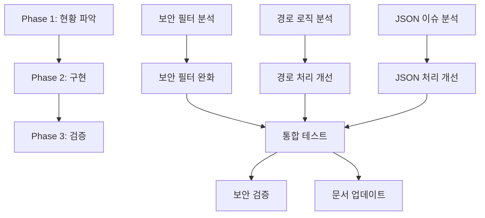

# Feature Breakdown #2: MCP 핵심 이슈 해결

**작성일**: 2025-09-26
**대상**: MCP 보안 필터 완화, 경로 해석 로직 수정, JSON 문자셋 처리 개선

---

## 문제 분석

### 1. 문제 정의 및 복잡성 평가
- **문제**: Local AI Suite MCP 서버의 3가지 핵심 이슈 해결
- **복잡성 수준**: 높음 (보안 요구사항으로 인해 상향 조정)
- **예상 소요 시간**: 4-5일 (보안 검증 시간 추가)
- **주요 도전 과제**: 보안을 유지하면서 사용성 개선, AST 기반 코드 검증, 안전한 경로 처리

### 2. 범위 및 제약조건
- **포함 범위**: MCP 서버 코드 수정, 보안 필터 규칙 조정, 경로 해석 로직 개선, JSON 처리 로직 개선
- **제외 범위**: 전체 시스템 아키텍처 변경, 새로운 MCP 도구 추가
- **제약조건**: 기존 시스템과의 호환성 유지, 보안 수준 최소한 유지
- **전제조건**: 현재 MCP 서버가 정상 동작 중

---

## 작업 분해

### Phase 1: 현황 파악 및 설계
**목표**: 각 이슈의 정확한 원인 파악 및 해결 방안 설계

| 작업 | 설명 | 완료 기준 (DoD) | 우선순위 |
|------|------|-----------------|----------|
| MCP 보안 필터 분석 | 현재 보안 필터 로직 상세 분석 | 보안 필터 동작 방식 문서화 완료 | 높음 |
| 경로 해석 로직 분석 | working_dir 처리 방식 및 문제점 파악 | 경로 처리 플로우 다이어그램 완성 | 높음 |
| JSON 처리 이슈 분석 | 한국어/특수문자 JSON 처리 문제 재현 | 문제 재현 테스트 케이스 작성 | 중간 |
| 해결 방안 설계 | 각 이슈별 기술적 해결 방안 수립 | 상세 구현 계획서 완성 | 높음 |

### Phase 2: 핵심 기능 구현
**목표**: 각 이슈별 핵심 수정사항 구현

| 작업 | 설명 | 완료 기준 (DoD) | 의존성 |
|------|------|-----------------|--------|
| 보안 모델 재설계 | 안전한 API 래퍼 및 AST 기반 검증 구현 | 기본 기능 지원하되 위험 API 차단 | Phase 1 완료 |
| 샌드박스 환경 구축 | RestrictedPython 또는 AST 검증기 적용 | 동적 import 및 위험한 builtin 차단 | 보안 모델 재설계 완료 |
| 경로 해석 로직 수정 | working_dir과 상대경로 처리 개선 | 모든 경로 테스트 케이스 통과 | Phase 1 완료 |
| JSON 문자셋 처리 개선 | UTF-8 인코딩 및 이스케이프 처리 강화 | 한국어 포함 JSON 요청 정상 처리 | Phase 1 완료 |

### Phase 3: 통합 테스트 및 검증
**목표**: 전체 수정사항 통합 테스트 및 안정성 검증

| 작업 | 설명 | 완료 기준 (DoD) | 위험도 |
|------|------|-----------------|--------|
| 통합 테스트 수행 | 3가지 수정사항이 모두 적용된 상태에서 전체 테스트 | 모든 MCP 도구 정상 동작 확인 | 중간 |
| 보안 회귀 테스트 | 보안 완화로 인한 새로운 취약점 검증 | 보안 스캔 도구로 검증 완료 | 높음 |
| 성능 테스트 | 수정사항으로 인한 성능 영향 측정 | 기존 대비 성능 저하 5% 이내 | 낮음 |
| 문서 업데이트 | 변경사항 반영한 문서 업데이트 | CLAUDE.md 및 관련 문서 업데이트 | 낮음 |

### 산출물


---

## 실행 계획

### 우선순위 매트릭스
```
긴급 & 중요           | 중요하지만 덜 긴급
- 보안 필터 완화      | - JSON 처리 개선
- 경로 해석 수정      | - 성능 테스트

긴급하지만 덜 중요    | 덜 중요 & 덜 긴급
- 통합 테스트         | - 문서 업데이트
```

### 마일스톤
- **Day 1**: Phase 1 완료 (현황 파악 및 설계)
- **Day 2**: Phase 2 완료 (핵심 구현)
- **Day 3**: Phase 3 완료 (테스트 및 검증)

### 위험 요소 및 대응 방안
| 위험 요소 | 가능성 | 영향도 | 대응 방안 |
|-----------|--------|--------|-----------|
| AST 우회를 통한 샌드박스 탈출 | 중간 | 매우높음 | RestrictedPython 도입 + 다중 검증 계층 |
| 경로 정규화 우회 (심볼릭 링크 등) | 높음 | 높음 | 실제 경로 해석 + 작업공간 경계 검증 |
| 성능 저하 (AST 파싱 오버헤드) | 높음 | 중간 | 코드 캐싱 + 비동기 처리 |
| 기존 사용자 워크플로우 영향 | 중간 | 중간 | 안전한 API 래퍼로 기능성 유지 |

---

## 세부 실행 작업 리스트

### 🔒 **Issue 1: MCP 보안 필터 완화**

**1.1 현재 보안 필터 분석**
```bash
# 작업: services/mcp-server/app.py에서 보안 필터 로직 확인
- 현재 차단되는 모듈/키워드 목록 추출
- 동적 import 우회 방법 분석 (importlib, __import__, eval)
- 실제 필요한 기능 vs 보안 위험 분석
```

**1.2 AST 기반 보안 모델 설계**
```python
# 안전한 API 래퍼 제공 방식
class SafeFileAPI:
    def read_text(self, path: str) -> str:
        # 경로 검증 + 안전한 파일 읽기
        pass

    def list_dir(self, path: str) -> List[str]:
        # 디렉토리 목록 - os.listdir 대신 안전한 래퍼
        pass

# AST 검증기로 위험한 구문 차단
import ast
def validate_code_ast(code: str) -> bool:
    # Import 노드, exec/eval 호출, getattr(builtins) 등 검사
    pass
```

**1.3 제한된 환경에서 기본 기능 제공**
```python
# 직접 모듈 import 대신 안전한 API 제공
SAFE_BUILTINS = {
    'print': print,
    'len': len,
    'range': range,
    # os.getcwd() 대신
    'get_current_dir': lambda: str(Path.cwd()),
    # os.path.join 대신
    'join_path': lambda *args: str(Path(*args))
}
```

### 🗂️ **Issue 2: MCP 경로 해석 로직 수정**

**2.1 경로 처리 로직 분석**
```bash
# 작업: resolve_path() 함수 및 working_dir 처리 방식 분석
- 현재 경로 해석 플로우 문서화
- 문제가 되는 시나리오 재현 (상대경로, 절대경로, working_dir 조합)
```

**2.2 경로 해석 개선 구현**
```python
def resolve_path(path: str, working_dir: str = None) -> str:
    """
    개선된 경로 해석 로직
    - 절대경로는 그대로 사용
    - 상대경로는 working_dir 기준으로 해석
    - working_dir이 없으면 현재 작업 디렉토리 사용
    """
    pass
```

**2.3 경로 처리 테스트 케이스 작성**
```python
# 테스트 시나리오 - 보안 강화
- /tmp에서 "test.txt" 요청 → /tmp/test.txt (허용)
- /home에서 "../etc/passwd" 요청 → 에러 (워크스페이스 탈출 차단)
- 심볼릭 링크를 통한 우회 시도 → 에러 (실제 경로 검증)
- 절대경로 요청 → 워크스페이스 내부인지 검증 후 처리

def secure_resolve_path(path: str, working_dir: str) -> str:
    resolved = Path(working_dir, path).resolve()
    workspace = Path("/mnt/workspace").resolve()

    # 워크스페이스 탈출 시도 차단
    if not str(resolved).startswith(str(workspace)):
        raise SecurityError("Path traversal attempt blocked")

    return str(resolved)
```

### 🌐 **Issue 3: JSON 문자셋 처리 개선**

**3.1 JSON 처리 이슈 재현**
```bash
# 한국어 포함 JSON 요청 테스트
curl -X POST http://localhost:8000/v1/chat/completions \
  -H "Content-Type: application/json; charset=utf-8" \
  -d '{"messages": [{"role": "user", "content": "안녕하세요"}]}'
```

**3.2 실제 JSON 처리 문제 해결**
```python
# 클라이언트 측: 올바른 UTF-8 인코딩
import json

def send_korean_request(message: str):
    data = {"message": message}
    # ensure_ascii=False로 유니코드 보존
    json_bytes = json.dumps(data, ensure_ascii=False).encode('utf-8')

    # Content-Type 헤더 명시
    headers = {'Content-Type': 'application/json; charset=utf-8'}
    return requests.post(url, data=json_bytes, headers=headers)

# 서버 측: 인코딩 명시적 처리 (필요시)
from fastapi.responses import JSONResponse

def custom_json_response(content):
    return JSONResponse(
        content=content,
        headers={"Content-Type": "application/json; charset=utf-8"}
    )
```

**3.3 클라이언트 측 JSON 처리 개선**
```python
# AI CLI에서 JSON 요청 시 proper encoding
import json
data = {"message": "안녕하세요"}
json_str = json.dumps(data, ensure_ascii=False)
```

---

## 품질 체크리스트

### 각 작업 완료 시 확인사항
- [ ] 요구사항 충족 여부 확인
- [ ] 단위 테스트 작성 및 통과
- [ ] 기존 기능 회귀 테스트 통과
- [ ] 코드 리뷰 완료
- [ ] 보안 영향도 평가 완료

### 전체 완료 기준
- [ ] 안전한 API를 통한 기본 기능 제공 (파일 읽기, 경로 처리 등)
- [ ] AST 검증기를 통한 위험한 코드 실행 차단
- [ ] 경로 탈출 시도 완전 차단 (../../../etc/passwd 등)
- [ ] 한국어 포함 JSON 요청 정상 처리
- [ ] 동적 import 우회 시도 차단 (importlib, __import__ 등)
- [ ] 보안 회귀 테스트 및 침투 테스트 통과

---

## 리소스 및 참고자료

### 필요한 리소스
- **인력**: 백엔드 개발자 1명 (Python/FastAPI 경험)
- **도구**: Python 개발 환경, 테스트 도구, 보안 스캔 도구
- **인프라**: 로컬 개발 환경 (Docker 기반)

### 학습 자료
- [FastAPI 공식 문서 - Request Body](https://fastapi.tiangolo.com/tutorial/body/)
- [Python pathlib 공식 문서](https://docs.python.org/3/library/pathlib.html)
- [Python Security Best Practices](https://python-security.readthedocs.io/)

### 유사 사례
- Jupyter Notebook의 코드 실행 보안 모델
- VSCode Extension의 파일 시스템 접근 방식

---

**💡 추가 고려사항**
- 각 수정사항은 독립적으로 테스트 가능하도록 구현
- 보안 완화 시 로그 및 모니터링 강화 필요
- 향후 더 정교한 보안 모델(샌드박스) 도입 고려

---

## 진행 상황 추적

### Phase 1: 현황 파악 및 설계
- [ ] MCP 보안 필터 분석
- [ ] 경로 해석 로직 분석
- [ ] JSON 처리 이슈 분석
- [ ] 해결 방안 설계

### Phase 2: 핵심 기능 구현
- [ ] 보안 필터 완화 구현
- [ ] 화이트리스트 보안 모델 적용
- [ ] 경로 해석 로직 수정
- [ ] JSON 문자셋 처리 개선

### Phase 3: 통합 테스트 및 검증
- [ ] 통합 테스트 수행
- [ ] 보안 회귀 테스트
- [ ] 성능 테스트
- [ ] 문서 업데이트

---

## 코덱스 리뷰 반영사항

### ⚠️ 주요 수정사항
1. **보안 모델 완전 재설계**: os/sys 직접 허용 대신 안전한 API 래퍼 제공
2. **AST 기반 검증**: 단순 문자열 매칭 대신 구문 트리 분석으로 동적 import 차단
3. **경로 탈출 방지**: Path.resolve() + 작업공간 경계 검증으로 ../../../etc/passwd 차단
4. **JSON 문제 정확한 진단**: CORS 헤더가 아닌 실제 인코딩 문제에 집중

### 🔍 미해결 질문들
- **구체적 사용 사례**: 실제로 os/sys 모듈이 필요한 구체적 상황 분석 필요
- **JSON 실패 샘플**: 현재 JSON 처리 실패 사례 수집 및 정확한 원인 파악 필요

### 📋 Next Steps (우선순위)
1. 현재 보안 필터에서 차단하는 실제 사용 사례 조사
2. RestrictedPython 도입 가능성 검토
3. 안전한 파일/경로 API 설계 및 프로토타입
4. JSON 처리 실패 케이스 재현 및 분석

**마지막 업데이트**: 2025-09-26 (코덱스 리뷰 반영)