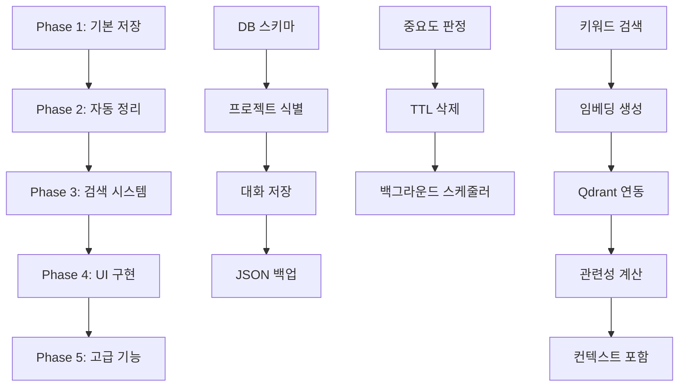

# Feature Breakdown #3: 프로젝트별 장기 기억 시스템

**작성일**: 2025-09-26
**대상**: 프로젝트별 장기 기억 시스템 - 무제한 대화 지원 및 스마트 정리

---

## 문제 분석

### 1. 문제 정의 및 복잡성 평가
- **문제**: 프로젝트별 장기 기억 시스템 구현 - 무제한 대화 지원 및 스마트 정리
- **복잡성 수준**: 높음
- **예상 소요 시간**: 12일 (2.5주)
- **주요 도전 과제**: 대용량 데이터 처리, 의미 검색 구현, 자동 중요도 판정, 벡터 임베딩 통합

### 2. 범위 및 제약조건
- **포함 범위**: SQLite 기반 메모리 저장, 자동 정리 시스템, 컨텍스트 검색, CLI/Desktop UI, 벡터 임베딩
- **제외 범위**: 클라우드 동기화, 멀티유저 지원, 실시간 협업
- **제약조건**: 로컬 환경에서만 동작, 기존 AI CLI와 호환성 유지, 성능 (1초 이내 검색)
- **전제조건**: 현재 AI CLI 시스템이 정상 동작, Qdrant 벡터 저장소 사용 가능, 기본 임베딩 경로는 로컬 모델 사용 (클라우드 API 사용 시 별도 opt-in 설정)

---

## 작업 분해

### Phase 1: 기본 저장 시스템 (3일)
**목표**: 프로젝트별 대화 저장 및 기본 조회 기능 완성

| 작업 | 설명 | 완료 기준 (DoD) | 우선순위 |
|------|------|-----------------|----------|
| 데이터베이스 스키마 설계 | SQLite 테이블 구조 및 인덱스 최적화 | schema.sql 파일 완성 및 테스트 통과 | 높음 |
| 프로젝트 식별 시스템 | 디렉토리 기반 프로젝트 해시 생성 | 동일 프로젝트에서 일관된 해시 생성 | 높음 |
| 기본 대화 저장 로직 | conversations 테이블에 대화 저장 | 대화 저장/조회 단위테스트 통과 | 높음 |
| JSON 백업 시스템 | 실시간 JSON 파일 백업 | 백업 파일 생성 및 복원 기능 동작 | 중간 |

### Phase 2: 자동 정리 시스템 (2일)
**목표**: 중요도 기반 자동 삭제 및 정리 스케줄러 구현

| 작업 | 설명 | 완료 기준 (DoD) | 의존성 |
|------|------|-----------------|--------|
| 중요도 자동 판정 로직 | 키워드/길이/코드 포함 기반 점수 계산 | 판정 정확도 85% 이상 | Phase 1 완료 |
| TTL 기반 자동 삭제 | importance_score별 TTL 적용 | 만료된 대화 자동 삭제 확인 | 중요도 판정 완료 |
| 백그라운드 정리 스케줄러 | cron/scheduler 기반 정리 작업 | 일정 간격으로 자동 정리 실행 | TTL 삭제 완료 |
| 안전한 삭제 확인 시스템 | 삭제 전 사용자 확인 및 롤백 | 실수 삭제 방지 기능 동작 | 자동 삭제 완료 |

### Phase 3: 검색 및 컨텍스트 시스템 (3일)
**목표**: 키워드/의미 검색 및 관련 컨텍스트 자동 포함

| 작업 | 설명 | 완료 기준 (DoD) | 위험도 |
|------|------|-----------------|--------|
| 키워드 기반 검색 | SQL LIKE 및 FTS 검색 구현 | 키워드 검색 1초 이내 응답 | 낮음 |
| 임베딩 생성 및 저장 | 대화별 벡터 임베딩 생성 | conversation_embeddings 테이블 활용 | 중간 |
| Qdrant 벡터 저장소 연동 | 대용량 의미 검색용 외부 저장소 | 벡터 유사도 검색 정상 동작 | 높음 |
| 벡터 동기화 큐/워커 | Qdrant 장애 대비 재시도 파이프라인 | vector_sync_queue 드레인 워커 테스트 | 높음 |
| 관련성 점수 계산 | 키워드+의미+시간+중요도 종합 점수 | 관련성 정확도 80% 이상 | 중간 |
| 컨텍스트 자동 포함 로직 | 질문 시 관련 이전 대화 자동 제공 | AI 응답 품질 개선 확인 | 중간 |

### Phase 4: 사용자 인터페이스 (2일)
**목표**: CLI 및 Desktop App UI 구현

| 작업 | 설명 | 완료 기준 (DoD) | 위험도 |
|------|------|-----------------|--------|
| AI CLI 메모리 명령어 | --memory 관련 15개 명령어 구현 | 모든 명령어 정상 동작 | 낮음 |
| Desktop App 메모리 UI | 메모리 관리 탭 및 검색 기능 | UI 완성 및 사용성 테스트 통과 | 중간 |
| 통계 및 시각화 | 메모리 사용량, 중요도 분포 차트 | 통계 정보 정확성 확인 | 낮음 |
| 설정 관리 인터페이스 | 보관기간, 자동정리 등 설정 UI | 설정 변경 즉시 반영 | 낮음 |

### Phase 5: 고급 기능 (2일)
**목표**: AI 요약, 중요 사실 추출, 백업/복원

| 작업 | 설명 | 완료 기준 (DoD) | 위험도 |
|------|------|-----------------|--------|
| AI 요약 생성 | 대화 그룹별 AI 요약 자동 생성 | 요약 품질 만족도 80% 이상 | 중간 |
| 중요 사실 자동 추출 | 코드/설정/결정사항 자동 분류 | important_facts 테이블 활용 | 높음 |
| 백업/복원 시스템 | 전체 메모리 백업 및 복원 기능 | 완전 백업/복원 성공 | 낮음 |
| 성능 모니터링 | 메모리 시스템 성능 지표 수집 | 성능 목표 달성 모니터링 | 낮음 |

### 산출물


---

## 실행 계획

### 우선순위 매트릭스
```
긴급 & 중요           | 중요하지만 덜 긴급
- DB 스키마 설계      | - AI 요약 생성
- 기본 저장 로직      | - Desktop App UI
- 프로젝트 식별       | - 성능 모니터링

긴급하지만 덜 중요    | 덜 중요 & 덜 긴급
- CLI 명령어 구현     | - 백업/복원 시스템
- 키워드 검색         | - 중요 사실 추출
```

### 마일스톤
- **Week 1 (Day 1-5)**: Phase 1 + Phase 2 완료 (기본 저장 + 자동 정리)
- **Week 2 (Day 6-10)**: Phase 3 + Phase 4 완료 (검색 시스템 + UI)
- **Week 3 (Day 11-12)**: Phase 5 완료 (고급 기능)

### 위험 요소 및 대응 방안
| 위험 요소 | 가능성 | 영향도 | 대응 방안 |
|-----------|--------|--------|-----------|
| Qdrant 연동 복잡성 | 높음 | 중간 | 로컬 SQLite 벡터 검색으로 대체 가능 |
| 임베딩 성능 문제 | 중간 | 높음 | 배치 처리 + 캐싱으로 최적화 |
| 중요도 판정 정확도 | 높음 | 중간 | 사용자 피드백 기반 지속 개선 |
| UI 복잡성 | 중간 | 낮음 | CLI 우선, Desktop UI는 단순화 |

---

## 세부 실행 작업 리스트

### 📁 **Phase 1: 기본 저장 시스템 (3일)**

**1.1 데이터베이스 스키마 구현**
```sql
-- schema.sql 생성
CREATE TABLE conversations (
    id INTEGER PRIMARY KEY AUTOINCREMENT,
    timestamp DATETIME DEFAULT CURRENT_TIMESTAMP,
    user_query TEXT NOT NULL,
    ai_response TEXT NOT NULL,
    model_used VARCHAR(50),
    importance_score INTEGER DEFAULT 5,
    session_id VARCHAR(50),
    token_count INTEGER,
    response_time_ms INTEGER,
    created_at DATETIME DEFAULT CURRENT_TIMESTAMP,
    updated_at DATETIME DEFAULT CURRENT_TIMESTAMP
);

-- 대화 태그 (정규화)
CREATE TABLE conversation_tags (
    conversation_id INTEGER NOT NULL,
    tag TEXT NOT NULL,
    created_at DATETIME DEFAULT CURRENT_TIMESTAMP,
    PRIMARY KEY (conversation_id, tag),
    FOREIGN KEY (conversation_id) REFERENCES conversations(id) ON DELETE CASCADE
);

-- 대화 요약
CREATE TABLE conversation_summaries (
    id INTEGER PRIMARY KEY AUTOINCREMENT,
    date_range TEXT,              -- "2024-09-01 to 2024-09-07"
    summary TEXT,                 -- AI 생성 요약
    conversation_count INTEGER,
    importance_level INTEGER,
    created_at DATETIME DEFAULT CURRENT_TIMESTAMP
);

-- 중요 사실
CREATE TABLE important_facts (
    id INTEGER PRIMARY KEY AUTOINCREMENT,
    fact TEXT NOT NULL,
    category VARCHAR(100),        -- code, config, decision, etc.
    source_conversation_id INTEGER,
    user_marked BOOLEAN DEFAULT FALSE,
    ai_suggested BOOLEAN DEFAULT FALSE,
    created_at DATETIME DEFAULT CURRENT_TIMESTAMP,
    FOREIGN KEY (source_conversation_id) REFERENCES conversations(id)
);

-- 의미 검색용 임베딩
CREATE TABLE conversation_embeddings (
    conversation_id INTEGER PRIMARY KEY,
    embedding BLOB NOT NULL,                     -- 1536 float32 벡터 직렬화
    vector_store_id TEXT,                        -- Qdrant 등 외부 스토어 식별자
    created_at DATETIME DEFAULT CURRENT_TIMESTAMP,
    FOREIGN KEY (conversation_id) REFERENCES conversations(id) ON DELETE CASCADE
);

-- 벡터 동기화 큐 (Qdrant 장애 대비 재시도)
CREATE TABLE vector_sync_queue (
    id INTEGER PRIMARY KEY AUTOINCREMENT,
    conversation_id INTEGER NOT NULL,
    operation TEXT NOT NULL CHECK(operation IN ('upsert', 'delete')),
    payload TEXT,
    retries INTEGER DEFAULT 0,
    last_error TEXT,
    created_at DATETIME DEFAULT CURRENT_TIMESTAMP,
    FOREIGN KEY (conversation_id) REFERENCES conversations(id) ON DELETE CASCADE
);

-- 인덱스
CREATE INDEX idx_conversations_timestamp ON conversations(timestamp);
CREATE INDEX idx_conversations_importance ON conversations(importance_score);
CREATE INDEX idx_conversation_tags_tag ON conversation_tags(tag);
CREATE INDEX idx_vector_sync_queue_status ON vector_sync_queue(operation, retries);
CREATE UNIQUE INDEX idx_vector_sync_queue_unique ON vector_sync_queue(conversation_id, operation);
```

> 모든 SQLite 커넥션은 `PRAGMA foreign_keys = ON` 및 JSON1 확장이 활성화되어 있다는 전제 하에 동작.

**1.2 프로젝트 식별 시스템**
```python
import hashlib
import os
from pathlib import Path

def get_project_hash(project_path: str) -> str:
    """프로젝트 경로 기반 해시 생성"""
    return hashlib.sha256(os.path.abspath(project_path).encode()).hexdigest()[:16]

def get_project_memory_path(project_path: str) -> Path:
    """프로젝트별 메모리 디렉토리 경로"""
    memory_root = os.environ.get('MEMORY_ROOT', '~/.local/share/local-ai/memory')
    return Path(memory_root).expanduser() / 'projects' / get_project_hash(project_path)
```

**1.3 대화 저장 로직**
```python
import sqlite3
from datetime import datetime
from typing import Dict, List, Optional

class MemoryManager:
    def __init__(self, project_path: str):
        self.project_path = project_path
        self.memory_path = get_project_memory_path(project_path)
        self.db_path = self.memory_path / 'memory.db'
        self._ensure_database()

    def _ensure_database(self):
        """데이터베이스 및 테이블 생성"""
        self.memory_path.mkdir(parents=True, exist_ok=True)
        with sqlite3.connect(self.db_path) as conn:
            conn.execute("PRAGMA foreign_keys = ON;")
            schema_path = Path(__file__).resolve().parent / "schema.sql"
            with open(schema_path, "r", encoding="utf-8") as fp:
                conn.executescript(fp.read())

    def _get_connection(self):
        conn = sqlite3.connect(self.db_path)
        conn.execute("PRAGMA foreign_keys = ON;")
        return conn

    def save_conversation(self, query: str, response: str, model: str, **kwargs):
        """대화를 데이터베이스에 저장"""
        importance_score = self.calculate_importance(query, response)
        session_id = kwargs.get('session_id', 'default')
        token_count = kwargs.get('token_count', 0)
        response_time = kwargs.get('response_time_ms', 0)

        with self._get_connection() as conn:
            conn.execute("""
                INSERT INTO conversations
                (user_query, ai_response, model_used, importance_score,
                 session_id, token_count, response_time_ms)
                VALUES (?, ?, ?, ?, ?, ?, ?)
            """, (query, response, model, importance_score,
                  session_id, token_count, response_time))

        # JSON 백업도 동시에 수행
        self._backup_to_json()

    def get_conversations(self, limit: int = 50, min_importance: int = 1):
        """저장된 대화 조회"""
        with self._get_connection() as conn:
            conn.row_factory = sqlite3.Row
            cursor = conn.execute("""
                SELECT * FROM conversations
                WHERE importance_score >= ?
                ORDER BY timestamp DESC
                LIMIT ?
            """, (min_importance, limit))
            return [dict(row) for row in cursor.fetchall()]
```

### 🧹 **Phase 2: 자동 정리 시스템 (2일)**

**2.1 중요도 자동 판정**
```python
def calculate_importance_score(query: str, response: str, context: dict = None) -> int:
    """자동 중요도 점수 계산 (1-10)"""
    score = 5  # 기본값

    # 키워드 분석
    high_importance_keywords = [
        "설정", "config", "환경변수", "architecture", "design pattern",
        "버그", "해결", "문제", "오류", "에러", "fix", "bug",
        "구현", "알고리즘", "최적화", "성능", "performance"
    ]

    low_importance_keywords = [
        "안녕", "hello", "테스트", "test", "확인", "체크"
    ]

    query_lower = query.lower()
    response_lower = response.lower()

    def adjust(delta: int) -> None:
        nonlocal score
        score = max(1, min(10, score + delta))

    if any(word in query_lower or word in response_lower for word in high_importance_keywords):
        adjust(2)
    if any(word in query_lower or word in response_lower for word in low_importance_keywords):
        adjust(-2)

    # 응답 길이 고려 (긴 응답 = 더 중요)
    if len(response) > 1000:
        adjust(1)
    if len(response) > 2000:
        adjust(1)

    # 코드 포함 여부
    if "```" in response or "def " in response or "class " in response:
        adjust(1)

    # 사용자 피드백 반영 (context에서)
    if context:
        if context.get("user_saved", False):
            score = 10  # 사용자가 명시적으로 저장
        if context.get("user_dismissed", False):
            score = min(score, 3)  # 사용자가 중요하지 않다고 표시

    return score

# 중요도별 TTL 설정
IMPORTANCE_LEVELS = {
    1: {"name": "즉시삭제", "ttl_days": 0, "description": "인사, 테스트"},
    2: {"name": "단기보관", "ttl_days": 3, "description": "간단한 질문"},
    3: {"name": "1주보관", "ttl_days": 7, "description": "일반 대화"},
    4: {"name": "2주보관", "ttl_days": 14, "description": "정보성 질문"},
    5: {"name": "기본보관", "ttl_days": 30, "description": "기본값"},
    6: {"name": "1개월", "ttl_days": 30, "description": "코드 관련"},
    7: {"name": "3개월", "ttl_days": 90, "description": "프로젝트 설정"},
    8: {"name": "6개월", "ttl_days": 180, "description": "중요 결정사항"},
    9: {"name": "1년보관", "ttl_days": 365, "description": "핵심 문서화"},
    10: {"name": "영구보관", "ttl_days": -1, "description": "사용자 중요표시"}
}
```

**2.2 TTL 기반 자동 삭제**
```python
from datetime import datetime, timedelta

def cleanup_expired_conversations(project_path: str, dry_run: bool = True):
    """만료된 대화 정리"""
    manager = MemoryManager(project_path)

    deleted_count = 0
    for importance_level, config in IMPORTANCE_LEVELS.items():
        if config["ttl_days"] <= 0:  # 즉시삭제 또는 영구보관
            if importance_level == 1:  # 즉시삭제
                if not dry_run:
                    with manager._get_connection() as conn:
                        stale_ids = [row[0] for row in conn.execute(
                            "SELECT id FROM conversations WHERE importance_score = 1"
                        ).fetchall()]

                        if stale_ids:
                            conn.execute(
                                "DELETE FROM conversations WHERE importance_score = 1"
                            )
                            conn.executemany(
                                "INSERT OR IGNORE INTO vector_sync_queue (conversation_id, operation, payload) VALUES (?, 'delete', json_object('queued_at', CURRENT_TIMESTAMP))",
                                [(conv_id,) for conv_id in stale_ids]
                            )
                            deleted_count += len(stale_ids)
            continue

        cutoff_date = datetime.now() - timedelta(days=config["ttl_days"])

        if not dry_run:
            with manager._get_connection() as conn:
                stale_ids = [row[0] for row in conn.execute("""
                    SELECT id FROM conversations
                    WHERE importance_score = ? AND created_at < ?
                """, (importance_level, cutoff_date)).fetchall()]

                if stale_ids:
                    conn.execute("""
                        DELETE FROM conversations
                        WHERE importance_score = ? AND created_at < ?
                    """, (importance_level, cutoff_date))
                    conn.executemany(
                        "INSERT OR IGNORE INTO vector_sync_queue (conversation_id, operation, payload) VALUES (?, 'delete', json_object('queued_at', CURRENT_TIMESTAMP))",
                        [(conv_id,) for conv_id in stale_ids]
                    )
                    deleted_count += len(stale_ids)
        else:
            # dry_run 모드: 삭제 예정 개수만 확인
            with manager._get_connection() as conn:
                cursor = conn.execute("""
                    SELECT COUNT(*) FROM conversations
                    WHERE importance_score = ? AND created_at < ?
                """, (importance_level, cutoff_date))
                count = cursor.fetchone()[0]
                print(f"중요도 {importance_level}: {count}개 대화 삭제 예정")

    return deleted_count
```

### 🔍 **Phase 3: 검색 및 컨텍스트 시스템 (3일)**

**3.1 키워드 기반 검색**
```python
def search_conversations(query: str, project_path: str, limit: int = 10) -> List[Dict]:
    """키워드로 대화 검색"""
    manager = MemoryManager(project_path)

    # 검색어를 단어로 분리
    keywords = query.lower().split()

    with manager._get_connection() as conn:
        conn.row_factory = sqlite3.Row

        # LIKE 연산자를 사용한 기본 검색
        where_conditions = []
        params = []

        for keyword in keywords:
            where_conditions.append(
                "(LOWER(user_query) LIKE ? OR LOWER(ai_response) LIKE ?)"
            )
            params.extend([f"%{keyword}%", f"%{keyword}%"])

        sql = f"""
        SELECT *,
               (importance_score * 0.3 +
                (julianday('now') - julianday(timestamp)) * -0.1) as relevance_score
        FROM conversations
        WHERE {' AND '.join(where_conditions)}
        ORDER BY relevance_score DESC, importance_score DESC, timestamp DESC
        LIMIT ?
        """
        params.append(limit)

        cursor = conn.execute(sql, params)
        return [dict(row) for row in cursor.fetchall()]

# FTS (Full Text Search) 활용하려면
def enable_fts_search(project_path: str):
    """전문 검색 기능 활성화"""
    manager = MemoryManager(project_path)

    with manager._get_connection() as conn:
        # FTS 가상 테이블 생성
        conn.execute("""
            CREATE VIRTUAL TABLE IF NOT EXISTS conversations_fts
            USING fts5(user_query, ai_response, content='conversations', content_rowid='id')
        """)

        # 기존 데이터를 FTS 테이블에 복사
        conn.execute("""
            INSERT INTO conversations_fts(conversations_fts) VALUES('rebuild')
        """)
```

**3.2 임베딩 및 벡터 검색**
```python
import numpy as np
import json
from typing import List

def generate_embedding(text: str, use_openai: bool = False) -> List[float]:
    """텍스트의 임베딩 벡터 생성"""
    if use_openai:
        # OpenAI API 사용
        import openai
        response = openai.Embedding.create(
            input=text,
            model="text-embedding-ada-002"
        )
        return response['data'][0]['embedding']
    else:
        # 로컬 임베딩 모델 사용 (예: sentence-transformers)
        from sentence_transformers import SentenceTransformer
        model = SentenceTransformer('all-MiniLM-L6-v2')
        embedding = model.encode(text)
        return embedding.tolist()

# NOTE: 기본값은 오프라인 호환을 위해 로컬 모델을 사용하며,
#       환경변수 `ENABLE_OPENAI_EMBEDDINGS=1` 등을 통해 opt-in 시 `use_openai=True`로 전환.

def store_conversation_embedding(conversation_id: int, text: str, project_path: str):
    """대화 임베딩 저장"""
    manager = MemoryManager(project_path)
    embedding = generate_embedding(text)

    # 벡터를 바이너리로 직렬화
    embedding_blob = np.array(embedding, dtype=np.float32).tobytes()

    with manager._get_connection() as conn:
        current = conn.execute(
            "SELECT vector_store_id FROM conversation_embeddings WHERE conversation_id = ?",
            (conversation_id,)
        ).fetchone()
        persisted_vector_id = current[0] if current else None

        conn.execute("""
            INSERT INTO conversation_embeddings (conversation_id, embedding, vector_store_id)
            VALUES (?, ?, ?)
            ON CONFLICT(conversation_id) DO UPDATE SET
                embedding = excluded.embedding,
                vector_store_id = COALESCE(conversation_embeddings.vector_store_id, excluded.vector_store_id)
        """, (conversation_id, embedding_blob, persisted_vector_id))

        conn.execute("""
            INSERT OR IGNORE INTO vector_sync_queue (conversation_id, operation, payload)
            VALUES (?, 'upsert', json_object('queued_at', CURRENT_TIMESTAMP))
        """, (conversation_id,))

def find_similar_conversations(query_text: str, project_path: str, limit: int = 5) -> List[Dict]:
    """의미적으로 유사한 대화 검색"""
    manager = MemoryManager(project_path)
    query_embedding = generate_embedding(query_text)
    query_vector = np.array(query_embedding, dtype=np.float32)

    similarities = []

    with manager._get_connection() as conn:
        conn.row_factory = sqlite3.Row
        cursor = conn.execute("""
            SELECT c.*, ce.embedding
            FROM conversations c
            JOIN conversation_embeddings ce ON c.id = ce.conversation_id
        """)

        for row in cursor.fetchall():
            stored_vector = np.frombuffer(row['embedding'], dtype=np.float32)

            # 코사인 유사도 계산
            cosine_sim = np.dot(query_vector, stored_vector) / (
                np.linalg.norm(query_vector) * np.linalg.norm(stored_vector)
            )

            conv_dict = dict(row)
            conv_dict['similarity_score'] = float(cosine_sim)
            similarities.append(conv_dict)

    # 유사도 기준으로 정렬
    similarities.sort(key=lambda x: x['similarity_score'], reverse=True)
    return similarities[:limit]
```

**3.3 Qdrant 벡터 저장소 연동**
```python
from qdrant_client import QdrantClient
from qdrant_client.http import models

def sync_embeddings_to_qdrant(
    project_path: str,
    qdrant_url: str = "http://localhost:6333",
    batch_size: int = 100,
) -> None:
    """SQLite의 임베딩을 Qdrant에 동기화"""
    manager = MemoryManager(project_path)
    client = QdrantClient(url=qdrant_url)

    collection_name = f"memory_{get_project_hash(project_path)}"

    # 컬렉션 생성 (존재하지 않는 경우)
    try:
        client.get_collection(collection_name)
    except Exception:
        client.create_collection(
            collection_name=collection_name,
            vectors_config=models.VectorParams(size=1536, distance=models.Distance.COSINE),
            on_disk=True,
            timeout=30,
        )

    with manager._get_connection() as conn:
        conn.row_factory = sqlite3.Row
        queued = conn.execute("""
            SELECT id, conversation_id, operation
            FROM vector_sync_queue
            ORDER BY created_at
            LIMIT ?
        """, (batch_size,)).fetchall()

    if not queued:
        return

    upsert_ids = [row["conversation_id"] for row in queued if row["operation"] == "upsert"]
    delete_ids = [row["conversation_id"] for row in queued if row["operation"] == "delete"]

    try:
        points = []
        if upsert_ids:
            with manager._get_connection() as conn:
                conn.row_factory = sqlite3.Row
                placeholders = ",".join(["?"] * len(upsert_ids))
                rows = conn.execute(f"""
                    SELECT c.id, c.user_query, c.ai_response, c.importance_score, c.timestamp, ce.embedding
                    FROM conversations c
                    JOIN conversation_embeddings ce ON c.id = ce.conversation_id
                    WHERE c.id IN ({placeholders})
                """, upsert_ids).fetchall()

            for row in rows:
                embedding_vector = np.frombuffer(row["embedding"], dtype=np.float32).tolist()
                points.append(models.PointStruct(
                    id=row["id"],
                    vector=embedding_vector,
                    payload={
                        "project_path": project_path,
                        "importance_score": int(row["importance_score"]),
                        "timestamp": row["timestamp"],
                    }
                ))

        if points:
            client.upsert(collection_name=collection_name, points=points, wait=True)

        if delete_ids:
            client.delete(collection_name=collection_name, points_selector=models.PointIdsList(points=delete_ids))

    except Exception as exc:
        # 실패 시 재시도 정보 업데이트
        with manager._get_connection() as conn:
            conn.executemany(
                """
                UPDATE vector_sync_queue
                SET retries = retries + 1,
                    last_error = ?
                WHERE id = ?
                """,
                [(str(exc), row["id"]) for row in queued]
            )
        raise
    else:
        with manager._get_connection() as conn:
            if upsert_ids:
                conn.executemany(
                    """
                    UPDATE conversation_embeddings
                    SET vector_store_id = ?
                    WHERE conversation_id = ?
                    """,
                    [(f"{collection_name}:{conv_id}", conv_id) for conv_id in upsert_ids]
                )

            conn.executemany(
                "DELETE FROM vector_sync_queue WHERE id = ?",
                [(row["id"],) for row in queued]
            )


def drain_vector_sync_queue(project_path: str, interval_seconds: int = 60):
    """백그라운드에서 큐를 주기적으로 처리"""
    import time
    while True:
        try:
            sync_embeddings_to_qdrant(project_path)
        except Exception as exc:
            # 재시도 간격을 늘리고 로깅/알림 처리
            print(f"[vector-sync] retry later: {exc}")
            time.sleep(interval_seconds * 2)
        else:
            time.sleep(interval_seconds)

def search_similar_in_qdrant(query_text: str, project_path: str, limit: int = 5):
    """Qdrant에서 유사한 대화 검색"""
    client = QdrantClient(url="http://localhost:6333")
    collection_name = f"memory_{get_project_hash(project_path)}"

    query_embedding = generate_embedding(query_text)
    try:
        search_result = client.search(
            collection_name=collection_name,
            query_vector=query_embedding,
            limit=limit,
            score_threshold=0.7
        )
    except Exception:
        # Qdrant 장애 시 로컬 SQLite 임베딩으로 폴백
        return find_similar_conversations(query_text, project_path, limit)

    hits = []
    for hit in search_result:
        hits.append({
            "id": hit.id,
            "score": hit.score,
            "payload": hit.payload
        })

    # 중요도 및 최신성으로 2차 정렬
    def combined_score(item):
        payload = item["payload"]
        importance = payload.get("importance_score", 5)
        timestamp = payload.get("timestamp")

        recency_penalty = 0
        if timestamp:
            from datetime import datetime
            try:
                age_days = (datetime.utcnow() - datetime.fromisoformat(timestamp)).days
                recency_penalty = age_days * 0.02
            except ValueError:
                recency_penalty = 0

        return item["score"] + importance * 0.05 - recency_penalty

    hits.sort(key=combined_score, reverse=True)
    return hits[:limit]
```

### 🖥️ **Phase 4: 사용자 인터페이스 (2일)**

**4.1 AI CLI 메모리 명령어**
```python
# scripts/ai.py에 추가할 함수들

def handle_memory_command(args):
    """메모리 관련 명령어 처리"""
    project_path = os.getcwd()
    manager = MemoryManager(project_path)

    if args.memory_action == "status":
        show_memory_status(manager)
    elif args.memory_action == "search":
        search_memory(manager, args.memory_query)
    elif args.memory_action == "save":
        save_last_conversation(manager)
    elif args.memory_action == "cleanup":
        cleanup_memory(manager, dry_run=args.dry_run)
    elif args.memory_action == "stats":
        show_memory_stats(manager)
    elif args.memory_action == "export":
        export_memory(manager, args.output_file)

def show_memory_status(manager):
    """메모리 상태 표시"""
    stats = manager.get_stats()
    print(f"📊 Memory Status for {manager.project_path}")
    print(f"Total conversations: {stats['total_count']}")
    print(f"Important (8-10): {stats['important_count']}")
    print(f"Recent (last 7 days): {stats['recent_count']}")
    print(f"Database size: {stats['db_size_mb']:.2f} MB")

def search_memory(manager, query):
    """메모리 검색"""
    results = manager.search_conversations(query, limit=10)
    print(f"🔍 Search results for '{query}':")

    for i, result in enumerate(results, 1):
        print(f"\n{i}. [{result['importance_score']}/10] {result['timestamp']}")
        print(f"Q: {result['user_query'][:100]}...")
        print(f"A: {result['ai_response'][:100]}...")

# CLI 인터페이스 확장
def add_memory_arguments(parser):
    """메모리 관련 명령어 인자 추가"""
    parser.add_argument('--memory', action='store_true', help='Memory management mode')
    parser.add_argument('--memory-action', choices=[
        'status', 'search', 'save', 'cleanup', 'stats', 'export', 'import'
    ], help='Memory action to perform')
    parser.add_argument('--memory-query', help='Search query for memory')
    parser.add_argument('--dry-run', action='store_true', help='Show what would be done')
    parser.add_argument('--output-file', help='Output file for export')
```

**4.2 Desktop App UI 컴포넌트 (기본 구조)**
```javascript
// desktop-app/src/components/MemoryManager.js
import React, { useState, useEffect } from 'react';

const MemoryManager = () => {
    const [conversations, setConversations] = useState([]);
    const [searchQuery, setSearchQuery] = useState('');
    const [stats, setStats] = useState({});

    const searchMemory = async (query) => {
        try {
            const response = await fetch('/api/memory/search', {
                method: 'POST',
                headers: { 'Content-Type': 'application/json' },
                body: JSON.stringify({ query })
            });
            const results = await response.json();
            setConversations(results);
        } catch (error) {
            console.error('Memory search failed:', error);
        }
    };

    const updateImportance = async (conversationId, newScore) => {
        try {
            await fetch('/api/memory/update-importance', {
                method: 'POST',
                headers: { 'Content-Type': 'application/json' },
                body: JSON.stringify({
                    conversation_id: conversationId,
                    importance_score: newScore
                })
            });
            // UI 업데이트
        } catch (error) {
            console.error('Importance update failed:', error);
        }
    };

    return (
        <div className="memory-manager">
            <div className="search-section">
                <input
                    type="text"
                    placeholder="Search conversations..."
                    value={searchQuery}
                    onChange={(e) => setSearchQuery(e.target.value)}
                    onKeyPress={(e) => e.key === 'Enter' && searchMemory(searchQuery)}
                />
                <button onClick={() => searchMemory(searchQuery)}>
                    Search
                </button>
            </div>

            <div className="stats-section">
                <div className="stat-card">
                    <h3>Total Conversations</h3>
                    <p>{stats.total_count}</p>
                </div>
                <div className="stat-card">
                    <h3>Important Items</h3>
                    <p>{stats.important_count}</p>
                </div>
            </div>

            <div className="conversations-list">
                {conversations.map(conv => (
                    <div key={conv.id} className="conversation-item">
                        <div className="importance-controls">
                            {[1,2,3,4,5,6,7,8,9,10].map(score => (
                                <button
                                    key={score}
                                    className={conv.importance_score === score ? 'active' : ''}
                                    onClick={() => updateImportance(conv.id, score)}
                                >
                                    {score}
                                </button>
                            ))}
                        </div>
                        <div className="conversation-content">
                            <p><strong>Q:</strong> {conv.user_query}</p>
                            <p><strong>A:</strong> {conv.ai_response.substring(0, 200)}...</p>
                            <small>{conv.timestamp} | Model: {conv.model_used}</small>
                        </div>
                    </div>
                ))}
            </div>
        </div>
    );
};

export default MemoryManager;
```

---

## 품질 체크리스트

### 각 작업 완료 시 확인사항
- [ ] 요구사항 충족 여부 확인 (메모리 저장/검색/정리)
- [ ] 단위 테스트 작성 및 통과 (각 모듈별)
- [ ] 성능 테스트 (1초 이내 검색 응답)
- [ ] 데이터 무결성 검사 (백업/복원 포함)
- [ ] 사용자 시나리오 테스트 통과

### 전체 완료 기준
- [ ] 100만개 대화 처리 가능 (성능 목표)
- [ ] 1초 이내 검색 응답 (성능 목표)
- [ ] 99.9% 데이터 안정성 (안정성 목표)
- [ ] 제로 설정 자동 동작 (사용성 목표)
- [ ] 직관적인 명령어 인터페이스 (사용성 목표)

---

## 리소스 및 참고자료

### 필요한 리소스
- **인력**: 백엔드 개발자 1명 (Python/SQLite/FastAPI 경험)
- **도구**: SQLite, Qdrant, OpenAI API (임베딩), pytest, React
- **인프라**: 로컬 개발 환경, 벡터 저장소

### 학습 자료
- [SQLite FTS5 문서](https://sqlite.org/fts5.html) - 전문 검색
- [Qdrant Python Client](https://qdrant.tech/documentation/quick-start/) - 벡터 검색
- [OpenAI Embeddings API](https://platform.openai.com/docs/guides/embeddings) - 임베딩 생성
- [sentence-transformers](https://www.sbert.net/) - 로컬 임베딩 모델

### 유사 사례
- Obsidian의 노트 연결 시스템
- Notion의 AI 검색 기능
- ChatGPT의 대화 기록 관리
- Roam Research의 양방향 링크

---

## 진행 상황 추적

### Phase 1: 기본 저장 시스템 (3일)
- [ ] 데이터베이스 스키마 설계
- [ ] 프로젝트 식별 시스템
- [ ] 기본 대화 저장 로직
- [ ] JSON 백업 시스템

### Phase 2: 자동 정리 시스템 (2일)
- [ ] 중요도 자동 판정 로직
- [ ] TTL 기반 자동 삭제
- [ ] 백그라운드 정리 스케줄러
- [ ] 안전한 삭제 확인 시스템

### Phase 3: 검색 및 컨텍스트 시스템 (3일)
- [ ] 키워드 기반 검색
- [ ] 임베딩 생성 및 저장
- [ ] Qdrant 벡터 저장소 연동
- [ ] 관련성 점수 계산
- [ ] 컨텍스트 자동 포함 로직

### Phase 4: 사용자 인터페이스 (2일)
- [ ] AI CLI 메모리 명령어
- [ ] Desktop App 메모리 UI
- [ ] 통계 및 시각화
- [ ] 설정 관리 인터페이스

### Phase 5: 고급 기능 (2일)
- [ ] AI 요약 생성
- [ ] 중요 사실 자동 추출
- [ ] 백업/복원 시스템
- [ ] 성능 모니터링

---

## 다음 단계 제안

1. 큐 드레인 워커를 APScheduler 등 백그라운드 작업 러너에 연결하고, 실패 시 로깅·알림 루틴을 구현해 벡터 동기화 장애를 조기에 감지한다.
2. `vector_sync_queue` 처리와 TTL 기반 삭제 로직을 검증하는 단위/통합 테스트를 설계해 재시도·삭제 동기화 시나리오를 자동화한다.

---

**💡 추가 고려사항**
- 메모리 사용량 모니터링 필수 (대용량 데이터 처리)
- 임베딩 생성 비용 최적화 (배치 처리, 캐싱)
- 사용자 프라이버시 보호 (로컬 저장 원칙)
- 마이그레이션 전략 (스키마 변경 대응)
- Qdrant 장애 대비 `vector_sync_queue` 기반 재시도 및 삭제 동기화 정책 유지

**마지막 업데이트**: 2025-09-26
