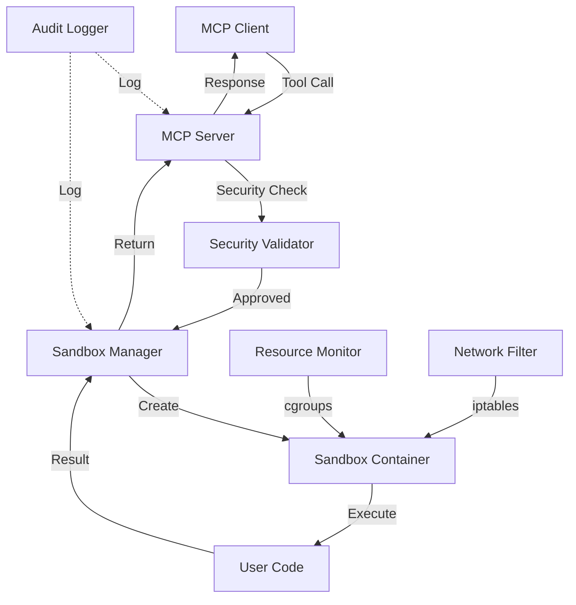
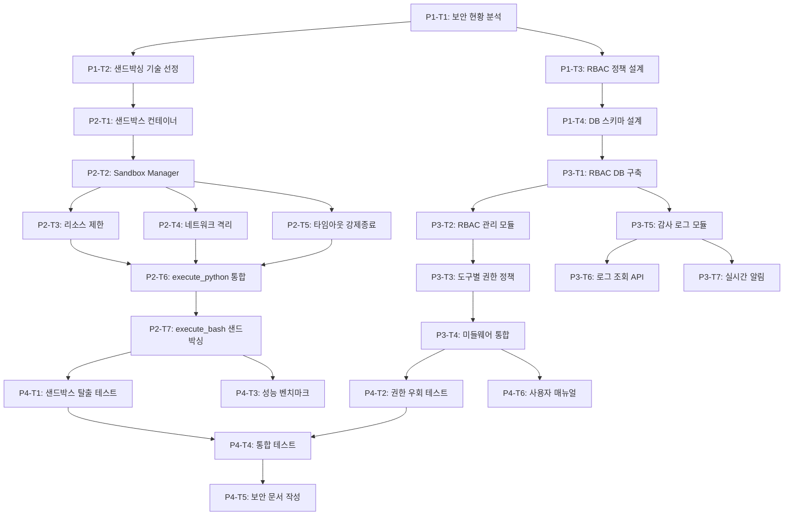

# MCP 보안 강화 (샌드박싱, 접근 제어) 구현 - Feature Breakdown

**작성일**: 2025-09-30
**작업자**: Feature Breakdown Command
**Arguments**: MCP 보안 강화(샌드방식, 접근 제어)를 구현할건데 체계적으로 분해해서 실행가능한 작업단위로 나눠주고

---

## 문제 분석

### 1. 문제 정의 및 복잡성 평가

- **문제**: MCP 서버의 보안 강화 - 샌드박싱과 접근 제어 시스템 구축
- **복잡성 수준**: **높음** (시스템 아키텍처 변경 + 보안 정책 설계)
- **예상 소요 시간**: 2-3주 (Phase 1-3 병렬 작업 시)
- **주요 도전 과제**:
  - 기존 security.py의 AST 기반 검증은 우회 가능성 존재
  - 코드 실행 샌드박싱 없음 (컨테이너 내에서 직접 실행)
  - 파일 시스템 접근 제한 미흡 (safe_api.py 경로 검증만 존재)
  - 명령어 실행 필터링 취약 (키워드 블랙리스트 방식)
  - Rate Limiting은 존재하나 리소스 격리 없음

### 2. 범위 및 제약조건

**포함 범위**:
1. **샌드박싱 구현**
   - Python 코드 실행 격리 환경 (Docker-in-Docker 또는 gVisor)
   - 네트워크 격리 및 리소스 제한 (CPU, 메모리, 디스크 I/O)
   - 실행 시간 제한 및 강제 종료 메커니즘

2. **접근 제어 강화**
   - Role-Based Access Control (RBAC) 시스템 구축
   - 도구별 권한 매트릭스 (읽기/쓰기/실행/관리자)
   - 사용자별 권한 프로파일 관리

3. **감사 로깅**
   - 모든 MCP 도구 호출 기록
   - 보안 이벤트 로깅 (실패한 접근 시도, 권한 거부)
   - 로그 집계 및 알림 시스템

**제외 범위**:
- 외부 침입 탐지 시스템 (IDS/IPS)
- 네트워크 방화벽 규칙 설정
- 전체 시스템 보안 감사 (다른 서비스 보안은 별도 작업)

**제약조건**:
- WSL2 환경 제약 (Docker Desktop 사용)
- RTX 4050 GPU 리소스 제한 (6GB VRAM)
- 기존 MCP 도구 API 호환성 유지 필요
- 성능 저하 최소화 (샌드박싱 오버헤드 < 100ms)

**전제조건**:
- Docker 컨테이너 환경 실행 중
- SQLite 기반 메타데이터 저장소 사용
- 기존 security.py, safe_api.py 모듈 이해

---

## 작업 분해

### Phase 1: 보안 설계 및 인프라 준비 (Week 1)

**목표**: 샌드박싱 아키텍처 설계 및 보안 정책 정의

| 작업 ID | 작업명 | 설명 | 완료 기준 (DoD) | 우선순위 | 예상 시간 |
|---------|--------|------|-----------------|----------|----------|
| P1-T1 | 현재 보안 현황 분석 | security.py, safe_api.py 취약점 분석 및 문서화 | 취약점 분석 보고서 작성 완료 | 높음 | 4시간 |
| P1-T2 | 샌드박싱 기술 선정 | Docker-in-Docker vs gVisor vs Firecracker 비교 | 기술 선정 문서 + PoC 코드 | 높음 | 6시간 |
| P1-T3 | RBAC 정책 설계 | 역할 정의, 권한 매트릭스 작성 | RBAC 정책 문서 (roles.yaml) | 높음 | 4시간 |
| P1-T4 | 데이터베이스 스키마 설계 | 감사 로그, 권한 관리 테이블 설계 (SQLite 최적화) | ERD 다이어그램 + SQL DDL | 중간 | 3시간 |
| P1-T5 | 보안 테스트 시나리오 작성 | 공격 벡터 및 방어 테스트 케이스 정의 | 테스트 시나리오 문서 (50+ cases) | 중간 | 4시간 |

**Phase 1 산출물**:
- `docs/security/vulnerability_analysis.md` - 취약점 분석 보고서
- `docs/security/sandboxing_architecture.md` - 샌드박싱 아키텍처 설계서
- `docs/security/rbac_policy.md` - RBAC 정책 문서
- `configs/rbac_roles.yaml` - 역할 정의 설정 파일
- `services/mcp-server/schema_security.sql` - 보안 관련 DB 스키마
- `tests/security/attack_scenarios.md` - 보안 테스트 시나리오

---

### Phase 2: 샌드박싱 구현 (Week 2)

**목표**: Python 코드 실행 격리 및 리소스 제한 구현

| 작업 ID | 작업명 | 설명 | 완료 기준 (DoD) | 의존성 | 예상 시간 |
|---------|--------|------|-----------------|--------|----------|
| P2-T1 | 샌드박스 컨테이너 구축 | 격리된 Python 실행 환경 Docker 이미지 | Dockerfile 작성 + 빌드 성공 | P1-T2 | 6시간 |
| P2-T2 | Sandbox Manager 모듈 개발 | 샌드박스 생성/실행/종료 관리 API | `sandbox_manager.py` 완성 + 단위 테스트 | P2-T1 | 8시간 |
| P2-T3 | 리소스 제한 구현 | CPU/Memory/Disk I/O 제한 적용 | cgroups 설정 + 제한 동작 확인 | P2-T2 | 4시간 |
| P2-T4 | 네트워크 격리 구현 | 샌드박스 내 네트워크 접근 차단/화이트리스트 | iptables 규칙 + 테스트 | P2-T2 | 5시간 |
| P2-T5 | 실행 타임아웃 강제 종료 | 시간 초과 시 프로세스 강제 종료 | timeout 메커니즘 + 테스트 | P2-T2 | 3시간 |
| P2-T6 | execute_python 도구 통합 | 기존 execute_python을 샌드박스로 교체 | app.py 수정 + 통합 테스트 | P2-T1~T5 | 4시간 |
| P2-T7 | execute_bash 도구 샌드박싱 | Bash 명령어 실행 샌드박싱 적용 | 안전한 명령어 실행 확인 | P2-T6 | 5시간 |

**Phase 2 산출물**:
- `services/mcp-server/sandbox/Dockerfile` - 샌드박스 컨테이너 이미지
- `services/mcp-server/sandbox_manager.py` - 샌드박스 관리 모듈
- `services/mcp-server/sandbox_config.py` - 리소스 제한 설정
- `tests/sandbox/test_sandbox_isolation.py` - 샌드박스 격리 테스트
- `tests/sandbox/test_resource_limits.py` - 리소스 제한 테스트

**아키텍처 다이어그램 (Mermaid)**:


---

### Phase 3: 접근 제어 및 감사 로깅 구현 (Week 2-3)

**목표**: RBAC 시스템 구축 및 모든 작업 감사 로깅

| 작업 ID | 작업명 | 설명 | 완료 기준 (DoD) | 의존성 | 예상 시간 |
|---------|--------|------|-----------------|--------|----------|
| P3-T1 | RBAC 데이터베이스 구축 | users, roles, permissions 테이블 생성 | SQLite 스키마 적용 완료 | P1-T4 | 3시간 |
| P3-T2 | RBAC 관리 모듈 개발 | 역할/권한 할당 및 검증 API | `rbac_manager.py` + 단위 테스트 | P3-T1 | 8시간 |
| P3-T3 | 도구별 권한 정책 적용 | 각 MCP 도구에 required_permission 설정 | 18개 도구 권한 설정 완료 | P3-T2 | 4시간 |
| P3-T4 | 미들웨어 통합 | FastAPI 미들웨어로 권한 검증 적용 | app.py 미들웨어 추가 + 테스트 | P3-T3 | 5시간 |
| P3-T5 | 감사 로그 모듈 개발 | 모든 도구 호출 및 보안 이벤트 로깅 | `audit_logger.py` + DB 저장 | P3-T1 | 6시간 |
| P3-T6 | 로그 조회 API 개발 | 감사 로그 검색/필터링 REST API | `/api/audit/logs` 엔드포인트 | P3-T5 | 4시간 |
| P3-T7 | 실시간 알림 시스템 | 심각한 보안 이벤트 알림 (Slack/Email) | 알림 발송 테스트 성공 | P3-T5 | 5시간 |

**Phase 3 산출물**:
- `services/mcp-server/rbac_manager.py` - RBAC 관리 모듈
- `services/mcp-server/audit_logger.py` - 감사 로깅 모듈
- `services/mcp-server/middleware/auth_middleware.py` - 권한 검증 미들웨어
- `services/mcp-server/api/audit_api.py` - 감사 로그 조회 API
- `services/mcp-server/notifications.py` - 알림 시스템
- `tests/rbac/test_permissions.py` - 권한 검증 테스트
- `tests/audit/test_logging.py` - 감사 로깅 테스트

**RBAC 데이터베이스 스키마 (SQLite 예시)**:
```sql
PRAGMA foreign_keys = ON;

-- users 테이블
CREATE TABLE IF NOT EXISTS security_users (
    user_id TEXT PRIMARY KEY,
    username TEXT NOT NULL,
    email TEXT,
    role_id INTEGER,
    created_at TEXT DEFAULT (CURRENT_TIMESTAMP),
    last_login TEXT,
    FOREIGN KEY (role_id) REFERENCES security_roles(role_id)
);

-- roles 테이블
CREATE TABLE IF NOT EXISTS security_roles (
    role_id INTEGER PRIMARY KEY AUTOINCREMENT,
    role_name TEXT NOT NULL UNIQUE,
    description TEXT,
    created_at TEXT DEFAULT (CURRENT_TIMESTAMP)
);

-- permissions 테이블
CREATE TABLE IF NOT EXISTS security_permissions (
    permission_id INTEGER PRIMARY KEY AUTOINCREMENT,
    permission_name TEXT NOT NULL UNIQUE,
    resource_type TEXT,
    action TEXT,
    description TEXT
);

-- role_permissions 매핑 테이블
CREATE TABLE IF NOT EXISTS security_role_permissions (
    role_id INTEGER,
    permission_id INTEGER,
    PRIMARY KEY (role_id, permission_id),
    FOREIGN KEY (role_id) REFERENCES security_roles(role_id) ON DELETE CASCADE,
    FOREIGN KEY (permission_id) REFERENCES security_permissions(permission_id) ON DELETE CASCADE
);

-- audit_logs 테이블
CREATE TABLE IF NOT EXISTS security_audit_logs (
    log_id INTEGER PRIMARY KEY AUTOINCREMENT,
    user_id TEXT,
    tool_name TEXT,
    action TEXT,
    resource_path TEXT,
    status TEXT,
    error_message TEXT,
    ip_address TEXT,
    timestamp TEXT DEFAULT (CURRENT_TIMESTAMP),
    execution_time_ms INTEGER
);
```

---

### Phase 4: 테스트 및 문서화 (Week 3)

**목표**: 전체 보안 시스템 검증 및 문서 작성

| 작업 ID | 작업명 | 설명 | 완료 기준 (DoD) | 위험도 | 예상 시간 |
|---------|--------|------|-----------------|--------|----------|
| P4-T1 | 샌드박스 탈출 테스트 | 다양한 우회 시도 시나리오 실행 | 모든 공격 시나리오 차단 확인 | 높음 | 6시간 |
| P4-T2 | 권한 우회 테스트 | 권한 상승 공격 시나리오 실행 | 권한 검증 100% 성공 | 높음 | 4시간 |
| P4-T3 | 성능 벤치마크 | 샌드박싱 오버헤드 측정 | 오버헤드 < 100ms 확인 | 중간 | 3시간 |
| P4-T4 | 통합 테스트 | 전체 시스템 End-to-End 테스트 | 모든 시나리오 통과 (90%+) | 중간 | 8시간 |
| P4-T5 | 보안 문서 작성 | 보안 아키텍처 및 운영 가이드 작성 | `SECURITY.md` 완성 | 낮음 | 6시간 |
| P4-T6 | 사용자 매뉴얼 작성 | RBAC 설정 및 권한 관리 가이드 | `docs/RBAC_GUIDE.md` 완성 | 낮음 | 4시간 |
| P4-T7 | 보안 설정 템플릿 제공 | 기본 역할/권한 YAML 템플릿 | `configs/security_*.yaml` 파일들 | 낮음 | 2시간 |

**Phase 4 산출물**:
- `SECURITY.md` - 보안 아키텍처 문서
- `docs/RBAC_GUIDE.md` - RBAC 사용자 가이드
- `configs/security_defaults.yaml` - 기본 보안 설정
- `tests/security/test_penetration.py` - 침투 테스트
- `tests/performance/benchmark_sandbox.py` - 성능 벤치마크
- `docs/security/SECURITY_AUDIT_REPORT.md` - 보안 감사 보고서

---

## 실행 계획

### 우선순위 매트릭스

```
┌─────────────────────────────┬─────────────────────────────┐
│ 긴급 & 중요                 │ 중요하지만 덜 긴급          │
│ (Do First)                  │ (Schedule)                  │
├─────────────────────────────┼─────────────────────────────┤
│ • P1-T1: 현재 보안 현황 분석│ • P1-T4: DB 스키마 설계     │
│ • P1-T2: 샌드박싱 기술 선정 │ • P1-T5: 테스트 시나리오    │
│ • P1-T3: RBAC 정책 설계     │ • P3-T6: 로그 조회 API      │
│ • P2-T1: 샌드박스 컨테이너  │ • P3-T7: 실시간 알림        │
│ • P2-T2: Sandbox Manager    │ • P4-T5~T7: 문서화          │
│ • P2-T6: execute_python 통합│                             │
│ • P3-T2: RBAC 관리 모듈     │                             │
│ • P3-T4: 미들웨어 통합      │                             │
│ • P4-T1: 샌드박스 탈출 테스트│                            │
└─────────────────────────────┴─────────────────────────────┘
┌─────────────────────────────┬─────────────────────────────┐
│ 긴급하지만 덜 중요          │ 덜 중요 & 덜 긴급          │
│ (Delegate)                  │ (Eliminate)                 │
├─────────────────────────────┼─────────────────────────────┤
│ • P2-T3: 리소스 제한        │ • 외부 IDS/IPS 통합         │
│ • P2-T4: 네트워크 격리      │ • 블록체인 기반 감사 로그   │
│ • P2-T7: execute_bash 샌드박싱│ • 생체 인증 시스템         │
│ • P3-T3: 도구별 권한 정책   │                             │
└─────────────────────────────┴─────────────────────────────┘
```

### 마일스톤

- **Week 1 (Day 1-7)**: Phase 1 완료 + Phase 2 시작
  - Day 1-2: 보안 분석 및 기술 선정 (P1-T1, P1-T2)
  - Day 3-4: RBAC 설계 및 DB 스키마 (P1-T3, P1-T4)
  - Day 5-7: 샌드박스 컨테이너 구축 (P2-T1, P2-T2)

- **Week 2 (Day 8-14)**: Phase 2 완료 + Phase 3 시작
  - Day 8-10: 리소스 제한 및 네트워크 격리 (P2-T3~T5)
  - Day 11-12: execute_python/bash 통합 (P2-T6, P2-T7)
  - Day 13-14: RBAC 데이터베이스 구축 (P3-T1, P3-T2)

- **Week 3 (Day 15-21)**: Phase 3-4 완료
  - Day 15-17: 권한 정책 적용 및 감사 로깅 (P3-T3~T6)
  - Day 18-19: 보안 테스트 (P4-T1~T4)
  - Day 20-21: 문서화 및 배포 준비 (P4-T5~T7)

### 작업 의존성 그래프 (Mermaid)



### 위험 요소 및 대응 방안

| 위험 요소 | 가능성 | 영향도 | 대응 방안 |
|-----------|--------|--------|-----------|
| **Docker-in-Docker 성능 저하** | 중간 | 높음 | gVisor 또는 Kata Containers 대안 검토, 벤치마크 조기 실시 |
| **WSL2 제약으로 cgroups 제한** | 높음 | 중간 | Docker Desktop의 리소스 제한 기능 활용, Kubernetes 고려 |
| **기존 MCP 도구 호환성 깨짐** | 낮음 | 높음 | Backward compatibility 레이어 구현, feature flag 도입 |
| **RBAC 설정 복잡도 증가** | 높음 | 중간 | 직관적인 YAML 템플릿 제공, CLI 관리 도구 개발 |
| **감사 로그 DB 부하** | 중간 | 중간 | 비동기 로깅, 로그 로테이션, 인덱싱 최적화 |
| **샌드박스 탈출 취약점 발견** | 낮음 | 높음 | 정기적인 보안 감사, 보안 업데이트 자동화, Bug Bounty 고려 |
| **SQLite 파일 잠금 충돌** | 중간 | 낮음 | WAL 모드 활용, 동시 접근 시 세션 큐 관리, 백업 시 스냅샷 절차 적용 |

---

## 품질 체크리스트

### 각 작업 완료 시 확인사항

- [ ] **기능 요구사항 충족**
  - [ ] 명세된 기능이 정상 동작하는가?
  - [ ] Edge case가 처리되는가?

- [ ] **보안 검증**
  - [ ] 알려진 우회 기법이 차단되는가?
  - [ ] 최소 권한 원칙이 적용되었는가?

- [ ] **코드 품질**
  - [ ] 코드 리뷰 완료 (2명 이상)
  - [ ] 린트 오류 없음 (Ruff, 필요 시 mypy)
  - [ ] 주석 및 Docstring 작성

- [ ] **테스트 커버리지**
  - [ ] 단위 테스트 작성 및 통과
  - [ ] 통합 테스트 시나리오 실행
  - [ ] 커버리지 > 80%

- [ ] **문서 업데이트**
  - [ ] API 문서 업데이트
  - [ ] CHANGELOG.md 기록
  - [ ] 관련 설정 파일 예제 제공

- [ ] **다음 작업 차단 요소 확인**
  - [ ] 의존성 있는 작업에 필요한 인터페이스 제공
  - [ ] 환경 변수 및 설정 문서화

### 전체 완료 기준 (Definition of Done)

- [ ] **핵심 기능 검증**
  - [ ] Python 코드 실행이 격리된 샌드박스에서 동작
  - [ ] 파일 시스템 접근이 허용된 경로로만 제한됨
  - [ ] 명령어 실행이 화이트리스트 기반으로 제한됨
  - [ ] RBAC 시스템이 모든 MCP 도구에 적용됨
  - [ ] 감사 로그가 모든 작업에 대해 기록됨

- [ ] **보안 테스트 통과**
  - [ ] 샌드박스 탈출 시나리오 50개 이상 차단
  - [ ] 권한 우회 시나리오 30개 이상 차단
  - [ ] OWASP Top 10 취약점 검증 완료

- [ ] **성능 요구사항 만족**
  - [ ] 샌드박스 오버헤드 < 100ms
  - [ ] RBAC 검증 오버헤드 < 10ms
  - [ ] 감사 로깅 오버헤드 < 5ms
  - [ ] 전체 시스템 응답 시간 < 500ms (p95)

- [ ] **배포 준비 완료**
  - [ ] Docker 이미지 빌드 및 푸시 성공
  - [ ] 데이터베이스 마이그레이션 스크립트 검증
  - [ ] 롤백 절차 문서화
  - [ ] Blue-Green 배포 테스트 완료

- [ ] **운영 문서 작성**
  - [ ] `SECURITY.md` - 보안 아키텍처
  - [ ] `RBAC_GUIDE.md` - 권한 관리 가이드
  - [ ] `INCIDENT_RESPONSE.md` - 보안 사고 대응 절차
  - [ ] `MONITORING.md` - 모니터링 및 알림 설정

---

## 리소스 및 참고자료

### 필요한 리소스

**인력**:
- 보안 엔지니어 1명 (샌드박싱 및 RBAC 설계)
- 백엔드 개발자 1명 (API 구현 및 DB 설계)
- DevOps 엔지니어 0.5명 (Docker 및 인프라 지원)
- QA 엔지니어 0.5명 (보안 테스트 및 검증)

**도구**:
- Docker Desktop with WSL2 integration
- SQLite 3.x (파일 기반 스키마 관리)
- Python 3.11 (asyncio, FastAPI)
- Pytest (단위/통합 테스트)
- Black, Ruff (코드 품질)
- gVisor 또는 Kata Containers (샌드박싱, 선택적)
- Prometheus + Grafana (모니터링)

**인프라**:
- WSL2 Ubuntu 22.04 LTS
- Docker Compose (버전 2.x)
- 최소 16GB RAM (샌드박스 실행 포함)
- 50GB 디스크 공간 (Docker 이미지 캐싱)

### 학습 자료

**샌드박싱 기술**:
- [gVisor Documentation](https://gvisor.dev/docs/) - 경량 샌드박싱
- [Docker Security Best Practices](https://docs.docker.com/engine/security/) - Docker 보안
- [Kata Containers Architecture](https://katacontainers.io/docs/) - VM 기반 컨테이너 격리
- [Linux cgroups v2](https://www.kernel.org/doc/html/latest/admin-guide/cgroup-v2.html) - 리소스 제한

**접근 제어 (RBAC)**:
- [NIST RBAC Standard](https://csrc.nist.gov/projects/role-based-access-control) - RBAC 표준
- [Casbin](https://casbin.org/) - Python RBAC 라이브러리
- [Open Policy Agent (OPA)](https://www.openpolicyagent.org/) - 정책 엔진

**감사 로깅**:
- [OWASP Logging Cheat Sheet](https://cheatsheetseries.owasp.org/cheatsheets/Logging_Cheat_Sheet.html)
- [ELK Stack for Security Monitoring](https://www.elastic.co/what-is/elk-stack)
- [Audit Trail Best Practices](https://www.sans.org/reading-room/whitepapers/logging/audit-trail-best-practices-35847)

**보안 테스트**:
- [OWASP Testing Guide](https://owasp.org/www-project-web-security-testing-guide/)
- [Python Sandbox Escape Techniques](https://blog.split.io/python-sandbox-escape/)
- [Docker Escape Vulnerabilities](https://unit42.paloaltonetworks.com/docker-escape-vulnerabilities/)

### 유사 사례 및 참고 프로젝트

**오픈소스 프로젝트**:
1. **Judge0** ([GitHub](https://github.com/judge0/judge0))
   - 온라인 코드 실행 플랫폼
   - Docker 기반 샌드박싱
   - 리소스 제한 및 보안 격리

2. **Piston** ([GitHub](https://github.com/engineer-man/piston))
   - 다중 언어 코드 실행 엔진
   - 경량 컨테이너 격리
   - Rate limiting 및 타임아웃

3. **Gitpod Workspace Security** ([Docs](https://www.gitpod.io/docs/security))
   - Kubernetes 기반 워크스페이스 격리
   - RBAC 및 네트워크 정책
   - 감사 로깅 및 모니터링

4. **StackBlitz WebContainers** ([Blog](https://blog.stackblitz.com/posts/introducing-webcontainers/))
   - 브라우저 내 Node.js 실행 환경
   - WebAssembly 기반 샌드박싱

**상용 솔루션**:
- AWS Lambda (서버리스 샌드박싱)
- Google Cloud Functions (자동 격리)
- Repl.it (온라인 IDE 보안 아키텍처)

---

## 추가 고려사항

### 💡 구현 팁

1. **샌드박스 기술 선정 우선순위**:
   - **1순위**: Docker cgroups + seccomp (구현 간단, 성능 좋음)
   - **2순위**: gVisor (보안 강화, 약간의 성능 저하)
   - **3순위**: Kata Containers (최고 보안, 높은 오버헤드)

2. **RBAC 역할 설계 예시**:
   ```yaml
   roles:
     - name: guest
       permissions: [read_file, list_files, rag_search]

     - name: developer
       permissions: [read_file, write_file, list_files, execute_python, git_*]

     - name: admin
       permissions: [*, execute_bash, system_*]
   ```

3. **감사 로그 최적화**:
   - 비동기 로깅 (asyncio queue)
   - Bulk insert (batch size: 100)
   - Partition by date (monthly)
   - Index on (user_id, timestamp, status)

4. **성능 모니터링 메트릭**:
   - `mcp_sandbox_create_duration_seconds`
   - `mcp_rbac_check_duration_seconds`
   - `mcp_audit_log_write_duration_seconds`
   - `mcp_sandbox_escape_attempts_total`

### 🔄 반복 개선 계획

- **Sprint 1 (Week 1)**: MVP 샌드박싱 (Docker cgroups)
- **Sprint 2 (Week 2)**: RBAC 기본 구현
- **Sprint 3 (Week 3)**: 감사 로깅 + 테스트
- **Sprint 4 (Week 4+)**: gVisor 마이그레이션 (옵션)

### 🚀 배포 전략

1. **Feature Flag 활용**:
   ```python
   ENABLE_SANDBOXING = os.getenv("ENABLE_SANDBOXING", "true")
   ENABLE_RBAC = os.getenv("ENABLE_RBAC", "true")
   ENABLE_AUDIT_LOG = os.getenv("ENABLE_AUDIT_LOG", "true")
   ```

2. **단계별 롤아웃**:
   - **Week 1**: Dev 환경에서 샌드박싱 테스트
   - **Week 2**: Staging 환경에서 RBAC 검증
   - **Week 3**: Production canary 배포 (10% 트래픽)
   - **Week 4**: Full production 배포

3. **롤백 계획**:
   - 이전 Docker 이미지로 즉시 복구 가능
   - Feature flag로 새 기능 즉시 비활성화
   - DB 마이그레이션 rollback script 준비

---

## 최종 체크리스트

### 보안 검증 항목

- [ ] **샌드박스 격리 확인**
  - [ ] 파일 시스템 탈출 불가
  - [ ] 네트워크 접근 제한 동작
  - [ ] 프로세스 격리 확인
  - [ ] 리소스 제한 적용 확인

- [ ] **RBAC 검증**
  - [ ] 권한 없는 사용자 차단
  - [ ] 역할 계층 구조 동작
  - [ ] 권한 상승 공격 차단

- [ ] **감사 로깅 검증**
  - [ ] 모든 작업 로그 기록
  - [ ] 로그 위변조 방지
  - [ ] 민감 정보 마스킹

- [ ] **성능 테스트**
  - [ ] 부하 테스트 (1000 req/sec)
  - [ ] 메모리 누수 확인
  - [ ] 동시 샌드박스 실행 (50개+)

### 운영 준비 항목

- [ ] **모니터링 설정**
  - [ ] Prometheus 메트릭 수집
  - [ ] Grafana 대시보드 구성
  - [ ] 알림 규칙 설정

- [ ] **문서화 완료**
  - [ ] 아키텍처 문서
  - [ ] 운영 가이드
  - [ ] 트러블슈팅 가이드
  - [ ] API 문서 업데이트

- [ ] **백업 및 복구**
  - [ ] DB 백업 자동화
  - [ ] 설정 파일 버전 관리
  - [ ] 재해 복구 계획

---

**문서 버전**: 1.0
**최종 업데이트**: 2025-09-30
**작성자**: Feature Breakdown Command (Claude Code)
**검토자**: (검토 후 추가)
**승인자**: (승인 후 추가)
