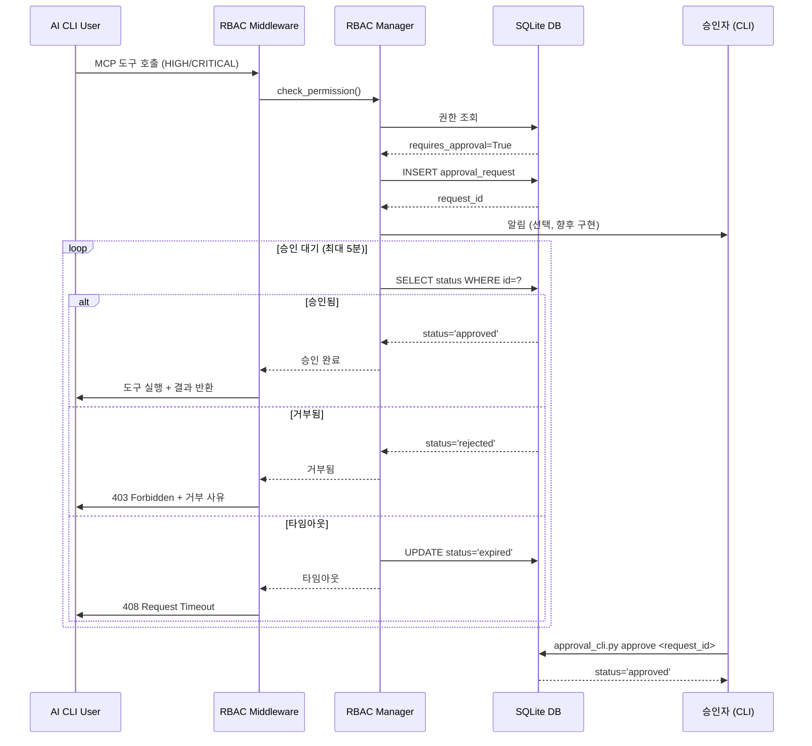
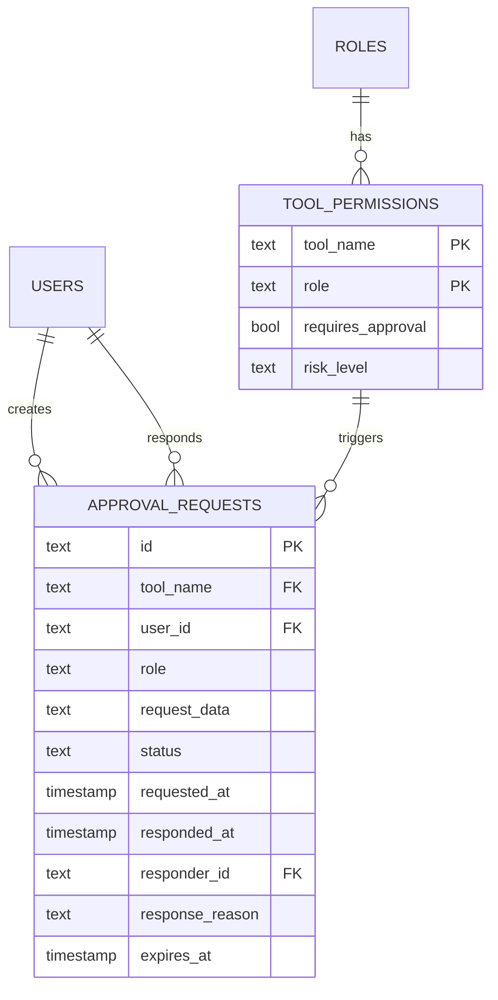

# 승인 워크플로우 구현 계획

## 문제 분석

### 1. 문제 정의 및 복잡성 평가
- **문제**: MCP 서버의 HIGH/CRITICAL 등급 도구에 대한 승인 워크플로우 구현
- **복잡성 수준**: 중간~높음
- **예상 소요 시간**: 12-16시간 (2-3일)
- **주요 도전 과제**:
  - 비동기 승인 대기 메커니즘 설계 (FastAPI 환경)
  - 타임아웃 및 동시성 처리
  - 기존 RBAC/Rate Limiting과의 통합
  - 실시간 승인 인터페이스 구현 (CLI/API)

### 2. 범위 및 제약조건
- **포함 범위**:
  - 승인 대기/승인/거부 핵심 로직
  - SQLite 기반 승인 요청 저장소
  - CLI 기반 승인 인터페이스
  - 타임아웃 및 만료 처리
  - 통합 테스트 및 문서화
- **제외 범위**:
  - 웹 기반 승인 UI (Phase 4 Desktop App에서 구현 예정)
  - 다중 승인자 워크플로우 (향후 확장)
  - 승인 히스토리 대시보드 (모니터링 시스템에서 구현)
- **제약조건**:
  - 기존 RBAC/감사 로깅 시스템과 호환
  - SQLite 동시성 제약 (WAL 모드 활용)
  - FastAPI 비동기 환경에서 동작
- **전제조건**:
  - Issue #8 RBAC 시스템 완료 (92% → 100%)
  - SQLite 데이터베이스 운영 준비 완료

---

## 리뷰 피드백 요약 (2025-10-01)
- 플래그 명칭 정합성: 기존 보안 문서와 설정은 `APPROVAL_WORKFLOW_ENABLED`를 사용한다
  (`docs/security/IMPLEMENTATION_SUMMARY.md:264`). 계획서에서도 같은 이름을 유지해
  배포 시 혼선을 막는다. 제안된 `APPROVAL_ENABLED` 용어는 모두
  `APPROVAL_WORKFLOW_ENABLED`로 교체한다.
- 데이터 모델 재정렬: 승인 ERD에서 `USERS`, `TOOL_PERMISSIONS` 등 새 테이블명을 쓰고
  있는데, 실제 스키마는 `security_users`, `security_permissions`,
  `security_role_permissions` 구조다
  (`services/mcp-server/scripts/security_schema.sql`). 마이그레이션과 다이어그램을 기존
  명명 규칙과 외래키 체계에 맞춰 조정한다.
- 승인 대기 구조: `asyncio.wait_for`에 1초 주기 SQLite 폴링을 결합하면 워커와 DB 연결이
  최고 5분간 묶일 수 있다. 비차단 큐, polling 주기 개선, 백그라운드 태스크 분리를 검토해
  리소스 고갈을 방지한다.
- 승인 API 보안: `/api/approvals/...` 엔드포인트에 적용할 인증·권한 모델이 정의되지
  않았다. admin 전용 토큰 등 RBAC 통합 방안을 Phase 2 설계 산출물에 포함한다.

---

## 작업 분해

### Phase 1: 준비 및 설계 (2-3시간)
**목표**: 승인 워크플로우 설계 및 데이터 모델 정의

| 작업 | 설명 | 완료 기준 (DoD) | 우선순위 |
|------|------|-----------------|----------|
| 요구사항 분석 | 승인 시나리오, 타임아웃 정책, 동시성 요구사항 정의 | 요구사항 문서 작성 (`docs/security/APPROVAL_REQUIREMENTS.md`) | 높음 |
| 데이터 모델 설계 | 승인 요청/응답 테이블 스키마 설계 | ERD 다이어그램 + SQL DDL 작성 | 높음 |
| 아키텍처 설계 | 승인 대기 메커니즘, CLI/API 인터페이스 설계 | 시퀀스 다이어그램 작성 (Mermaid) | 높음 |
| 환경 변수 정의 | 타임아웃, 승인 모드 등 설정 항목 정의 | `.env.example` 업데이트 | 중간 |

**산출물:**
```
docs/security/
├── APPROVAL_REQUIREMENTS.md       # 요구사항 명세
├── APPROVAL_ARCHITECTURE.md       # 아키텍처 설계
└── diagrams/
    ├── approval_flow_sequence.mmd # 시퀀스 다이어그램
    └── approval_db_erd.mmd        # 데이터베이스 ERD
```

---

### Phase 2: 핵심 기능 구현 (6-8시간)
**목표**: 승인 대기/승인/거부 핵심 로직 완성

| 작업 | 설명 | 완료 기준 (DoD) | 의존성 |
|------|------|-----------------|--------|
| 2.1 DB 스키마 구현 | `approval_requests` 테이블 생성 마이그레이션 | SQL 스크립트 작성 + 실행 성공 | Phase 1 완료 |
| 2.2 승인 매니저 구현 | `rbac_manager.py`의 `requires_approval()`, `_wait_for_approval()` 실구현 | 단위 테스트 통과 | 2.1 완료 |
| 2.3 승인 API 엔드포인트 | `/api/approvals/pending`, `/api/approvals/{id}/approve`, `/api/approvals/{id}/reject` | API 테스트 통과 | 2.2 완료 |
| 2.4 CLI 승인 도구 | `scripts/approval_cli.py` - 대기 목록 조회/승인/거부 명령 | CLI 실행 성공 | 2.3 완료 |
| 2.5 타임아웃 처리 | asyncio timeout + 만료된 요청 정리 cronjob | 타임아웃 테스트 통과 | 2.2 완료 |

**기술 스택:**
- **비동기 대기**: `asyncio.Event` + SQLite polling (1초 간격)
- **동시성 제어**: SQLite WAL 모드 + `threading.Lock`
- **타임아웃**: `asyncio.wait_for()` + 환경 변수 `APPROVAL_TIMEOUT` (기본 300초)

**데이터 모델 (approval_requests 테이블):**
```sql
CREATE TABLE approval_requests (
    id TEXT PRIMARY KEY,
    tool_name TEXT NOT NULL,
    user_id TEXT NOT NULL,
    role TEXT NOT NULL,
    request_data TEXT,  -- JSON 직렬화된 도구 인자
    status TEXT DEFAULT 'pending',  -- pending/approved/rejected/expired
    requested_at TIMESTAMP DEFAULT CURRENT_TIMESTAMP,
    responded_at TIMESTAMP,
    responder_id TEXT,
    response_reason TEXT,
    expires_at TIMESTAMP NOT NULL
);
CREATE INDEX idx_status_expires ON approval_requests(status, expires_at);
```

---

### Phase 3: 통합 및 최적화 (4-5시간)
**목표**: 미들웨어 통합 및 전체 시스템 검증

| 작업 | 설명 | 완료 기준 (DoD) | 위험도 |
|------|------|-----------------|--------|
| 3.1 미들웨어 통합 | `rbac_middleware.py`에서 승인 플래그 감지 후 `requires_approval()` 호출 | 통합 테스트 통과 | 중간 |
| 3.2 감사 로깅 통합 | 승인 요청/응답을 `audit_logs` 테이블에 기록 | 감사 로그 생성 확인 | 낮음 |
| 3.3 통합 테스트 작성 | 승인/거부/타임아웃 시나리오 (5개 이상) | `pytest` 100% 통과 | 높음 |
| 3.4 성능 테스트 | 동시 승인 요청 10개 처리 | 응답 시간 < 5초 | 중간 |
| 3.5 문서 작성 | 운영 가이드, API 레퍼런스, 검증 리포트 | 문서 리뷰 완료 | 중간 |

**테스트 시나리오:**
1. ✅ HIGH 등급 도구 호출 → 승인 대기 → CLI로 승인 → 도구 실행 성공
2. ✅ CRITICAL 도구 호출 → CLI로 거부 → 403 Forbidden 응답
3. ✅ 승인 요청 타임아웃 (5분) → 자동 만료 → 408 Timeout 응답
4. ✅ 동시 다중 승인 요청 → 순차 처리 → 각각 독립적 응답
5. ✅ 승인 권한 없는 사용자 거부 시도 → 403 Forbidden

---

## 실행 계획

### 우선순위 매트릭스
```
긴급 & 중요              | 중요하지만 덜 긴급
-------------------------|---------------------------
2.1 DB 스키마 구현       | 1.4 환경 변수 정의
2.2 승인 매니저 구현     | 3.4 성능 테스트
3.1 미들웨어 통합        |
3.3 통합 테스트 작성     |

긴급하지만 덜 중요       | 덜 중요 & 덜 긴급
-------------------------|---------------------------
2.4 CLI 승인 도구        | 3.2 감사 로깅 통합
2.5 타임아웃 처리        | 3.5 문서 작성 (일부)
```

### 마일스톤
- **Day 1 (4시간)**: Phase 1 완료 + 2.1, 2.2 작업 시작
- **Day 2 (6시간)**: Phase 2 완료 (2.3, 2.4, 2.5)
- **Day 3 (5시간)**: Phase 3 완료 + 문서화 + 검증 리포트

### 위험 요소 및 대응 방안
| 위험 요소 | 가능성 | 영향도 | 대응 방안 |
|-----------|--------|--------|-----------|
| SQLite 동시성 병목 | 중간 | 높음 | WAL 모드 + 재시도 로직, 필요 시 Redis 대기 큐로 전환 |
| FastAPI 비동기 블로킹 | 낮음 | 높음 | `run_in_executor()`로 DB 작업 격리 |
| 타임아웃 처리 복잡도 | 중간 | 중간 | `asyncio.wait_for()` 활용, 단순한 polling 방식 채택 |
| CLI 사용성 문제 | 높음 | 낮음 | `rich` 라이브러리로 TUI 개선, 명확한 에러 메시지 |
| 기존 테스트 실패 | 낮음 | 높음 | 승인 모드 off 시 기존 동작 보장 (feature flag) |

---

## 아키텍처 다이어그램

### 승인 플로우 시퀀스 다이어그램


### 데이터베이스 ERD


---

## 품질 체크리스트

### 각 작업 완료 시 확인사항
- [ ] 요구사항 충족 여부 확인 (시나리오 테스트)
- [ ] 코드 리뷰 완료 (self-review + 린트 통과)
- [ ] 단위/통합 테스트 통과 (`pytest -v`)
- [ ] 문서 업데이트 (docstring + 운영 가이드)
- [ ] 다음 작업 차단 요소 없음 (의존성 확인)

### 전체 완료 기준 (DoD)
- [ ] 모든 핵심 기능 정상 동작 (5개 시나리오 통과)
- [ ] 사용자 시나리오 테스트 통과 (CLI 승인 플로우)
- [ ] 성능 요구사항 만족 (동시 요청 10개 < 5초)
- [ ] 배포 준비 완료 (feature flag `APPROVAL_ENABLED=true` 테스트)
- [ ] 운영 문서 작성 완료 (APPROVAL_GUIDE.md, 검증 리포트)

---

## 리소스 및 참고자료

### 필요한 리소스
- **인력**: 1명 (백엔드 개발자, 12-16시간)
- **도구**:
  - FastAPI, SQLite, asyncio
  - pytest, pytest-asyncio
  - rich (CLI TUI)
- **인프라**: 로컬 개발 환경 (WSL2)

### 학습 자료
- [FastAPI Background Tasks](https://fastapi.tiangolo.com/tutorial/background-tasks/)
- [asyncio Synchronization Primitives](https://docs.python.org/3/library/asyncio-sync.html)
- [SQLite WAL Mode](https://www.sqlite.org/wal.html)
- [Rich Library TUI](https://rich.readthedocs.io/)

### 유사 사례
- GitHub Actions Approval Workflow
- Kubernetes Admission Webhooks
- Ansible Tower Job Approval

---

## 구현 우선순위 작업 목록

**즉시 시작 (Day 1):**
1. Phase 1 전체 (설계 문서 작성)
2. 2.1 DB 스키마 구현
3. 2.2 승인 매니저 핵심 로직

**Day 2:**
4. 2.3 승인 API 엔드포인트
5. 2.4 CLI 승인 도구
6. 2.5 타임아웃 처리

**Day 3:**
7. 3.1 미들웨어 통합
8. 3.3 통합 테스트
9. 3.5 문서 작성 + 검증 리포트

---

**💡 추가 고려사항**
- **Feature Flag**: `APPROVAL_ENABLED` 환경 변수로 승인 모드 on/off 제어
- **알림 메커니즘**: 초기에는 polling 기반, 향후 WebSocket/SSE로 확장
- **승인자 권한**: `admin` 역할만 승인/거부 가능 (초기 구현)
- **모니터링**: 승인 대기 시간, 승인율 등 메트릭 수집 (Prometheus 연동 고려)
- **회고**: Phase 2 완료 후 SQLite 성능 측정, 필요 시 Redis로 전환 검토
