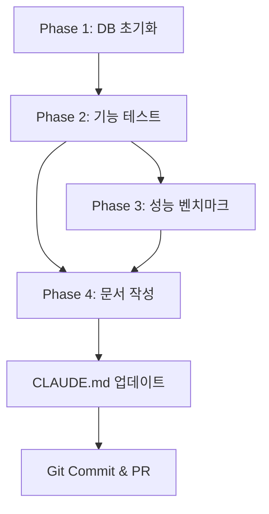
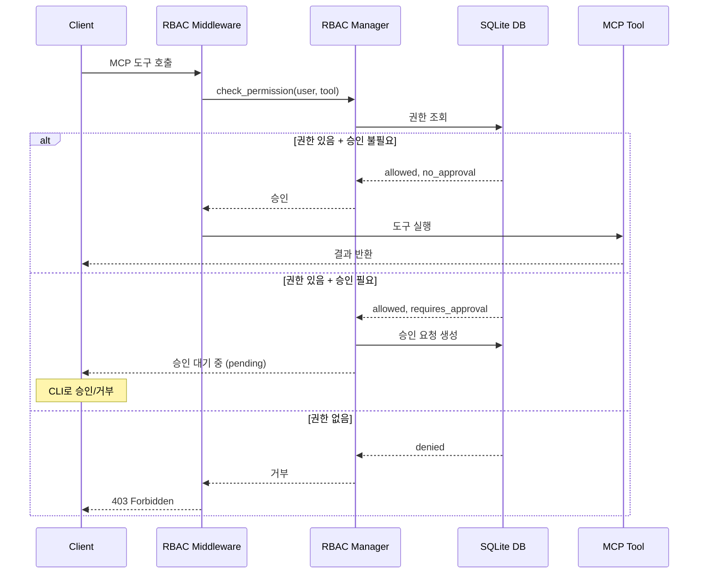

# Issue #8 RBAC 운영 준비 완료 계획

## 문제 분석

### 1. 문제 정의 및 복잡성 평가
- **문제**: Issue #8 RBAC 시스템의 운영 준비 작업 완료 (92% → 100%)
- **복잡성 수준**: 중간
- **예상 소요 시간**: 2-3시간
- **주요 도전 과제**:
  - 기존 DB 스키마와 시딩 스크립트의 일관성 검증
  - 실제 FastAPI 서비스 환경에서 RBAC 동작 검증
  - 성능 벤치마크 기준 설정 및 측정
  - 운영 문서의 실무 활용 가능성 확보

### 2. 범위 및 제약조건
- **포함 범위**:
  - DB 초기화 및 시딩 (security.db)
  - RBAC 기능 테스트 (pytest 기반)
  - 성능 벤치마크 (locust/httpx 기반)
  - 운영 문서 작성 (SECURITY.md, RBAC_GUIDE.md)
  - CLAUDE.md 업데이트
- **제외 범위**:
  - 새로운 RBAC 기능 추가
  - 승인 워크플로우 추가 개발 (Issue #16에서 완료됨)
  - 프론트엔드 관리 UI 개발
- **제약조건**:
  - Issue #16 승인 워크플로우가 완료된 상태 기준
  - 기존 RBAC 코드 구조 유지 (services/mcp-server/)
  - SQLite 기반 DB (PostgreSQL 마이그레이션 제외)
- **전제조건**:
  - Issue #16 승인 워크플로우 완료 (✅ 완료됨)
  - services/mcp-server/ RBAC 코드 구현 완료 (✅ 완료됨)
  - Docker 환경 구성 완료

---

## 작업 분해

### Phase 1: DB 초기화 및 검증 (약 30분)
**목표**: 운영 환경용 security.db를 최신 스키마와 시드 데이터로 준비

- 스키마 확인: `services/mcp-server/scripts/security_schema.sql`, `services/mcp-server/scripts/approval_schema.sql` 위치와 내용을 점검하고 변경분이 있으면 리뷰한다.
- DB 초기화: `python services/mcp-server/scripts/seed_security_data.py --reset`으로 security.db를 생성·시딩하고, 승인 워크플로우 테이블이 필요한 경우 `python services/mcp-server/scripts/apply_approval_schema.py --db-path /mnt/e/ai-data/sqlite/security.db`를 추가 실행한다.
- 시드 데이터 검증: `sqlite3 /mnt/e/ai-data/sqlite/security.db "SELECT * FROM security_users"` 등 기본 쿼리로 역할/권한 매핑을 확인한다.
- 데이터 무결성: `PRAGMA foreign_key_check`, `PRAGMA integrity_check` 결과를 기록하고, 인덱스/뷰가 원하는 대로 생성됐는지 확인한다.

**산출물:**
- `/mnt/e/ai-data/sqlite/security.db` 초기화 로그와 결과 스크린샷
- `services/mcp-server/scripts/verify_rbac_sqlite.py` 실행 리포트(무결성·성능 스냅샷)

---

### Phase 2: RBAC 기능 테스트 (약 60분)
**목표**: FastAPI 경로와 RBAC 미들웨어가 역할·권한별로 정상 동작하는지 검증

- 테스트 환경: 컨테이너 또는 로컬 가상환경에서 pytest/httpx/pytest-asyncio 설치 여부를 확인한다.
- 권한 시나리오: `services/mcp-server/tests/test_rbac_operations.py`를 신규 작성해 admin/developer/guest(=user) 역할의 허용·거부 케이스 10건 이상을 커버한다.
- 승인 연동: 기존 `services/mcp-server/tests/test_approval_workflow.py`를 재사용해 HIGH/CRITICAL 민감도 도구의 승인 대기 → 승인/거부 흐름을 다시 확인한다.
- 감사 로깅: 테스트 중 생성된 `security_audit_logs` 를 쿼리해 성공/거부 이벤트가 모두 기록되는지 검증한다.
- 에러 처리: 403, 500 등 예외 응답을 고의로 유발해 메시지·코드가 문서화된 정책과 일치하는지 확인한다.

**테스트 실행:**
```bash
pytest services/mcp-server/tests/test_rbac_operations.py -q
pytest services/mcp-server/tests/test_approval_workflow.py -q
```

---

### Phase 3: 성능 벤치마크 (약 30분)
**목표**: RBAC 승인·검증 단계가 API 응답 시간에 주는 영향을 정량화

- 도구 및 스크립트: locust 또는 httpx 기반 벤치마크 스크립트를 `services/mcp-server/tests/benchmark_rbac.py`(신규)로 작성한다.
- 기준 정의: RPS 100+, 95p latency 100ms 이하, 에러율 1% 이하(권한 거부 제외)를 목표로 문서화한다.
- 실행: `/tools/{tool_name}` 엔드포인트를 1분 이상 지속 부하하고 RBAC on/off 비교가 가능하면 함께 기록한다.
- 결과 수집: RPS/평균/95p latency, 에러율을 CSV 또는 JSON으로 보존하고, 주요 수치를 Phase 4 문서에 반영한다.

**예상 결과:**
- `python services/mcp-server/tests/benchmark_rbac.py --duration 60 --output data/rbac_benchmark.csv`
- 오버헤드가 10% 이상이면 원인을 정리하고 후속 최적화 항목으로 남긴다.

---

### Phase 4: 운영 문서 작성 (약 40분)
**목표**: 운영 조직이 바로 참고할 수 있는 보안·운영 가이드 정비

- `SECURITY.md`: RBAC 아키텍처, 승인 흐름, 배포 절차(환경 변수, DB 초기화, 헬스체크)를 최신 상태로 갱신한다.
- `RBAC_GUIDE.md`: 사용자·역할 관리, 권한 매트릭스, 승인 워크플로우 사용법, CLI 절차, 테스트/벤치마크 요약, 트러블슈팅을 포함해 신규 작성하거나 대폭 보강한다.
- 결과 반영: Phase 2 테스트 로그와 Phase 3 벤치마크 결과를 표/그래프 형태로 삽입하고, 운영 체크리스트를 추가한다.
- 문서 검토: Markdown 렌더링과 내부 링크를 확인하고, 주요 변경점을 CLAUDE.md에 기록한다.
- CLAUDE.md 업데이트: Issue #8/16 완료 상태, Production readiness 95%를 반영하고 후속 과제를 링크한다.

**문서 구조 가이드:**

**SECURITY.md**
```markdown
# Security Overview
## RBAC System
- Architecture (ERD, Sequence Diagram)
- Roles & Permissions
- Approval Workflow

## Deployment
- DB Initialization
- Environment Variables
- Health Check

## Audit Logging
- Log Format
- Query Examples
```

**RBAC_GUIDE.md**
```markdown
# RBAC Operation Guide
## Getting Started
- Prerequisites
- Quick Start

## User Management
- Create/Update/Delete Users
- Assign Roles

## Permission Management
- Tool Permission Matrix
- Update Permissions

## Approval Workflow
- Enable/Disable
- Approve/Reject Requests
- CLI Usage

## Testing
- Test Results Summary
- Performance Benchmark

## Troubleshooting
- Common Issues
- Debug Commands
```

---

## 실행 계획

### 우선순위 매트릭스
```
긴급 & 중요              | 중요하지만 덜 긴급
-------------------------|---------------------------
security.db 초기화/시딩  | 무결성 검증 로그 정리
권한 검증 테스트 확장    | 성능 지표 목표치 문서화
CLAUDE.md 업데이트       | 트러블슈팅 가이드 작성

긴급하지만 덜 중요       | 덜 중요 & 덜 긴급
-------------------------|---------------------------
부하 테스트 실행         | 온/오프 비교 분석
예외 응답 검증           | SECURITY.md 세부 업데이트
```

### 마일스톤
- **0-30분**: Phase 1 완료 (DB 초기화 및 검증)
- **30-90분**: Phase 2 완료 (RBAC 기능 테스트)
- **90-120분**: Phase 3 완료 (성능 벤치마크)
- **120-160분**: Phase 4 완료 (운영 문서 작성)
- **160-180분**: 최종 검증 및 커밋

### 위험 요소 및 대응 방안
| 위험 요소 | 가능성 | 영향도 | 대응 방안 |
|-----------|--------|--------|-----------|
| 기존 스키마 불일치 | 낮음 | 높음 | Issue #16에서 이미 스키마 통합 완료, 검증 스크립트로 사전 확인 |
| 테스트 실패 | 중간 | 높음 | 실패 시 로그 수집 후 디버깅, 필요 시 코드 수정 (1시간 버퍼) |
| 성능 기준 미달 | 낮음 | 중간 | 기준 조정 또는 최적화 방안 문서화 (현재 성능 기록) |
| 문서 작성 지연 | 중간 | 낮음 | 핵심 운영 가이드 우선 작성, 상세 설명은 후속 작업 |

---

## 품질 체크리스트

### 각 작업 완료 시 확인사항
- [ ] DB 테이블/인덱스 생성 확인 (Phase 1)
- [ ] pytest 테스트 100% 통과 (Phase 2)
- [ ] 벤치마크 결과 CSV 파일 생성 (Phase 3)
- [ ] 문서 Markdown 렌더링 확인 (Phase 4)
- [ ] 다음 Phase 차단 요소 없음

### 전체 완료 기준 (DoD)
- [ ] security.db 초기화 및 `verify_rbac_sqlite.py` 결과 로그 첨부
- [ ] RBAC pytest 스위트(권한/승인/에러) 100% 통과
- [ ] 성능 벤치마크 목표 달성 (RPS 100+, 95p latency < 100ms)
- [ ] SECURITY.md, RBAC_GUIDE.md 갱신 완료(체크리스트/로그 포함)
- [ ] CLAUDE.md에 Issue #8/16 상태와 readiness 95% 반영
- [ ] Conventional Commit 메시지 초안 작성

---

## 리소스 및 참고자료

### 필요한 리소스
- **인력**: 1명 (백엔드 개발자, 2-3시간)
- **도구**:
  - Python 3.11+, pytest, httpx, pytest-asyncio
  - locust 또는 httpx (벤치마크)
  - SQLite 3.x
- **인프라**: 로컬 개발 환경 (WSL2)

### 학습 자료
- [pytest Documentation](https://docs.pytest.org/)
- [Locust Load Testing](https://docs.locust.io/)
- [FastAPI Testing](https://fastapi.tiangolo.com/tutorial/testing/)
- [SQLite PRAGMA Commands](https://www.sqlite.org/pragma.html)

### 유사 사례
- Issue #14 Service Reliability 테스트/문서화 프로세스
- Issue #16 Approval Workflow 검증 리포트

### 프로젝트 문서
- `docs/security/IMPLEMENTATION_SUMMARY.md` - RBAC 구현 요약
- `docs/progress/v1/ri_4.md` - Issue #8 상세 계획
- `services/mcp-server/tests/test_approval_workflow.py` - 승인 워크플로우 테스트 참고

---

## 아키텍처 다이어그램

### 작업 의존성 그래프


### RBAC 시스템 아키텍처 (참고)


---

## 💡 추가 고려사항

### Phase 완료 후 회고
- **Phase 1 후**: DB 스키마 이슈 발견 시 즉시 수정, 다음 Phase 진행 전 재검증
- **Phase 2 후**: 테스트 실패율 10% 이상 시 원인 분석 및 코드 수정
- **Phase 3 후**: 성능 기준 미달 시 현재 성능 기록 후 최적화 계획 수립 (후속 이슈)

### 예상 이슈 및 대응
- **Issue #16 충돌**: 승인 워크플로우 스키마가 RBAC 테이블과 충돌할 가능성
  - 대응: `approval_requests` 테이블이 `security_users`를 참조하도록 외래키 검증
- **성능 오버헤드**: RBAC 미들웨어가 모든 요청에서 DB 조회
  - 대응: 권한 캐싱 메커니즘 고려 (후속 최적화)
- **문서 불일치**: 코드 변경이 문서에 반영 안됨
  - 대응: Phase 4에서 코드 리뷰 후 문서 동기화

### 후속 작업 (선택적)
- [ ] PostgreSQL 마이그레이션 (SQLite 동시성 제약 해결)
- [ ] 권한 캐싱 메커니즘 추가 (성능 최적화)
- [ ] 웹 기반 RBAC 관리 UI 개발 (Phase 4 Desktop App)
- [ ] 전체 시스템 통합 테스트 (Phase 1-3 포함)

---

## 구현 우선순위 작업 목록

**즉시 시작:**
1. ✅ `python services/mcp-server/scripts/seed_security_data.py --reset`
2. ✅ 필요 시 `apply_approval_schema.py`로 승인 스키마 적용 및 `verify_rbac_sqlite.py` 실행
3. ✅ pytest/httpx/pytest-asyncio 설치 여부 확인

**Phase 1 완료 후:**
4. ✅ `test_rbac_operations.py` 작성·통과
5. ✅ `test_approval_workflow.py` 재검증 및 감사 로그 확인

**Phase 2 완료 후:**
6. ✅ `benchmark_rbac.py` 부하 테스트 실행 및 CSV 수집
7. ✅ `SECURITY.md`·`RBAC_GUIDE.md` 운영 가이드 반영

**최종 단계:**
8. ✅ CLAUDE.md에 readiness 95% 기록
9. ✅ Git commit & Push (Conventional Commit 규칙)

---

**🎯 성공 기준**
- Production readiness: 85% → **95%**
- Issue #8 완료율: 92% → **100%**
- 운영 준비 상태: **배포 가능**
