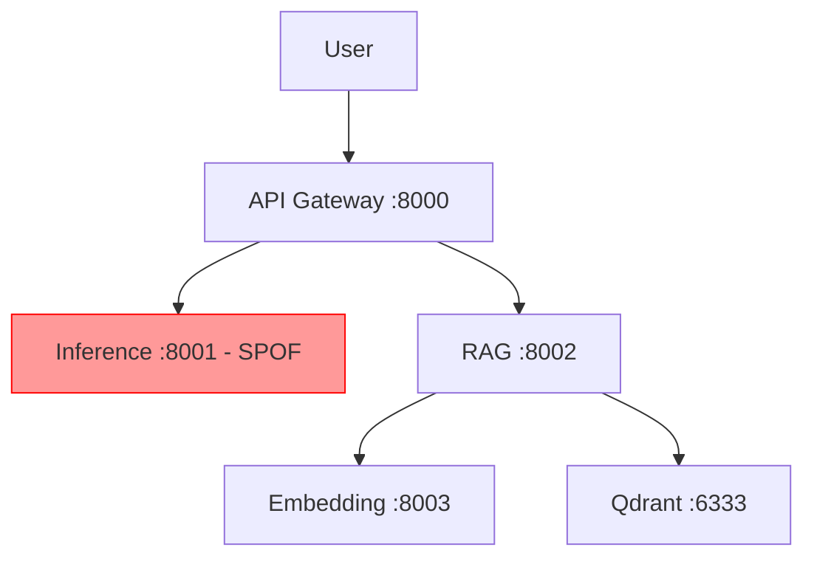

# GitHub Issue #14 - Service Reliability 개선 분석 및 해결 계획

## 📋 Issue Information Summary

**이슈 번호**: #14
**제목**: [Enhancement] Service Reliability 개선 - LLM 이중화 및 자동 복구
**상태**: OPEN
**생성일**: 2025-10-08
**우선순위**: HIGH
**복잡도**: MEDIUM-HIGH

**핵심 요구사항**:
- Phase 2 LLM 서버 이중화 (inference-chat/inference-code 분리)
- 모든 서비스에 `/health` 엔드포인트 및 Docker healthcheck 추가
- RAG-Qdrant 호출에 재시도/백오프 메커니즘 추가
- 타임아웃 환경변수 통일
- MCP 모델 스위치 컨테이너 이름 수정

---

## 🔍 Technical Investigation

### 영향 범위 분석

**Phase 2 현재 구조** (`compose.p2.yml:2`):
- 단일 `inference` 컨테이너가 chat/code 트래픽 모두 처리 (SPOF)
- healthcheck는 있으나 `depends_on`이 `service_healthy` 조건 미사용
- RAG/Embedding/Qdrant는 healthcheck 없음

**Phase 3 현재 구조** (`compose.p3.yml`):
- 이미 이중화 완료 (inference-chat:8001, inference-code:8004)
- Embedding/Qdrant에 healthcheck 추가됨
- `depends_on` 조건으로 `service_healthy` 사용

**코드 영향 범위**:
1. **Docker Compose**: `docker/compose.p2.yml` 전체 개편 + 채팅 모델 기본값 3B로 변경
2. **LiteLLM Config**: `services/api-gateway/config.p2.yaml` (api_base 수정)
3. **RAG Service**: `services/rag/app.py:207,215` (Qdrant 호출 재시도)
4. **MCP Server**: `services/mcp-server/app.py:1299` (컨테이너 이름 수정)
5. **환경변수**: `.env.example` (타임아웃 표준화 + 3B 기본값 명시)

### Dependency Check

**의존성 이슈**:
- Phase 2 개선은 Phase 3 구조를 참고하여 역이식
- Phase 1은 영향 없음 (단일 inference 유지)
- 기존 사용자 워크플로우 호환성 유지 필요
- 현재 `docker/compose.p3.yml`은 일부 서비스에서 여전히 기본 `depends_on`을 사용하고 있으므로, 역이식 시 여기 정의한 `condition: service_healthy` 규칙을 직접 반영해야 함

---

## 💡 Solution Strategy

### Recommended Approach: **Option 1 - Phase 3 구조 역이식**

**장점**:
- Phase 3에서 이미 검증된 이중화 구조 재사용
- 최소한의 변경으로 안정성 확보
- Phase 2/3 구조 일관성 확보

**단점**:
- GPU 메모리 부족 가능성 (7B + 7B 동시 실행)
- Phase 2 사용자는 재배포 필요

**예상 시간**: 3-5일 (20-30시간)
**위험도**: Medium

**GPU 메모리 대응**:
- Phase 2 기본 채팅 모델을 Qwen2.5-3B-Instruct-Q4_K_M.gguf로 고정해 VRAM 사용을 6GB 이내로 유지
- `--n-gpu-layers` 조정으로 추가 CPU fallback 활용

---

## 📅 Detailed Implementation Plan

### Phase 1: 아키텍처 설계 및 환경 변수 통일 (Day 1, 6시간)

| Task | Description | DoD | Risk |
|------|-------------|-----|------|
| Phase 2/3 구조 비교 분석 | compose.p2.yml vs p3.yml 차이점 문서화 | Mermaid 다이어그램 완성 | Low |
| 타임아웃 환경변수 표준화 | `.env.example`에 `LLM_REQUEST_TIMEOUT` 등 추가 | 환경변수 문서 완성 | Low |
| GPU 메모리 검증 | 7B+7B 동시 실행 테스트 또는 3B+7B 대안 확인 | 실제 실행 로그 확인 | Medium |
| 헬스체크 스펙 정의 | `/health` 엔드포인트 API 스펙 문서화 | OpenAPI 스펙 완성 | Low |

### Phase 2: LLM 서버 이중화 (Day 2-3, 10시간)

| Task | Description | DoD | Risk |
|------|-------------|-----|------|
| compose.p2.yml 수정 | inference → inference-chat/inference-code 분리 | `docker-compose config` 검증 | Medium |
| config.p2.yaml 수정 | api_base를 inference-chat:8001 / inference-code:8004로 분리 | LiteLLM 구문 검증 | Low |
| 포트 매핑 정리 | inference-chat:8001, inference-code:8004 확정 | 포트 충돌 없음 확인 | Low |
| 채팅 모델 기본값 3B로 조정 | compose.p2.yml 기본 `CHAT_MODEL`을 Qwen2.5-3B로 변경하고 `.env.example`/문서 반영 | `docker-compose config` 출력 및 문서 리뷰 | Low |
| LiteLLM 페일오버 구성 | `config.p2.yaml` 라우터에 재시도/백업 엔드포인트 설정 추가 | 라우터 재시도 시뮬레이션 로그 확인 | Medium |
| Phase 2 기동 테스트 | `make up-p2` 실행 및 양쪽 모델 호출 테스트 | 양쪽 API 정상 응답 | High |

#### LiteLLM 페일오버 구성 세부 사항
- `model_list`에 `model_name: chat-7b`를 두 개 정의하고 `api_base`를 각각 `inference-chat`(priority 1)과 `inference-code`(priority 2)로 설정해 순차 백업 경로 확보
- `router` 섹션에 `num_retries`, `retry_on_status_codes`, `retry_strategy: sequence`를 추가하여 5xx/타임아웃 시 자동 재시도 되도록 구성
- 필요 시 `fallbacks` 옵션으로 추가 엔드포인트(예: Phase 3용) 연결, 재시도 지표는 LiteLLM 로그와 Prometheus 계측으로 검증

### Phase 3: 헬스체크 및 의존성 관리 (Day 3-4, 10시간)

| Task | Description | DoD | Risk |
|------|-------------|-----|------|
| RAG `/health` 엔드포인트 강화 | Qdrant/Embedding 의존성 체크 추가 (기존 코드 활용) | curl 테스트 통과 | Low |
| Embedding healthcheck 추가 | compose.p2.yml에 healthcheck 블록 추가 | Docker inspect 확인 | Low |
| Qdrant healthcheck 추가 | `/proc/net/tcp` 기반 체크 (Phase 3 방식) | Docker inspect 확인 | Low |
| depends_on 조건 추가 | `condition: service_healthy` 전면 적용 | 의존성 순서 확인 | Medium |

### Phase 4: 재시도 메커니즘 및 에러 처리 개선 (Day 4-5, 8시간)

| Task | Description | DoD | Risk |
|------|-------------|-----|------|
| RAG Qdrant 재시도 추가 | `tenacity` 라이브러리로 3회 재시도 + exponential backoff | 단위 테스트 통과 | Medium |
| RAG 에러 응답 개선 | 500 → 503 + Retry-After 헤더 추가 | API 테스트 확인 | Low |
| MCP 컨테이너 이름 수정 | `inference` → `inference-chat`/`inference-code` | 모델 스위치 동작 확인 | Low |
| 타임아웃 환경변수 적용 | RAG_LLM_TIMEOUT 등 모든 서비스에 적용 | 타임아웃 로그 확인 | Low |

### Phase 5: 통합 테스트 및 문서화 (Day 5, 6시간)

| Task | Description | DoD | Risk |
|------|-------------|-----|------|
| Failover 테스트 | inference-chat 강제 종료 후 LiteLLM이 inference-code로 재시도하고 자동 복구 확인 | 30초 내 복구 + 재시도 로그 확보 | High |
| 의존성 복구 테스트 | Qdrant 재시작 후 RAG 재연결 확인 | 5분 내 재연결 | Medium |
| 타임아웃 시나리오 테스트 | connect/read 타임아웃 분리 동작 확인 | 로그 분석 완료 | Low |
| 운영 문서 작성 | `docs/ops/SERVICE_RELIABILITY.md` 작성 | 문서 리뷰 완료 | Low |

---

## 🚨 Risk Assessment & Mitigation

### High Risk Items

| Risk | Impact | Probability | Mitigation Strategy |
|------|--------|-------------|-------------------|
| GPU 메모리 부족 (이중화) | Medium | Low | Phase 2 기본 채팅 모델을 3B로 설정하고 필요 시 `--n-gpu-layers` 조정 |
| 기존 워크플로우 중단 | High | Medium | Phase 1 유지, Phase 2/3만 수정. 롤백 스크립트 준비 |
| LiteLLM failover 미동작 | Medium | Medium | 사전 로컬 테스트, LiteLLM 공식 문서 참조 |
| 순환 의존성 발생 | Medium | Low | 의존성 그래프 사전 검증, 타임아웃 설정 |

### Technical Challenges

1. **GPU 메모리 관리**:
   - 해결: Chat 모델을 3B로 다운그레이드 (Qwen2.5-3B-Instruct-Q4_K_M.gguf)
   - 대안: CPU fallback 활용 (`--n-gpu-layers` 조정)

2. **Qdrant 재시도 로직**:
   - 해결: `tenacity` 라이브러리 사용 (exponential backoff)
   - 코드: `@retry(stop=stop_after_attempt(3), wait=wait_exponential(multiplier=1, min=2, max=10))`

3. **헬스체크 타이밍**:
   - 해결: `start_period` 30초 설정으로 초기 시작 시간 확보
   - Qdrant는 HTTP 클라이언트 없으므로 `/proc/net/tcp` 활용

### Rollback Plan

**롤백 시나리오**:
1. **이중화 실패 시** → `git revert`로 이전 compose.p2.yml 복구
2. **GPU 메모리 부족 시** → `.env`에서 `CHAT_MODEL=Qwen2.5-3B-Instruct-Q4_K_M.gguf` 설정
3. **의존성 순환 시** → `depends_on` 조건 제거 후 수동 순서 조정

---

## 📦 Resource Requirements

### Human Resources
- **개발자**: 1명, Docker/FastAPI/Python 숙련
- **리뷰어**: 시스템 아키텍트 또는 시니어 개발자
- **QA**: 통합 테스트 담당자 (선택)

### Technical Resources
- **개발 도구**: Docker Compose 3.8+, Python 3.11+, `tenacity` 라이브러리
- **GGUF 모델**: Qwen2.5-3B-Instruct-Q4_K_M.gguf, Qwen2.5-Coder-7B-Instruct-Q4_K_M.gguf
- **테스트 환경**: WSL2 + RTX 4050 (6GB VRAM)
- **모니터링**: Docker logs, Prometheus (기존 instrumentator 활용)

### Time Estimation
- **총 예상 시간**: 5일 (40시간)
- **버퍼 시간**: 1-2일 (20% 버퍼)
- **완료 목표일**: 2025-10-13

---

## 🧪 Quality Assurance Plan

### Test Strategy

**테스트 레벨**:
- **Unit Tests**: RAG Qdrant 재시도 로직 단위 테스트
- **Integration Tests**: 헬스체크 체인, 의존성 순서 테스트
- **E2E Tests**: Failover 시나리오, 복구 시나리오 테스트

### Test Cases

```gherkin
Feature: LLM 서버 이중화

  Scenario: inference-chat 장애 시 자동 복구
    Given Phase 2 서비스가 정상 기동됨
    When inference-chat 컨테이너를 강제 종료함
    Then 30초 이내에 inference-chat이 자동 재시작됨
    And API Gateway가 정상 응답함
    And LiteLLM 로그에서 inference-code로의 페일오버가 기록됨

  Scenario: Qdrant 재시작 후 RAG 재연결
    Given Phase 2 서비스가 정상 기동됨
    When Qdrant 컨테이너를 재시작함
    Then 5분 이내에 RAG가 Qdrant와 재연결됨
    And /query 엔드포인트가 정상 응답함

  Scenario: 타임아웃 표준화 동작
    Given 모든 서비스에 LLM_REQUEST_TIMEOUT=60 설정됨
    When LLM 응답이 60초 초과함
    Then 모든 서비스가 일관되게 타임아웃 에러 반환
```

### Performance Criteria
- **Failover 시간**: 30초 이내
- **Qdrant 재연결**: 5분 이내
- **응답시간**: 기존 대비 10% 이내 오버헤드
- **GPU 메모리**: 6GB 이내 사용

---

## 📣 Communication Plan

### Status Updates
- **이슈 댓글 업데이트**: 각 Phase 완료 시 진행률 업데이트
- **실시간 소통**: 이슈 댓글 및 커밋 로그

### Stakeholder Notification
- **프로젝트 매니저**: Phase 완료 시 진행률 보고
- **사용자**: Phase 2 재배포 일정 안내 (Breaking Change)

---

## 📋 User Review Checklist

**다음 항목들을 검토해주세요:**

### Planning Review
- [ ] **이슈 분석이 정확한가?**
  - 6가지 주요 이슈가 모두 파악되었나요?
  - Phase 2/3 구조 차이가 명확히 분석되었나요?

- [ ] **선택한 해결 방안이 적절한가?**
  - Phase 3 구조 역이식 방식이 최선인가?
  - GPU 메모리 대응 방안이 합리적인가?

- [ ] **구현 계획이 현실적인가?**
  - 5일 일정이 타이트하지 않나?
  - 각 Phase별 의존성이 올바르게 설정되었나?

### Resource Review
- [ ] **시간 추정이 합리적인가?**
  - 40시간 + 버퍼 20%가 충분한가?

- [ ] **필요한 리소스가 확보 가능한가?**
  - Qwen2.5-3B 모델 다운로드 가능한가?
  - RTX 4050 GPU 메모리 6GB 충분한가?

### Risk Review
- [ ] **위험 요소가 충분히 식별되었나?**
  - GPU 메모리, 워크플로우 중단, LiteLLM failover 대응 방안이 구체적인가?

- [ ] **롤백 계획이 현실적인가?**
  - `git revert`만으로 충분한가?

### Quality Review
- [ ] **테스트 전략이 충분한가?**
  - Failover, 재연결, 타임아웃 시나리오가 모두 커버되나?

---

## 🚀 Next Steps

**검토 완료 후 진행할 작업:**

1. **Plan Approval**: 위 검토를 통과하면 계획 승인
2. **Issue Update**: GitHub 이슈 #14에 상세 계획 댓글 추가
3. **Timeline Setup**: 프로젝트 일정 등록
4. **Implementation Start**: Phase 1부터 순차 진행

**수정이 필요한 경우:**
- 구체적인 수정 사항을 알려주시면 계획을 업데이트하겠습니다.

---

## 💡 피드백 요청

이 계획에 대해 어떤 부분을 수정하거나 보완해야 할까요? 특히:
- GPU 메모리 대응 (3B vs 7B 선택)
- Phase 2/3 동시 수정 vs Phase 2만 수정
- 타임라인 조정 필요 여부

---

## 📚 Resources & References

**학습 자료**:
- LiteLLM Failover: https://docs.litellm.ai/docs/routing
- Docker Compose healthcheck: https://docs.docker.com/compose/compose-file/compose-file-v3/#healthcheck
- Tenacity 재시도: https://tenacity.readthedocs.io/
- FastAPI Background Tasks: https://fastapi.tiangolo.com/tutorial/background-tasks/

**필요한 리소스**:
- Docker Compose 3.8+
- Python 라이브러리: `tenacity`, `httpx`
- GGUF 모델: `Qwen2.5-Coder-7B-Instruct-Q4_K_M.gguf`, `Qwen2.5-3B-Instruct-Q4_K_M.gguf`
- WSL2 + RTX 4050 (6GB VRAM)

---

## 아키텍처 다이어그램

### 현재 구조 (Phase 2)


### 개선 후 구조 (Phase 2 이중화)
```mermaid
graph TD
    User[User] --> Gateway[API Gateway :8000]
    Gateway --> InferenceChat[Inference-Chat (Qwen2.5-3B) :8001]
    Gateway -.failover.-> InferenceCode[Inference-Code (Qwen2.5-Coder-7B) :8004]
    Gateway --> RAG[RAG :8002]
    RAG -- retry/backoff --> Embedding[Embedding :8003]
    RAG -- retry/backoff --> Qdrant[Qdrant :6333]

    InferenceChat -.healthcheck.-> Gateway
    InferenceCode -.healthcheck.-> Gateway
    Embedding -.healthcheck.-> RAG
    Qdrant -.healthcheck.-> RAG

    style InferenceChat fill:#9f9
    style InferenceCode fill:#9f9
```

---

**관련 문서**: `docs/progress/v1/fb_7.md`
**예상 완료일**: 2025-10-13 (5일 소요)
