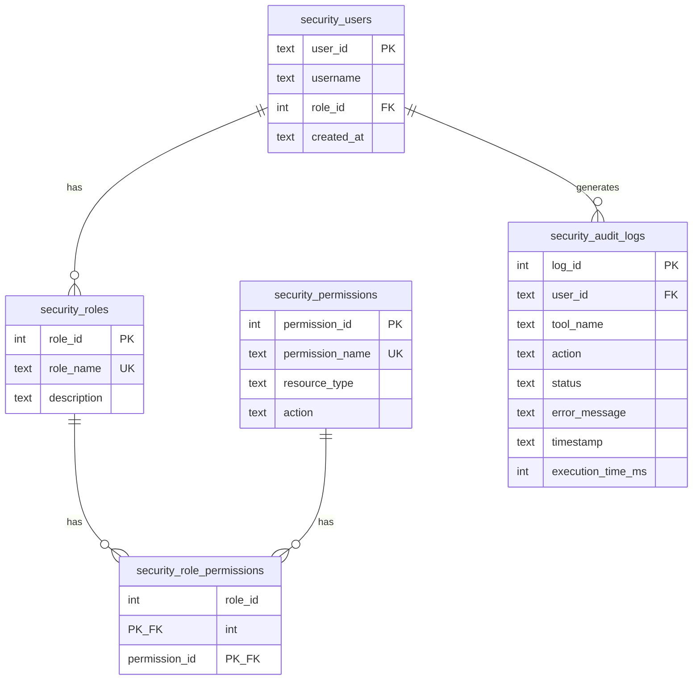
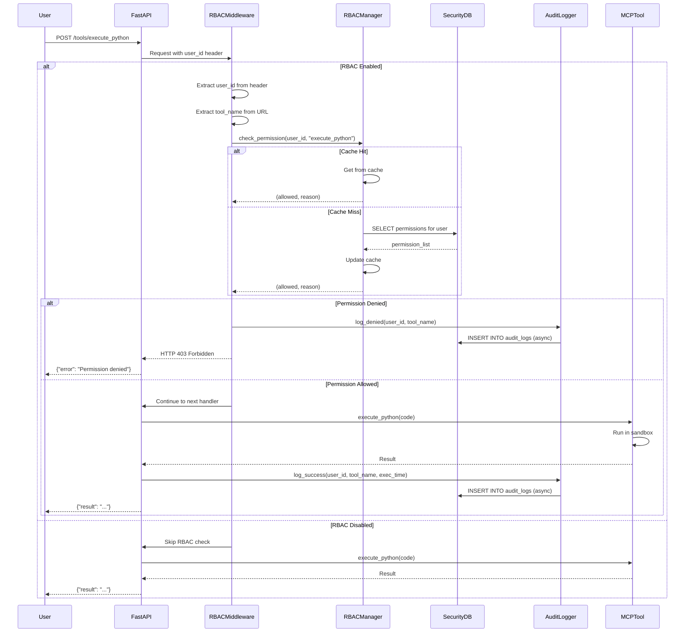
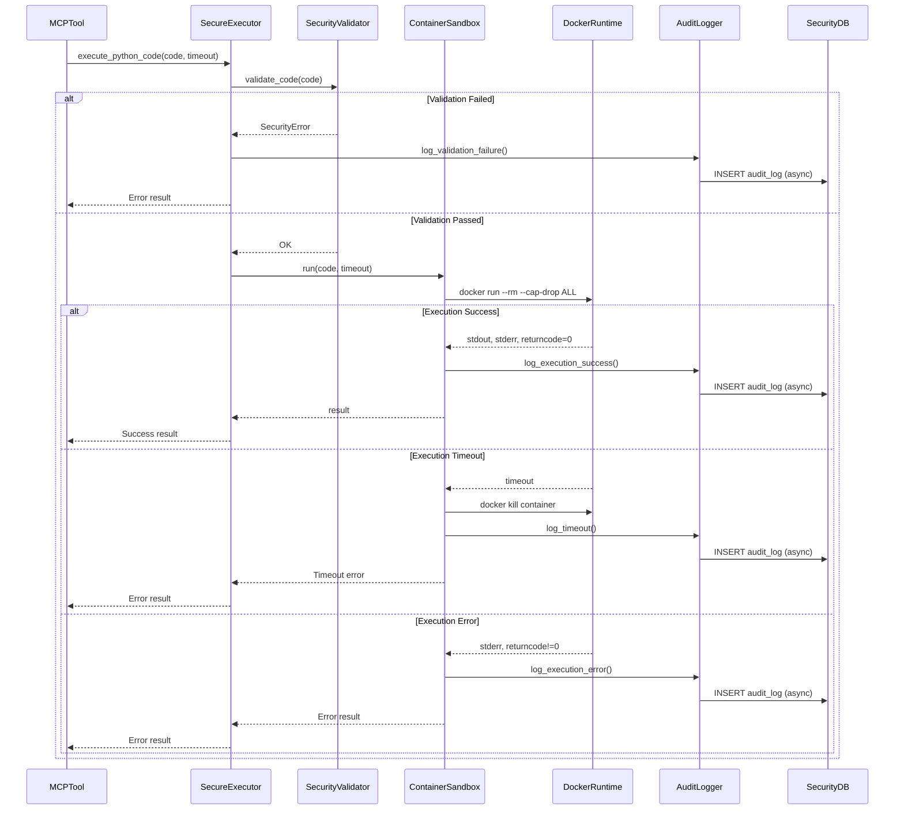
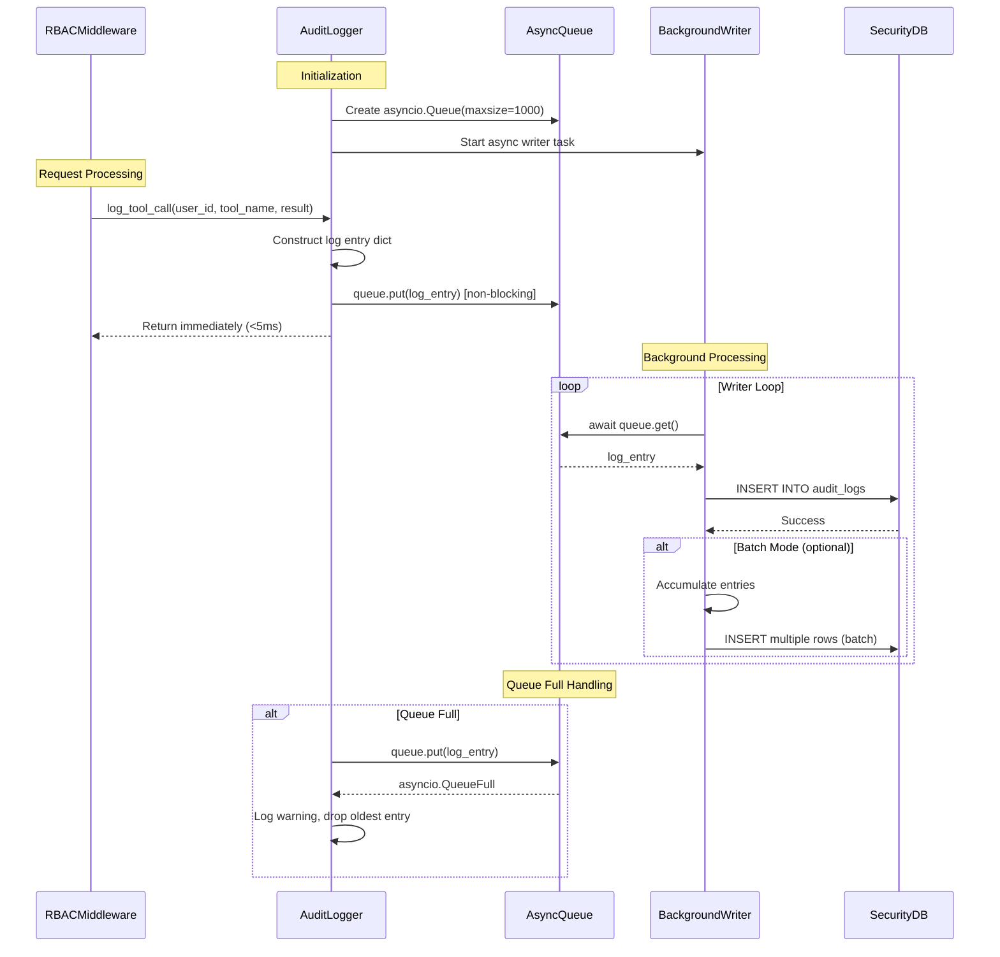
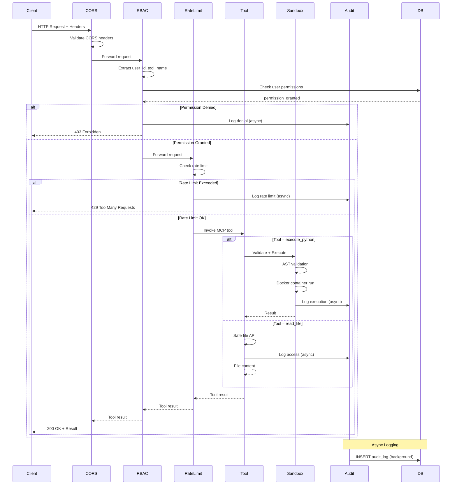

# Security Architecture Design

## Entity Relationship Diagram (ERD)

### Database Schema



### Table Details

#### security_users
**Purpose**: Store user information and role assignments

| Column | Type | Constraints | Description |
|--------|------|-------------|-------------|
| user_id | TEXT | PRIMARY KEY | Unique user identifier |
| username | TEXT | NOT NULL | Display name |
| role_id | INTEGER | FOREIGN KEY | Reference to security_roles |
| created_at | TEXT | DEFAULT CURRENT_TIMESTAMP | Account creation time |

**Indexes**:
- Primary: user_id
- Foreign: role_id → security_roles(role_id)

#### security_roles
**Purpose**: Define available roles (guest, developer, admin)

| Column | Type | Constraints | Description |
|--------|------|-------------|-------------|
| role_id | INTEGER | PRIMARY KEY AUTOINCREMENT | Role identifier |
| role_name | TEXT | NOT NULL UNIQUE | Role name (guest/developer/admin) |
| description | TEXT | NULL | Role description |

**Default Roles**:
- `guest` (role_id=1): Read-only access
- `developer` (role_id=2): Developer access with code execution
- `admin` (role_id=3): Full administrative access

#### security_permissions
**Purpose**: Define granular permissions for MCP tools

| Column | Type | Constraints | Description |
|--------|------|-------------|-------------|
| permission_id | INTEGER | PRIMARY KEY AUTOINCREMENT | Permission identifier |
| permission_name | TEXT | NOT NULL UNIQUE | Permission name (matches tool name) |
| resource_type | TEXT | NULL | Resource type (tool/file/system) |
| action | TEXT | NULL | Action type (read/write/execute) |

**Examples**:
- `read_file` - resource_type: file, action: read
- `execute_python` - resource_type: tool, action: execute
- `git_commit` - resource_type: tool, action: execute

#### security_role_permissions
**Purpose**: Map roles to permissions (many-to-many)

| Column | Type | Constraints | Description |
|--------|------|-------------|-------------|
| role_id | INTEGER | PK, FK | Reference to security_roles |
| permission_id | INTEGER | PK, FK | Reference to security_permissions |

**Composite Primary Key**: (role_id, permission_id)

**Cascading Rules**:
- ON DELETE CASCADE: Deleting role removes all mappings
- ON DELETE CASCADE: Deleting permission removes all mappings

#### security_audit_logs
**Purpose**: Record all tool invocations and security events

| Column | Type | Constraints | Description |
|--------|------|-------------|-------------|
| log_id | INTEGER | PRIMARY KEY AUTOINCREMENT | Log entry identifier |
| user_id | TEXT | NULL | User who invoked the tool |
| tool_name | TEXT | NULL | MCP tool name |
| action | TEXT | NULL | Action performed |
| status | TEXT | NULL | Result (success/denied/error) |
| error_message | TEXT | NULL | Error details if failed |
| timestamp | TEXT | DEFAULT CURRENT_TIMESTAMP | Event timestamp |
| execution_time_ms | INTEGER | NULL | Execution duration in milliseconds |

**Indexes**:
- Primary: log_id
- Index: user_id (for user activity queries)
- Index: tool_name (for tool usage statistics)
- Index: timestamp (for time-based queries)

---

## Sequence Diagrams

### 1. RBAC Permission Check Flow



### 2. Sandbox Execution with Audit Logging



### 3. Asynchronous Audit Logging Flow



### 4. User Request End-to-End Flow



---

## Component Architecture

### Layered Architecture

```
┌─────────────────────────────────────────────────────────┐
│                    Presentation Layer                    │
│  FastAPI Endpoints, CORS Middleware, HTTP Handlers      │
└───────────────────────┬─────────────────────────────────┘
                        │
┌───────────────────────┴─────────────────────────────────┐
│                   Security Layer                         │
│  ┌──────────────┐  ┌──────────────┐  ┌──────────────┐  │
│  │ RBAC Middle- │  │ Rate Limiter │  │ Access Ctrl  │  │
│  │    ware      │  │              │  │              │  │
│  └──────────────┘  └──────────────┘  └──────────────┘  │
└───────────────────────┬─────────────────────────────────┘
                        │
┌───────────────────────┴─────────────────────────────────┐
│                   Business Logic Layer                   │
│  ┌──────────────┐  ┌──────────────┐  ┌──────────────┐  │
│  │  MCP Tools   │  │ RBAC Manager │  │ Audit Logger │  │
│  │  (18 tools)  │  │              │  │              │  │
│  └──────────────┘  └──────────────┘  └──────────────┘  │
└───────────────────────┬─────────────────────────────────┘
                        │
┌───────────────────────┴─────────────────────────────────┐
│                 Execution Layer                          │
│  ┌──────────────┐  ┌──────────────┐  ┌──────────────┐  │
│  │   Security   │  │  Container   │  │  Safe File   │  │
│  │  Validator   │  │   Sandbox    │  │     API      │  │
│  └──────────────┘  └──────────────┘  └──────────────┘  │
└───────────────────────┬─────────────────────────────────┘
                        │
┌───────────────────────┴─────────────────────────────────┐
│                   Data Layer                             │
│  ┌────────────────────────┐  ┌───────────────────────┐  │
│  │  Security Database     │  │  Docker Runtime       │  │
│  │  (SQLite WAL Mode)     │  │  (Container Executor) │  │
│  └────────────────────────┘  └───────────────────────┘  │
└─────────────────────────────────────────────────────────┘
```

### Data Flow

```
Client Request
    │
    ↓
[CORS Middleware] → Allow origins
    │
    ↓
[RBAC Middleware] → Extract user_id, tool_name
    │               → Check RBAC permission
    │               → If denied: Log + Return 403
    ↓
[Rate Limiter] → Check rate limit
    │          → Check concurrent execution
    │          → If exceeded: Return 429
    ↓
[MCP Tool Handler] → Route to appropriate tool
    │
    ├→ [execute_python]
    │   ├→ SecurityValidator.validate_code()
    │   └→ ContainerSandbox.run()
    │
    ├→ [read_file]
    │   └→ SafeFileAPI.read_text()
    │
    └→ [Other tools]
        └→ Tool-specific logic
    │
    ↓
[Audit Logger] → Queue log entry (async)
    │
    ↓
Response to Client
```

---

## Performance Considerations

### RBAC Permission Cache

**Strategy**: In-memory LRU cache with TTL

```python
cache = {
    "user_id:tool_name": {
        "allowed": True/False,
        "reason": str,
        "cached_at": timestamp,
        "ttl": 300  # 5 minutes
    }
}
```

**Cache Invalidation**:
- On role change: Invalidate all entries for user_id
- On permission change: Invalidate all entries for tool_name
- On TTL expiry: Auto-evict stale entries

### Async Audit Logging

**Queue Size**: 1000 entries (configurable)
**Writer Strategy**: Background task with batch insertion
**Overflow Handling**: Drop oldest entries with warning log

**Performance Targets**:
- Queue insertion: <1ms
- Background write: <10ms per batch
- Total overhead: <5ms (non-blocking)

### Database Optimization

**WAL Mode**: Enable concurrent readers + single writer
**Indexes**:
- user_id (for permission lookups)
- tool_name (for usage statistics)
- timestamp (for log queries)

**Connection Pooling**: Reuse connections across requests

---

## Security Design Principles

1. **Fail Secure**: Default deny for unknown users/permissions
2. **Least Privilege**: Users granted minimum necessary permissions
3. **Defense in Depth**: Multiple security layers (RBAC + Rate Limit + Sandbox)
4. **Audit Everything**: Log all security-relevant events
5. **Feature Flags**: Allow disabling security for testing/debugging
6. **Graceful Degradation**: Continue operation if non-critical components fail

---

## Deployment Architecture

### Development Environment
- RBAC_ENABLED=false
- SANDBOX_ENABLED=true
- RATE_LIMIT_ENABLED=true
- Loose rate limits for testing

### Production Environment
- RBAC_ENABLED=true
- SANDBOX_ENABLED=true
- RATE_LIMIT_ENABLED=true
- Strict rate limits
- Audit log retention: 90 days
- Database backups: Daily
